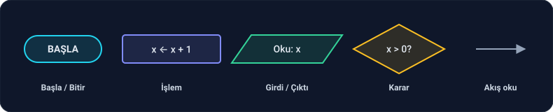
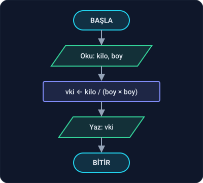
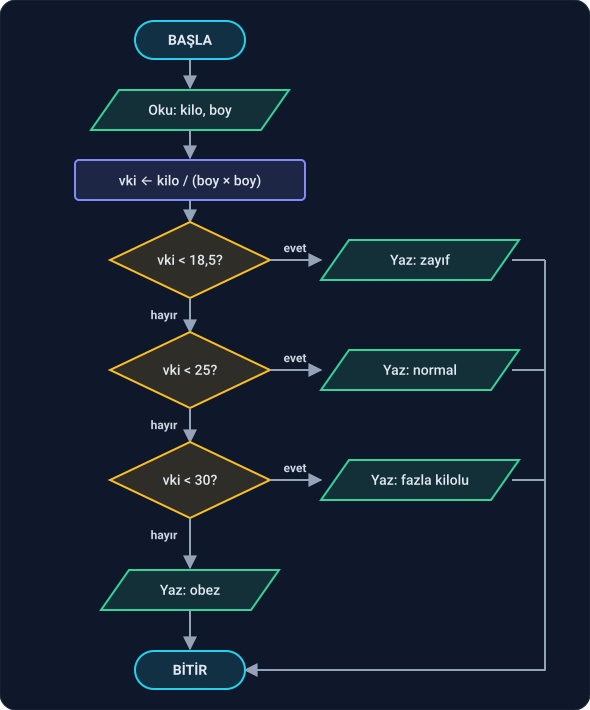
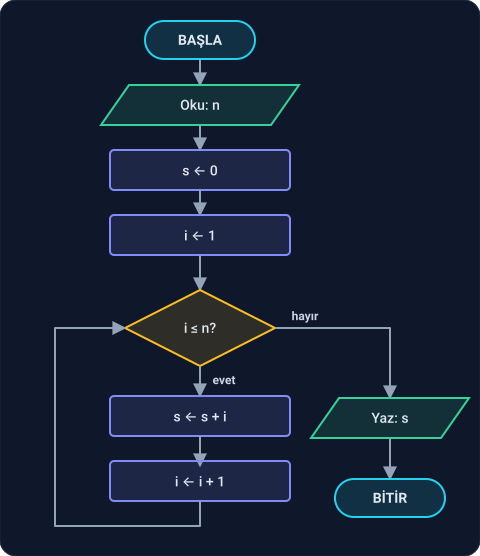
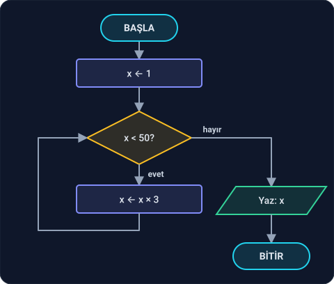
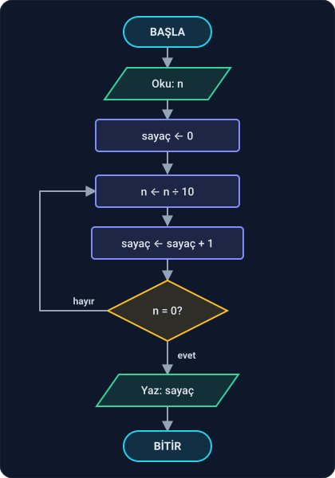

## Önce kısa bir mola

Ders 1.1'de bir anda çok şey geldi: algoritma, beş özellik, girdi–çıktı–koşul, edge case, pseudocode, `←`, `÷`, `mod`, Pólya'nın dört adımı… Okurken "bu kadarını aklımda nasıl tutacağım?" dediysen ya da bazı alıştırmalarda takıldıysan, bil ki **bu çok normal**.

Bugün büyük sistemler yazan, işletim sistemi çekirdeğine kod gönderen, milyonlarca kişinin kullandığı yazılımları geliştiren herkes bir zamanlar tam olarak burada durdu. Herkes ilk döngüsünü kağıtta çizdi, herkes ilk trace table'da bir yerde yanlış saydı, herkes "atama ile eşitlik aynı şey değil mi?" diye düşündü. Bu yolun kısa bir versiyonu yok; herkes aynı yoldan geçiyor. Fark, yolda kalanla yürümeye devam eden arasında.

:::tip[Bu derste nefes alacaksın]
Bu derste yeni kavram az. Öğreneceğin şeylerin çoğu, Ders 1.1'de zaten bildiğin şeylerin **resmi**. Pseudocode ile yazdığın algoritmaları bu kez çizeceksin. Bir şeyi hem okuyup hem görmek, aklında kalmasını kolaylaştırır.
:::

Bu derste de kod yazmıyoruz; kağıt ve kalem yeterli. Bilgisayarda çizmek istersen ücretsiz [draw.io](https://app.diagrams.net) işini görür. Beş bölüm var:

1. Akış diyagramı nedir, neden öğreniyoruz?
2. Semboller
3. Sıralı akış
4. Karar
5. Döngü: okun geri dönüşü

---

## 1. Akış diyagramı nedir, neden öğreniyoruz?

**Akış diyagramı**, bir algoritmanın resmidir. Her adım bir kutuya yazılır, kutular oklarla bağlanır. Okları takip eden göz, algoritmanın hangi sırayla çalıştığını, nerede yol ayrımına girdiğini ve nerede geri döndüğünü bir bakışta görür.

**Dürüst olalım:** Bir web uygulaması geliştirirken kimse akış diyagramı çizmez. İş hayatında bir ekip toplantısında "hadi bunun akış diyagramını çizelim" cümlesini pek duymayacaksın. O zaman neden öğreniyoruz?

Çünkü akış diyagramı bir **araç** değil, bir **düşünme biçimi**. Kod yazmaya başladığında `if`, `while`, `for` gibi yapılar göreceksin. Bunları ezberleyen biri, "bu döngü kaç kez dönecek?", "bu koşul yanlış olursa program nereye gider?" sorularını cevaplarken zorlanır. Akış diyagramını çizmiş biri ise bu soruların cevabını **görür**, çünkü programın akışını bir kere kendi eliyle çizmiştir.

Daha da önemlisi: işlemci de tam olarak böyle çalışır. Faz 7'de assembly'ye geldiğimizde, `if` ve `while` diye bir şey olmadığını, sadece "şu koşul doğruysa şu adrese **atla**" komutları olduğunu göreceksin. O atlamalar, bu derste çizeceğin okların ta kendisidir. Akış diyagramı, yüksek seviyeli kod ile makinenin gerçekte yaptığı şey arasındaki köprüdür.

Yani bu ders, yarın işte kullanacağın bir beceri için değil, **sağlam bir yazılım temeli** oturtmak için var. Temeli sağlam olanın üzerine her şey kurulur.

---

## 2. Semboller

Akış diyagramlarında beş temel sembol kullanılır. Bu semboller uluslararası bir standartla (ISO 5807) belirlenmiştir; dünyanın her yerinde aynı anlama gelir.

| Sembol | Şekil | Ne zaman kullanılır? | Pseudocode'daki karşılığı |
| --- | --- | --- | --- |
| **Başla / Bitir** | Oval | Algoritmanın başı ve sonu | `ALGORİTMA …`, `DÖNDÜR` |
| **İşlem** | Dikdörtgen | Hesaplama ve atama | `x ← x + 1` |
| **Girdi / Çıktı** | Paralelkenar | Dışarıdan değer alma ya da dışarıya sonuç verme | `GİRDİ`, `ÇIKTI` |
| **Karar** | Eşkenar dörtgen | Doğru ya da yanlış cevaplı bir soru | `EĞER`, `OLDUĞU SÜRECE` |
| **Akış oku** | Ok | Bir sonraki adımı gösterir | Satırların sırası |

İki kural var:

- **Her diyagramın tek bir başı vardır.** BAŞLA'ya ok girmez, BAŞLA'dan tek bir ok çıkar.
- **Kararın iki çıkışı vardır**: biri "evet", biri "hayır". Hangi okun hangisi olduğu mutlaka yazılır.

---

## 3. Sıralı akış

En basit akış: adımlar yukarıdan aşağıya, hiç dallanmadan sırayla çalışır.

**Örnek: vücut kitle indeksi.** Ders 1.1'de bu problemin girdisini, çıktısını ve koşulunu yazmıştık. Şimdi ilk yarısını, yani değeri hesaplayan kısmını çizelim:

Okları takip et: BAŞLA → kilo ile boyu oku → hesapla → sonucu yaz → BİTİR. Hiçbir yol ayrımı yok; her kutudan tek bir ok çıkıyor.

Kilo 70, boy 1,75 için: 1,75 × 1,75 = 3,0625 ve 70 / 3,0625 ≈ 22,86. Diyagram 22,86 yazar.

### Alıştırma

**3.1** Celsius cinsinden bir sıcaklığı Fahrenheit'a çeviren algoritmanın akış diyagramını çiz. Formül: F = C × 9 / 5 + 32. Diyagramını C = 100 ile dene.

Cevap

Yukarıdan aşağıya beş kutu:

1. **BAŞLA** (oval)
2. **Oku: C** (paralelkenar)
3. **F ← C × 9 / 5 + 32** (dikdörtgen)
4. **Yaz: F** (paralelkenar)
5. **BİTİR** (oval)

C = 100 için: 100 × 9 = 900, 900 / 5 = 180, 180 + 32 = **212**. Suyun kaynama noktası 212 °F'tır.

---

## 4. Karar

Gerçek problemlerin çoğunda bir yerde soru sorulur ve cevaba göre yol ayrılır. Bunu **karar** sembolü gösterir: içine doğru ya da yanlış cevaplı bir soru yazılır, iki ok çıkar.

**Örnek: vücut kitle indeksi grubu.** Değeri hesapladık; şimdi hangi gruba girdiğini bulalım. Ders 1.1'deki sınırlar: 18,5'in altı zayıf; 18,5 ve üstü ama 25'in altı normal; 25 ve üstü ama 30'un altı fazla kilolu; 30 ve üstü obez.

Kararlar **zincir** halinde sıralanmış. Dikkat et:

- İkinci karar sadece "vki < 25?" diye soruyor, "18,5 ≤ vki < 25?" diye sormuyor. Neden? Çünkü buraya gelen biri, ilk karardan zaten **"hayır"** cevabıyla geçti. Yani vki'nin 18,5'ten küçük olmadığı **kesin**. Bir okun nereden geldiğini bilmek, o noktada neyin doğru olduğunu bilmek demektir.
- Dört yoldan hangisinden gidilirse gidilsin, hepsi aynı BİTİR'e varıyor. Bir girdi için **yalnızca bir** yol izlenir; iki gruba birden düşmek imkânsızdır.

Kilo 70, boy 1,75 için vki ≈ 22,86. İlk karar: 22,86 < 18,5? Hayır. İkinci karar: 22,86 < 25? Evet. Sonuç: **normal**.

### Alıştırmalar

**4.1** Vücut kitle indeksi **tam olarak 25** olan biri hangi gruba düşer? Okları tek tek takip ederek bul.

**4.2** İki sayıdan büyüğünü yazan algoritmanın akış diyagramını çiz (Ders 1.1, Alıştırma 4.2).

**4.3** Vücut kitle indeksi diyagramında kararların sırasını ters çevirdiğimizi düşün: önce "vki < 30?", sonra "vki < 25?", sonra "vki < 18,5?" soruluyor ve her "evet" kendi grubuna gidiyor. vki = 22,86 için ne yazılır? Neden?

Cevaplar

**4.1** 25 < 18,5? Hayır. 25 < 25? **Hayır** (25, kendisinden küçük değildir). 25 < 30? Evet. Sonuç: **fazla kilolu**. Ders 1.1'de "25 ve üstü fazla kilolu" diye yazdığımız sınır, diyagramda tam olarak böyle çalışıyor.

**4.2**

1. **BAŞLA**
2. **Oku: a, b**
3. Karar: **a ≥ b?**
   - evet → **Yaz: a**
   - hayır → **Yaz: b**
4. İki yol da **BİTİR**'e gider.

**4.3** İlk karar: 22,86 < 30? **Evet**, ve bu "evet" fazla kilolu grubuna gider. Yanlış sonuç! Ters sırada, 30'dan küçük olan **herkes** ilk kararda yakalanır; diğer kararlara hiç sıra gelmez. Zincir kararlarda sıra önemlidir: her karar, kendinden öncekilerin "hayır" cevaplarına güvenir.

---

## 5. Döngü: okun geri dönüşü

Şimdiye kadar oklar hep aşağı ya da yana gitti. Bir ok **yukarı**, daha önce geçtiğimiz bir noktaya dönerse, o adımlar tekrar çalışır. Buna **döngü** denir.

**Örnek: 1'den n'e kadar toplam.** Ders 1.1'deki Alıştırma 4.3'ün "Gizem" algoritmasını hatırla. Onun akış diyagramı:

Okları takip et:

1. s ve i başlangıç değerlerini alır.
2. Karar: **i ≤ n?**
3. Evet ise s'ye i eklenir, i bir artar ve sol taraftaki ok **yukarı döner**, tekrar karara gelir.
4. Hayır ise sağa çıkılır, s yazılır, algoritma biter.

Bu diyagramda dikkat etmen gereken tek şey şu: **geri dönen ok kararın üstüne değil, kararın kendisine** gelir. Her turdan sonra soru yeniden sorulur. Döngüden çıkmanın tek yolu, kararın "hayır" cevabıdır.

n = 4 için okları takip ederek:

| Tur | i ≤ n? | s | i |
| --- | --- | --- | --- |
| başlangıç | — | 0 | 1 |
| 1 | 1 ≤ 4 evet | 1 | 2 |
| 2 | 2 ≤ 4 evet | 3 | 3 |
| 3 | 3 ≤ 4 evet | 6 | 4 |
| 4 | 4 ≤ 4 evet | 10 | 5 |
| — | 5 ≤ 4 **hayır** | 10 | 5 |

Sonuç: 10. Kontrol: 1 + 2 + 3 + 4 = 10.

**Önce sor, sonra yap; önce yap, sonra sor.** Ders 1.1'de iki tür döngü görmüştük:

- `OLDUĞU SÜRECE`: önce koşula bakılır. Yukarıdaki diyagramda karar, döngünün **başında**. Koşul en baştan yanlışsa döngü hiç çalışmaz.
- `TEKRARLA … OLANA KADAR`: önce bir kez yapılır, sonra koşula bakılır. Diyagramda karar döngünün **sonunda** olur. Döngü en az bir kez çalışır.

Aradaki fark, diyagramda kararın **nerede** durduğundan ibarettir. Bunu aşağıdaki alıştırmada kendin göreceksin.

### Alıştırmalar

**5.1** n! (n faktöriyel), 1'den n'e kadar olan sayıların çarpımıdır: 5! = 1 × 2 × 3 × 4 × 5 = 120. Tanım gereği 0! = 1'dir. n!'i hesaplayan algoritmanın akış diyagramını çiz. (İpucu: toplam diyagramına çok benzer.)

**5.2** Diyagramını n = 0 ile dene. Doğru sonucu veriyor mu?

**5.3** Aşağıdaki diyagram ne yazar? Okları takip ederek bul. Kararın içindeki 50 yerine 100 yazsaydık sonuç ne olurdu?

**5.4** Ders 1.1'deki BasamakSayısı algoritmasının düzeltilmiş, `TEKRARLA … OLANA KADAR` kullanan halini akış diyagramı olarak çiz. Karar nerede durmalı?

Cevaplar

**5.1** Toplam diyagramındaki iki değişiklik yeterli: başlangıçta **f ← 1** (toplamada 0'dan, çarpmada 1'den başlanır; 0 ile çarpılan her şey 0 olur), döngü içinde **f ← f × i**.

**5.2** n = 0 için: f ← 1, i ← 1. Karar: 1 ≤ 0? Hayır. Döngü hiç çalışmaz, f = 1 yazılır. 0! = 1 olduğu için **doğru**. Burada "önce sor" döngüsü tam istediğimiz şeyi yapıyor.

**5.3**

| x | x < 50? |
| --- | --- |
| 1 | evet |
| 3 | evet |
| 9 | evet |
| 27 | evet |
| 81 | **hayır** |

Diyagram **81** yazar. Karar 100 olsaydı 81 < 100 evet olurdu, bir tur daha dönülürdü: x = 243 ve 243 < 100 hayır. Sonuç **243**. Döngü, 3'ün kuvvetlerinden sınırı ilk geçeni buluyor.

**5.4** Karar döngünün **sonunda** durur: önce bölme ve sayma yapılır, sonra "n = 0?" diye sorulur. "Hayır" ise ok yukarı, bölme adımına döner; "evet" ise sonuç yazılır.

n = 0 için: 0 ÷ 10 = 0, sayaç 1 olur, "n = 0?" evet, 1 yazılır. Doğru.

Toplam ve faktöriyel diyagramlarıyla karşılaştır: orada karar döngünün **başındaydı**, burada **sonunda**. "Önce sor" ile "önce yap" arasındaki fark, kağıtta tam olarak bu kadar görünür.

---

## Kaynaklar

- ISO 5807:1985, *Information processing — Documentation symbols and conventions for data, program and system flowcharts*: akış diyagramı sembollerinin standardı.
- Donald Knuth, *The Art of Computer Programming*, Cilt 1 (3. baskı), §1.1: Öklid algoritmasının akış diyagramı, kitabın ilk diyagramıdır.

**Sıradaki ders:** Algoritmayı elle çalıştırmak: tracing.
