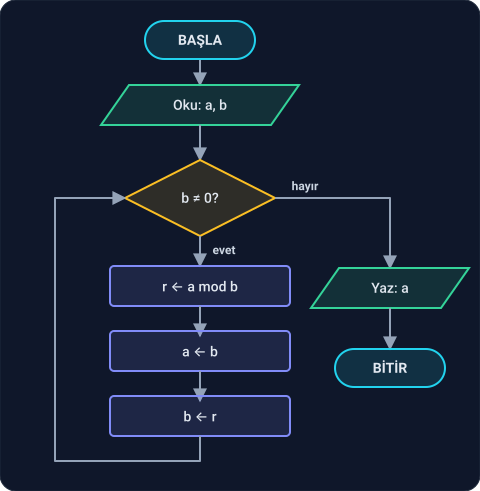
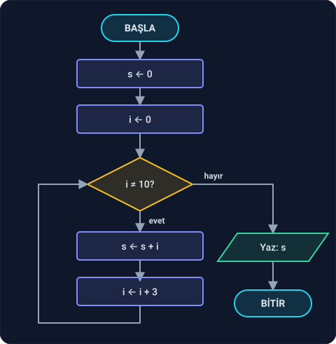
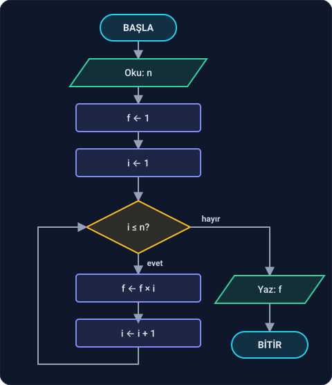
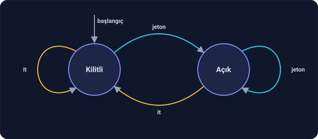
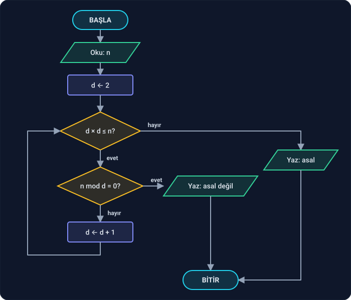
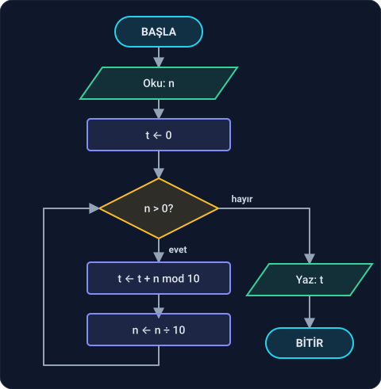

Faz 1'in son dersi. Trace table'larını Ders 1.1 ve 1.2'de zaten kullandın; bu derste onları bir **araca** dönüştüreceğiz: bir algoritmanın doğru çalıştığını göstermek ve yanlış çalıştığında hatayı yakalamak için. Ardından yeni bir çizim türü göreceğiz: state machine. En sonda da Faz 1'de öğrendiğin her şeyi bir arada kullanacağın iki problem var.

Kağıt ve kalem yeterli. Altı bölüm var:

1. Tracing'in kuralları
2. Öklid algoritması
3. Trace ederek hata bulmak
4. Loop invariant
5. State machine
6. Faz alıştırması

---

## 1. Tracing'in kuralları

**Tracing** (iz sürme), bir algoritmayı bilgisayar yerine senin çalıştırmandır: her adımda değişkenlerin değerini bir tabloya yazarsın. Kulağa basit geliyor ama programcının elindeki en güçlü araçlardan biri. Faz 2'de LLDB adlı bir debugger (hata ayıklayıcı) ile tanışacaksın; yaptığı iş, bu tabloyu senin yerine tutmaktan ibaret.

Dört kural:

1. **Her değişkene bir sütun aç.** Kararlar için de bir sütun aç ve sorunun cevabını yaz.
2. **Bir satır, bir tur.** Döngünün her dönüşü yeni bir satırdır.
3. **Kafandan atlama.** "Bu sefer de aynısı olur" deme. Her değeri gerçekten hesapla ve yaz. Hatalar tam olarak atlanan satırlarda saklanır.
4. **Durduğunda son satırı oku.** Çıktı oradadır. Durmuyorsa, o da bir bilgidir.

---

## 2. Öklid algoritması

İki sayının **en büyük ortak böleni (EBOB)**, ikisini de kalansız bölen en büyük sayıdır. Örneğin EBOB(12, 18) = 6.

Küçük sayılarda bölenleri tek tek deneyebilirsin. Peki 1071 ile 462? Yaklaşık 2300 yıl önce Öklid, *Elemanlar* adlı kitabında çok daha kısa bir yol yazdı. Bugün bilinen en eski algoritmalardan biridir.

```
ALGORİTMA Öklid
GİRDİ: a, b  (a ≥ 0, b ≥ 0, ikisi birden 0 değil)
ÇIKTI: EBOB(a, b)

b ≠ 0 OLDUĞU SÜRECE:
    r ← a mod b
    a ← b
    b ← r
DÖNDÜR a
```



**Trace table: a = 1071, b = 462**

| Tur | a | b | b ≠ 0? | r ← a mod b |
| --- | --- | --- | --- | --- |
| 1. | 1071 | 462 | evet | 147 |
| 2. | 462 | 147 | evet | 21 |
| 3. | 147 | 21 | evet | 0 |
| bitiş | 21 | 0 | **hayır** | — |

Sonuç: **21**. Sadece üç turda. Kontrol: 1071 = 21 × 51 ve 462 = 21 × 22.

**Neden çalışıyor?** a = q × b + r olsun (q bölüm, r kalan). a'yı ve b'yi bölen her sayı, r = a − q × b'yi de böler. Tersine, b'yi ve r'yi bölen her sayı a'yı da böler. Yani (a, b) çiftinin ortak bölenleri ile (b, r) çiftinin ortak bölenleri **aynıdır**; bu yüzden EBOB'ları da aynıdır. Algoritma her turda sayıları küçültüyor ama EBOB'u hiç değiştirmiyor. b sonunda 0 olunca, EBOB(a, 0) = a olur. İspatın ayrıntısı Faz 6'da.

**Sonluluk.** Ders 1.1'deki beş özelliği hatırla: bu algoritma bitiyor mu? Kalan her zaman bölenden küçüktür (r < b). Yani b her turda **kesinlikle** küçülür. Sıfırdan büyük bir tamsayı sonsuza kadar küçülemez; b eninde sonunda 0 olur.

### Alıştırmalar

**2.1** – EBOB(48, 18)'i trace table ile bul.

**2.2** – EBOB(18, 48)'i bul. Sayıların sırası ters olunca ne oldu?

**2.3** – EBOB(17, 5) kaçtır? Bu sonuç 17 ve 5 hakkında ne söyler?

<details>
<summary>Cevaplar</summary>

**2.1**

| Adım | a | b | r |
| --- | --- | --- | --- |
| 1. | 48 | 18 | 12 |
| 2. | 18 | 12 | 6 |
| 3. | 12 | 6 | 0 |
| bitiş | 6 | 0 | — |

EBOB = **6**.

**2.2** – İlk turda 18 mod 48 = 18 olur, yani a ← 48, b ← 18. Algoritma sayıların yerini **kendiliğinden** değiştirdi ve bir tur fazlasıyla aynı sonuca vardı: **6**. Sırayı dert etmene gerek yok.

**2.3** – 17 mod 5 = 2, 5 mod 2 = 1, 2 mod 1 = 0. EBOB = **1**. 1'den başka ortak böleni olmayan sayılara **aralarında asal** denir.

</details>

---

## 3. Trace ederek hata bulmak

Aşağıdaki algoritma, 10'a kadar olan sayılar arasından 3'ün katlarını toplamak için yazılmış:

```
s ← 0
i ← 0
i ≠ 10 OLDUĞU SÜRECE:
    s ← s + i
    i ← i + 3
DÖNDÜR s
```



Bakınca doğru görünüyor. Trace edelim:

| Tur | i ≠ 10? | s | i |
| --- | --- | --- | --- |
| başlangıç | — | 0 | 0 |
| 1. | evet | 0 | 3 |
| 2. | evet | 3 | 6 |
| 3. | evet | 9 | 9 |
| 4. | evet | 18 | 12 |
| 5. | evet | 30 | 15 |
| 6. | evet | 45 | 18 |

i'nin değerlerine bak: 0, 3, 6, 9, 12, 15, … **10'un üstünden atladı.** i hiçbir zaman tam olarak 10 olmayacak; "i ≠ 10?" sorusunun cevabı sonsuza kadar "evet" kalacak. Bu algoritma **bitmez**. Ders 1.1'deki sonluluk özelliği bozuk.

Tabloya bakmadan, sadece koda bakarak bu hatayı görmek zordur. Tabloda ise iki şey hemen göze çarpar: çıkış koşulu hiç "hayır" olmuyor ve i, 10'a yaklaşacağına onu geçip uzaklaşıyor.

**Düzeltme:** "tam olarak 10 olana kadar" değil, "10'dan küçük olduğu sürece" demeliyiz: `i < 10 OLDUĞU SÜRECE`. Şimdi i = 12 olunca koşul "hayır" olur ve döngü biter. Sonuç: 0 + 3 + 6 + 9 = **18**.

**Ders:** Döngüden çıkış koşulunda `≠` kullanmak tehlikelidir. Değişken sınırı atlarsa döngü sonsuza gider. `<`, `≤` gibi karşılaştırmalar ise sınır atlansa bile durur.

### Alıştırma

**3.1** – Aşağıdaki algoritma 1'den n'e kadar toplamı hesaplamak için yazılmış ama bir hatası var. n = 3 için trace et ve hatayı bul.

```
s ← 0
i ← 1
i ≤ n OLDUĞU SÜRECE:
    s ← s + i
DÖNDÜR s
```

<details>
<summary>Cevap</summary>

| Tur | i ≤ n? | s | i |
| --- | --- | --- | --- |
| başlangıç | — | 0 | 1 |
| 1. | evet | 1 | 1 |
| 2. | evet | 2 | 1 |
| 3. | evet | 3 | 1 |
| 4. | evet | 4 | 1 |

i hiç değişmiyor! Döngü içinde `i ← i + 1` unutulmuş. i hep 1 kaldığı için koşul hep doğru, algoritma bitmiyor. Tabloda i sütununun **hiç değişmemesi** hatanın kendisi.

</details>

---

## 4. Loop invariant

Trace table bir algoritmanın **bir girdi için** doğru çalıştığını gösterir. Peki **her girdi için** doğru çalıştığından nasıl emin oluruz? Sonsuz sayıda girdiyi tek tek deneyemeyiz.

Bunun için **loop invariant** (döngü değişmezi) kullanılır: döngünün her turunun başında **her zaman doğru** olan bir cümle.

Ders 1.2'deki 1'den n'e toplam algoritmasına geri dönelim. Değişmez şu:

> Her turun başında, **s = 1 + 2 + … + (i − 1)**.

n = 4 için trace table'a bakıp kontrol edelim:

| Adım | i | s | 1 + … + (i − 1) | Doğru mu? |
| --- | --- | --- | --- | --- |
| 1. | 1 | 0 | (hiç sayı yok) = 0 | ✓ |
| 2. | 2 | 1 | 1 | ✓ |
| 3. | 3 | 3 | 1 + 2 | ✓ |
| 4. | 4 | 6 | 1 + 2 + 3 | ✓ |
| çıkış | 5 | 10 | 1 + 2 + 3 + 4 | ✓ |

Ama bu yine sadece n = 4. Asıl güç, değişmezin **üç adımda** her n için gösterilebilmesinde:

1. **Başlangıçta doğru:** i = 1, s = 0. Toplanacak sayı yok, toplam 0. ✓
2. **Her tur onu korur:** Tur başında s = 1 + … + (i − 1) ise, turda s'ye i eklenir ve i bir artar. Yeni s = 1 + … + i olur; yeni i ile yazınca bu yine 1 + … + (i − 1) demektir. ✓
3. **Çıkışta istediğimizi verir:** Döngü i = n + 1 olunca biter. Değişmeze göre s = 1 + … + n. Tam olarak istediğimiz. ✓

Bu üç adım, algoritmanın **her n için** doğru olduğunun ispatıdır. Şimdilik bu kadarı yeter; loop invariant'ı Faz 6'da tümevarım ile, Faz 8 ve 9'da veri yapıları ve algoritmalarda çok kullanacağız.

### Alıştırmalar

**4.1** – Ders 1.2'deki faktöriyel algoritmasının loop invariant'ı yaz. Algoritma hatırlatma olarak aşağıda:



**4.2** – Öklid algoritmasında her turda değişmeyen şey ne? (İpucu: Bölüm 2'deki "Neden çalışıyor?" kısmına bak.)

<details>
<summary>Cevaplar</summary>

**4.1** – Her turun başında **f = 1 × 2 × … × (i − 1)**, yani f = (i − 1)!. Başlangıçta i = 1, f = 1 = 0! ✓. Döngü i = n + 1 olunca biter ve f = n! olur.

**4.2** – **EBOB(a, b)** değeri. a ve b her turda değişir, ama ikisinin EBOB'u en baştaki sayıların EBOB'una her zaman eşittir. Döngü bittiğinde b = 0 ve EBOB(a, 0) = a olduğu için, döndürülen a aradığımız sonuçtur.

</details>

---

## 5. State machine

Şimdiye kadar çizdiğimiz diyagramlar bir hesap yapıp bitiyordu. Bazı sistemler ise hiç bitmez; sürekli **olay** bekler ve her olaya, o an **hangi durumda** olduğuna göre farklı tepki verir. Bunları anlatmanın yolu **state machine**'dir (durum makinesi).

**Örnek: metro turnikesi.** Turnikenin iki durumu var: **Kilitli** ve **Açık**. İki olay olabilir: **jeton** atılır ya da kola **it**ilir.

- Kilitliyken jeton atılırsa açılır.
- Kilitliyken itilirse hiçbir şey olmaz, kilitli kalır.
- Açıkken itilirse biri geçer ve tekrar kilitlenir.
- Açıkken jeton atılırsa açık kalır (jeton boşa gider).



Daireler durumları, oklar geçişleri gösterir. Her okun üstünde, o geçişi tetikleyen olay yazar. Kendi üstüne dönen ok, durumun değişmediği anlamına gelir.

Aynı bilgi bir **geçiş tablosu** olarak da yazılabilir:

| Şu anki durum | jeton | it |
| --- | --- | --- |
| **Kilitli** | Açık | Kilitli |
| **Açık** | Açık | Kilitli |

State machine'de trace etmek, tabloda satır satır ilerlemektir. Olaylar: jeton, it, it, jeton, jeton, it.

| Adım | Olay | Önceki durum | Sonraki durum |
| --- | --- | --- | --- |
| 1. | jeton | Kilitli | Açık |
| 2. | it | Açık | Kilitli |
| 3. | it | Kilitli | Kilitli |
| 4. | jeton | Kilitli | Açık |
| 5. | jeton | Açık | Açık |
| 6. | it | Açık | Kilitli |

**Neden önemli?** Etrafındaki pek çok sistem aslında bir state machine: trafik ışığı, asansör, çamaşır makinesi, bir oyundaki karakterin "yürüyor / zıplıyor / düşüyor" halleri. Metni harf harf okuyup "bu geçerli bir sayı mı?" diye karar veren programlar da öyle. Aşağıdaki ikinci alıştırma tam olarak bunu yapıyor. State machine ilerideki fazlarda en sık geri döneceğimiz fikirlerden biri.

### Alıştırmalar

**5.1** – Bir trafik ışığının state machine'i çiz. Durumlar: Kırmızı, Yeşil, Sarı. Tek olay var: "süre doldu". Işık kırmızıdan yeşile, yeşilden sarıya, sarıdan kırmızıya geçer. Geçiş tablosunu da yaz.

**5.2** – Aşağıdaki state machine, bir metnin **geçerli bir tamsayı** olup olmadığına karar veriyor. Metin soldan sağa, karakter karakter okunur; her karakter bir olaydır. Başlangıç durumu **Başla**. Metin bittiğinde makine **Sayı** durumundaysa metin geçerlidir, değilse geçersizdir.

| Şu anki durum | `-` | rakam (0–9) | başka karakter |
| --- | --- | --- | --- |
| **Başla** | İşaret | Sayı | Hata |
| **İşaret** | Hata | Sayı | Hata |
| **Sayı** | Hata | Sayı | Hata |
| **Hata** | Hata | Hata | Hata |

Şu metinlerin her biri için trace et: `-42`, `007`, `4-2`, `-`, ve hiç karakteri olmayan boş metin. Hangileri geçerli?

<details>
<summary>Cevaplar</summary>

**5.1**

| Şu anki durum | süre doldu |
| --- | --- |
| **Kırmızı** | Yeşil |
| **Yeşil** | Sarı |
| **Sarı** | Kırmızı |

Diyagramda üç daire ve bir halka şeklinde üç ok olur: Kırmızı → Yeşil → Sarı → Kırmızı. Her okun üstünde "süre doldu" yazar.

**5.2**

- `-42`: Başla →(`-`) İşaret →(`4`) Sayı →(`2`) Sayı. Sonda **Sayı**: **geçerli**.
- `007`: Başla → Sayı → Sayı → Sayı: **geçerli**. (Baştaki sıfırlar bu makineye göre sorun değil.)
- `4-2`: Başla →(`4`) Sayı →(`-`) **Hata** →(`2`) Hata: **geçersiz**. Bir kez Hata'ya düşen makine oradan çıkamaz.
- `-`: Başla → İşaret. Metin bitti ama makine **İşaret** durumunda: **geçersiz**. Tek başına eksi işareti bir sayı değildir.
- Boş metin: Hiç olay yok, makine **Başla**'da kalır: **geçersiz**.

Faz 2'de klavyeden sayı okuyan fonksiyonu sıfırdan yazarken bu tabloyu hatırlayacaksın.

</details>

---

## 6. Faz alıştırması

Faz 1'in sonuna geldin. Şimdi öğrendiğin her şeyi bir arada kullanma zamanı: problemi tanımla, pseudocode'unu yaz, akış diyagramını çiz ve trace ederek dene. Edge case'leri unutma.

**Önce kendin çöz.** Çözümler aşağıdaki kutularda; ama bu sefer kutuyu açmadan önce gerçekten uğraş. Takılırsan Pólya'nın dört adımına geri dön.

**6.1 Asal sayı.** 1'den büyük olup sadece 1'e ve kendisine bölünen sayılara **asal** denir: 2, 3, 5, 7, 11, … Bir sayının asal olup olmadığını bulan algoritmayı tasarla. 91 ve 97 ile dene.

**6.2 Basamak toplamı.** Bir sayının basamaklarının toplamını bulan algoritmayı tasarla. Örnek: 2026 → 2 + 0 + 2 + 6 = 10.

<details>
<summary>Çözüm 6.1: Asal sayı</summary>

**Anla.** Girdi: n, koşul n ≥ 2. Çıktı: "asal" ya da "asal değil".

**Plan.** 2'den başlayarak n'yi bölen bir sayı ara. Bulursan asal değildir. Ama nereye kadar aramalı? n − 1'e kadar mı?

Hayır, **√n'e kadar** yeterli. Neden? n = a × b ise a ile b'nin ikisi birden √n'den büyük olamaz; olsaydı çarpımları n'yi geçerdi. Yani n'nin bir böleni varsa, √n'den küçük ya da ona eşit bir böleni mutlaka vardır. Karekök almak yerine d × d ≤ n diye sorarız; aynı şeydir.

**Uygula.**
```
ALGORİTMA AsalMı
GİRDİ: n  (n ≥ 2)
ÇIKTI: "asal" ya da "asal değil"

d ← 2
d × d ≤ n OLDUĞU SÜRECE:
    EĞER n mod d = 0 İSE
        DÖNDÜR "asal değil"
    d ← d + 1
DÖNDÜR "asal"
```



Diyagramda yeni bir şey var: döngünün **içinden** dışarı çıkan bir yol. Bölen bulunduğu an, döngünün bitmesini beklemeden sonuç yazılıyor.

**İz: n = 91**

| Adım | d | d × d ≤ 91? | 91 mod d | Sonuç |
| --- | --- | --- | --- | --- |
| 1. | 2 | 4, evet | 1 | devam |
| 2. | 3 | 9, evet | 1 | devam |
| 3. | 4 | 16, evet | 3 | devam |
| 4. | 5 | 25, evet | 1 | devam |
| 5. | 6 | 36, evet | 1 | devam |
| 6. | 7 | 49, evet | **0** | **asal değil** |

91 = 7 × 13. İlk bakışta asal gibi görünür ama değildir.

**İz: n = 97**

| Adım | d | d × d ≤ 97? | 97 mod d |
| --- | --- | --- | --- |
| 1. | 2 | 4, evet | 1 |
| 2. | 3 | 9, evet | 1 |
| 3. | 4 | 16, evet | 1 |
| 4. | 5 | 25, evet | 2 |
| 5. | 6 | 36, evet | 1 |
| 6. | 7 | 49, evet | 6 |
| 7. | 8 | 64, evet | 1 |
| 8. | 9 | 81, evet | 7 |
| bitiş | 10 | 100, **hayır** | — |

Hiç bölen bulunamadı: **asal**. 95 sayı yerine sadece 8 sayı denedik.

**Geriye bak.** Edge case'ler:

- n = 2: 2 × 2 = 4 ≤ 2? Hayır. Döngü hiç çalışmaz: **asal**. Doğru.
- n = 4: 4 ≤ 4? **Evet**. 4 mod 2 = 0: **asal değil**. Doğru.

n = 4'e dikkat: koşulu `d × d < n` diye yazsaydık, 4 < 4 hayır olurdu ve algoritma 4'e "asal" derdi! `≤` ile `<` arasındaki tek karakterlik fark, yanlış bir sonuç demek. Sınırları her zaman edge case'lerle dene.

</details>

<details>
<summary>Çözüm 6.2: Basamak toplamı</summary>

**Anla.** Girdi: n ≥ 0. Çıktı: n'nin basamaklarının toplamı. Örnekler: 2026 → 10, 7 → 7, 0 → 0.

**Plan.** Ders 1.1'deki BasamakSayısı'nı hatırla: sayıyı 10'a bölerek basamakları tek tek "yiyorduk". Bu sefer yenen basamağın **değerini** de istiyoruz. Son basamak n mod 10'dur (2026 mod 10 = 6). Önce onu topla, sonra n ÷ 10 ile at.

**Uygula.**
```
ALGORİTMA BasamakToplamı
GİRDİ: n  (n ≥ 0)
ÇIKTI: n'nin basamaklarının toplamı

t ← 0
n > 0 OLDUĞU SÜRECE:
    t ← t + n mod 10
    n ← n ÷ 10
DÖNDÜR t
```



**İz: n = 2026**

| Tur | n > 0? | n mod 10 | t | n |
| --- | --- | --- | --- | --- |
| başlangıç | — | — | 0 | 2026 |
| 1. | evet | 6 | 6 | 202 |
| 2. | evet | 2 | 8 | 20 |
| 3. | evet | 0 | 8 | 2 |
| 4. | evet | 2 | 10 | 0 |
| bitiş | **hayır** | — | 10 | 0 |

Sonuç: **10**.

**Geriye bak.** n = 0 için döngü hiç çalışmaz ve t = 0 döner. 0'ın basamak toplamı gerçekten 0, yani burada `OLDUĞU SÜRECE` doğru seçim. BasamakSayısı'nda aynı döngü n = 0'da hata vermişti, burada vermiyor. Aynı yapı bir problemde doğru, öbüründe yanlış olabilir; bu yüzden her problemin edge case'i ayrıca denenir.

**Loop invariant** (meraklısı için): her turun başında, t + (n'nin basamak toplamı) = (ilk sayının basamak toplamı). n = 0 olunca t, aradığımız sonuçtur.

</details>

---

## Faz 1 bitti

Artık bir problemi tanımlayabiliyor, algoritmasını pseudocode ile yazabiliyor, akış diyagramını çizebiliyor ve trace ederek doğruluğunu sınayabiliyorsun. Hata bulmayı, loop invariant'ı ve state machine'i de gördün.

Bu fazda tek satır kod yazmadık. Ama Faz 2'ye geçtiğinde göreceksin: çizdiğin her diyagram, C'de birkaç satıra dönüşecek. Zor kısım, yani **düşünmek**, burada yapıldı.

## Kaynaklar

- Öklid, *Elemanlar*, Kitap VII, Önerme 1–2: Öklid algoritmasının ilk yazılı hali.
- Donald Knuth, *The Art of Computer Programming*, Cilt 1 (3. baskı), §1.1: Öklid algoritması ve tracing; §1.2.1: tümevarım ve algoritmaların doğruluğu.
- George Pólya, *How to Solve It*: problem çözmenin dört adımı.

**Sıradaki faz:** C'ye giriş. İlk programını yazıp derleyeceksin.
