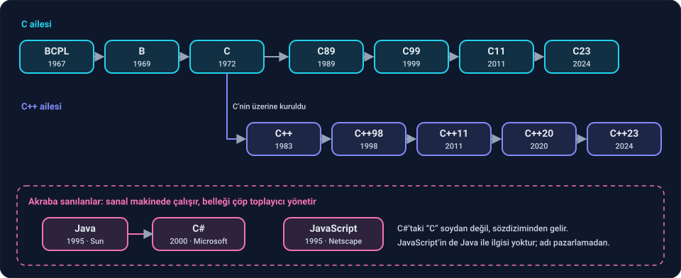

Faz 1'de algoritmayı kağıtta kurmayı öğrendin. Artık onu bilgisayara yazdırma zamanı. Bu fazın dili **C**.

Kod yazmaya başlamadan önce bu derste C'yi tanıyacağız: nereden geldi, neden hâlâ ayakta, C++ ve C# ile akrabalığı ne. Ortamı kurup ilk programı yazmak bir sonraki dersin konusu.

---

## 1. C nereden geldi?

1969'da Bell Laboratuvarları'nda Ken Thompson ve Dennis Ritchie, **Unix** adını verdikleri bir işletim sistemi üzerinde çalışıyordu. Unix assembly ile yazılmıştı. Bunun büyük bir sorunu vardı: assembly işlemciye özeldir. Unix'i başka bir bilgisayara taşımak, onu baştan yazmak demekti.

İhtiyaç belliydi: makineye assembly kadar yakın, ama bir makineye bağlı olmayan bir dil.

- **BCPL** (1967, Martin Richards): sade, taşınabilir bir sistem dili.
- **B** (1969, Ken Thompson): BCPL'in küçültülmüş hali. Ama veri tipi yoktu; her şey bir "word"dü. Faz 0'da gördüğün byte, halfword, word ayrımını yapamıyordu.
- **C** (1972, Dennis Ritchie): B'ye veri tipleri eklendi. Artık bir değişkenin bir byte mı, bir word mü olduğunu söyleyebiliyordun.

1973'te Unix'in çekirdeği C ile yeniden yazıldı. Bu bir dönüm noktasıydı: o yıllarda işletim sistemleri neredeyse her zaman assembly ile yazılırdı. Artık Unix'i yeni bir makineye taşımak için sadece C derleyicisini taşımak yetiyordu. Unix ve C birlikte dünyaya yayıldı.

1978'de Brian Kernighan ve Dennis Ritchie *The C Programming Language* kitabını yazdı. Yazarlarının baş harfleriyle **K&R** diye anılan bu kitap, yıllarca C'nin tanımı yerine geçti. Bu fazın ana kaynağı da o.

---

## 2. C hâlâ gelişiyor

C 50 yaşını geçti ama donmuş bir dil değil. 1989'dan beri uluslararası bir standart komitesi (ISO'daki WG14) C'yi düzenli olarak günceller:

| Sürüm | Yıl | Öne çıkanlar |
| --- | --- | --- |
| K&R C | 1978 | Kitabın tarif ettiği ilk C |
| **C89 / C90** | 1989 / 1990 | İlk resmi standart (ANSI, sonra ISO) |
| C95 | 1995 | Küçük bir ek: geniş karakterler |
| **C99** | 1999 | `//` yorumları, `long long`, `stdint.h`, değişkenleri bloğun ortasında tanımlama |
| **C11** | 2011 | İş parçacıkları (`threads.h`), atomik işlemler, `_Generic` |
| C17 | 2018 | Sadece hata düzeltmeleri, yeni özellik yok |
| **C23** | 2024 | `bool`, `true`, `false` artık anahtar kelime; `nullptr`, `typeof`, `0b1010` gibi ikilik sayılar, `#embed` |

Bir sonraki sürüm üzerinde çalışmalar sürüyor. Yani C, yarım asırdır hem kullanılan hem bakımı yapılan bir dil.

Bu kitapta C'yi modern haliyle, C99 ve sonrasının kurallarıyla yazacağız.

---

## 3. C nerede kullanılıyor?

"Eski bir dil" diye düşünme. Şu an bu sayfayı okurken kullandığın sistemlerin bir kısmı C ile yazılmış:

- **İşletim sistemleri:** Linux çekirdeği C ile yazılmıştır. Windows ve macOS çekirdeklerinin önemli bölümleri de C'dir.
- **Gömülü sistemler:** Çamaşır makinesi, araba beyni, akıllı saat, modem… Belleği kilobaytlarla ölçülen bu cihazlarda dil seçeneği neredeyse yoktur: C.
- **Veritabanları ve altyapı:** SQLite (dünyada en çok kullanılan veritabanı), PostgreSQL, Redis, nginx, curl, Git.
- **Başka dillerin kendisi:** Python'u çalıştıran resmi yorumlayıcı **CPython**, C ile yazılmıştır. Python'da yazdığın her satır, sonunda bir C programı tarafından çalıştırılır.

Ortak nokta: hızın, bellek kontrolünün ve donanıma yakınlığın şart olduğu her yer.

---

## 4. C++: neden çıktı, neden bu kadar zor?

1979'da yine Bell Laboratuvarları'nda Bjarne Stroustrup büyük yazılımlar üzerinde çalışıyordu. C hızlıydı ama büyük bir programı düzenli tutmak için araç sunmuyordu. Başka dillerde gördüğü **sınıf** fikrini (verilerle onları işleyen fonksiyonları bir arada tutmak) C'nin hızından vazgeçmeden istiyordu. Önce adına "C with Classes" dedi; 1983'te adı **C++** oldu. `++`, C'de "bir artır" demektir: C'nin bir fazlası.

C++ da düzenli güncellenir: C++98, C++11 (dili baştan yenileyen büyük sürüm), C++14, C++17, C++20, C++23, ve sıradaki C++26. Bugün oyun motorları (Unreal Engine), tarayıcılar (Chrome), Photoshop gibi büyük masaüstü uygulamaları, borsa sistemleri ve yapay zeka kütüphanelerinin hesap yapan çekirdekleri C++ ile yazılır.

**C++ en zor dillerden biridir.** Bunu açıkça söyleyelim, çünkü çoğu kişi tam tersini düşünür.

C++'ın sözdizimini öğrenmek birkaç hafta sürer. `class` yazmayı, `std::vector` kullanmayı, döngü kurmayı öğrenen herkes "C++ biliyorum" der. Ve C++'ı JavaScript ya da Python yazar gibi yazar. Sonuç: program çalışır, ama C++ bunun bedelini **performansla** ödetir. Bazen aynı işi yapan bir Python programından bile yavaş çalışır.

Neden? Çünkü C++ sana hiçbir şeyi saklamaz ve hiçbir şeyi senin yerine düzeltmez. Şu masum görünen fonksiyona bak:

```cpp
// Python alışkanlığıyla yazılmış
double ortalama(std::vector<double> sayilar) {
    double toplam = 0;
    for (auto x : sayilar) toplam += x;
    return toplam / sayilar.size();
}
```

Python'da bir listeyi fonksiyona vermek bedavadır. Burada ise `sayilar` parametresi, verilen vektörün **tamamının kopyasıdır**. 10 milyon sayılık bir vektörde, fonksiyon her çağrıldığında 80 megabayt bellek ayrılır, kopyalanır ve çöpe atılır. Çözüm tek bir işarettir: `const std::vector<double>& sayilar`. Ama o işaretin neden gerektiğini bilmek için belleğin nasıl çalıştığını bilmek gerekir.

C++ böyle yüzlerce tuzakla doludur: gereksiz kopyalar, bellekte dağınık duran nesneler, her yerde kullanılan sanal fonksiyonlar, gizli bellek ayırmaları… Hiçbiri hata vermez. Hepsi sessizce performansı yer.

**C++ herkesin kullanabileceği ama sadece ustaların iyi yazabildiği bir dildir.** Doğru kullanıldığında en hızlı ve en sağlam yazılımlar onunla yazılır; yanlış kullanıldığında en yavaş ve en kırılgan yazılımlar da onunla yazılır. Fark sözdiziminde değil, kodun altında ne olduğunu bilmektedir.

---

## 5. Yanlış anlaşılan akrabalıklar

Programlama dillerinin adları çoğu zaman yanıltıcıdır. Adı benzeyen iki dilin akraba olduğunu sanmak, yeni başlayanların en sık düştüğü yanılgılardan biridir. Üç tanesini düzeltelim.

**C ve C#.** Adındaki "C" yanıltmasın: **C#'ın C ve C++ ile soy bağı yoktur.** C# 2000 yılında Microsoft'ta Anders Hejlsberg tarafından tasarlandı ve asıl akrabası 1995'te çıkan **Java**'dır. İkisi de aynı felsefeyle çalışır:

- Program doğrudan işlemcide değil, bir **sanal makinede** çalışır (C# için .NET, Java için JVM).
- Belleği programcı değil, bir **çöp toplayıcı** yönetir.

C ve C++'ta ise program doğrudan işlemcide çalışır ve belleği programcı yönetir. C#, C'nin süslü parantezli yazım tarzını ödünç almıştır; benzerlik bundan ibarettir.

**Java ve JavaScript.** Adlarının yarısı ortak ama aralarında hiçbir ilgi yoktur. JavaScript 1995'te Netscape'te Brendan Eich tarafından tarayıcılar için tasarlandı. O yıllarda Java çok popülerdi; JavaScript adı, bu popülerlikten yararlanmak için pazarlama amacıyla seçildi.

**C ve C++.** Bu ikisi gerçekten akrabadır: C++, C'nin üzerine kurulmuştur. Ama iş ilanlarında sık görülen "C/C++" yazımı, ikisinin aynı dil olduğu izlenimini verir. Değildir. İyi yazılmış bir C programı ile iyi yazılmış bir C++ programı bambaşka görünür; birinde doğru olan alışkanlık, öbüründe yanlış olabilir. C bilmek C++'ı öğrenmeyi kolaylaştırır, ama C++ bildiğin anlamına gelmez.



Bu kitabın çizgisi **C → C++**. C# ve Java kötü diller değildir; Windows uygulamaları, Unity ile oyun geliştirme ve kurumsal sunucu yazılımlarında çok iyi iş çıkarırlar. Ama farklı bir felsefeyle çalışırlar ve bu kitabın konusu değildirler.

---

## 6. Neden C ile başlıyoruz?

Çünkü C, programlamanın **en saf, en ham** halidir.

- **Küçüktür.** İlk standart C'de sadece 32 anahtar kelime vardı. C++'ın standart belgesi C'ninkinin yaklaşık üç katı uzunluğundadır.
- **Hiçbir şey saklamaz.** Bir değişken bellekte bir kutudur, bir dizi yan yana kutulardır. Arka planda gizlice çalışan bir mekanizma yoktur.
- **Hatanın nereden geldiğini görürsün.** Python gibi dillerde bellek ve nesneler arka planda yönetilir; bir şey yavaşladığında ya da beklenmedik davrandığında sebebi çoğu zaman göremediğin o katmandadır. C'de ise hata ya senin kodundadır ya da senin kodunun belleğe yaptığı bir şeydedir. Bulmayı öğrendiğinde, başka hiçbir dilde hata seni korkutmaz.
- **Her şeyin nereden geldiğini öğrenirsin.** Diğer dillerin "hazır" sunduğu her şeyi (string, liste, yazdırma) C'de sıfırdan yazacağız. Sonra hangi dili kullanırsan kullan, arka planda ne olduğunu bileceksin.

---

## Kaynaklar

- Brian Kernighan & Dennis Ritchie, *The C Programming Language* (2. baskı), Önsöz ve Giriş: C'nin yaratıcılarından dilin felsefesi.
- Dennis Ritchie, *The Development of the C Language* (1993): C'nin doğuşunu yaratıcısından dinlemek için.
- Bjarne Stroustrup, *The Design and Evolution of C++*: C++'ın neden ve nasıl tasarlandığı.

**Sıradaki ders:** Ortamı kurup ilk programı yazacağız.
