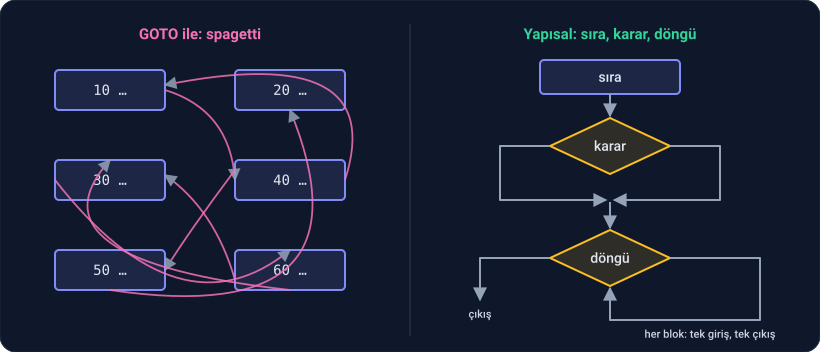
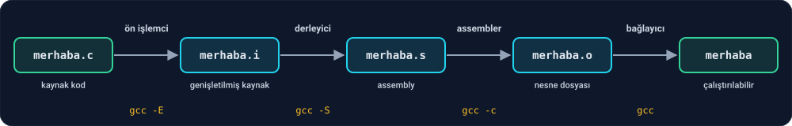

import { Tabs, TabItem } from '@astrojs/starlight/components';

Her programlama yolculuğu aynı cümleyle başlar: **Hello, world!** Bu derste ekrana o cümleyi yazdıracağız. Ama önce, bu kitap boyunca kullanacağın çalışma ortamını sağlam bir şekilde kuracağız. Bir kez doğru kurulan ortam, sonraki her derste işini kolaylaştırır.

---

## 1. Neye ihtiyacın var?

- **clang:** C kodunu çalıştırılabilir programa çeviren **derleyici**. LLVM adlı büyük bir derleyici projesinin parçasıdır.
- **LLDB:** Yine LLVM projesinden. Programı adım adım çalıştırıp her adımda değişkenlerin değerine bakmanı sağlayan **hata ayıklayıcı**. Faz 1'deki iz tablosunun dijital hali; Ders 2.6'da ayrıntısıyla kullanacağız.
- **VS Code:** Kodu yazacağın **editör**. Ücretsiz, her işletim sisteminde çalışır; derleme ve hata ayıklamayı tek tuşa bağlayacağız.

---

## 2. Kurulum

<Tabs>
  <TabItem label="Linux">
    **1. Derleyici ve hata ayıklayıcı.** Ubuntu ya da Debian kullanıyorsan terminalde:

    ```sh
    sudo apt update
    sudo apt install clang lldb curl
    ```

    **2. VS Code.** [code.visualstudio.com](https://code.visualstudio.com) adresinden `.deb` paketini indirip çift tıklayarak kur.
  </TabItem>
  <TabItem label="Windows">
    Windows'ta C'yi Linux üzerinde çalıştıracağız. Bunun için Windows'un içine gömülü bir Linux olan **WSL**'i (Windows Subsystem for Linux) kullanacağız.

    **1. WSL.** PowerShell'i **yönetici olarak** aç:

    ```sh
    wsl --install
    ```

    Bilgisayarı yeniden başlat. Başlat menüsünde çıkan **Ubuntu**'yu aç, bir kullanıcı adı ve parola belirle.

    **2. Derleyici ve hata ayıklayıcı.** Ubuntu penceresinde:

    ```sh
    sudo apt update
    sudo apt install clang lldb curl
    ```

    **3. VS Code.** [code.visualstudio.com](https://code.visualstudio.com) adresinden **Windows** sürümünü indirip kur. Ardından VS Code'da sol kenardaki Eklentiler simgesine (`Ctrl+Shift+X`) tıkla ve **WSL** eklentisini (Microsoft) kur. Bu eklenti, VS Code'un Windows'ta açılıp Ubuntu'nun içinde çalışmasını sağlar.

    Bu kitaptaki bütün terminal komutlarını **Ubuntu penceresinde** ya da VS Code'un WSL'e bağlı terminalinde yazacaksın.
  </TabItem>
  <TabItem label="macOS">
    **1. Derleyici ve hata ayıklayıcı.** Terminalde:

    ```sh
    xcode-select --install
    ```

    Bu komut clang'i ve LLDB'yi birlikte kurar. (macOS'ta `gcc` diye bir komut da görürsün; o da aslında clang'i çalıştırır. Biz her yerde doğrudan `clang` yazacağız.)

    **2. VS Code.** [code.visualstudio.com](https://code.visualstudio.com) adresinden indirip **Uygulamalar** klasörüne taşı. VS Code'u aç, `Cmd+Shift+P` ile komut paletini aç ve **Shell Command: Install 'code' command in PATH** komutunu çalıştır. Böylece terminalden `code` yazarak VS Code'u açabileceksin.
  </TabItem>
</Tabs>

Kurulumu kontrol et:

```sh
clang --version
lldb --version
```

İkisi de bir sürüm numarası gösteriyorsa hazırsın.

---

## 3. Çalışma alanını hazırla

Bu kitap boyunca yazacağın bütün kodlar **tek bir klasörde**, fazlara göre ayrılmış alt klasörlerde duracak. Klasörü oluşturmak ve VS Code'un ayar dosyalarını indirmek için terminale şu satırları yapıştır:

```sh
mkdir -p ~/yazilim-ogrenelim/faz-02 ~/yazilim-ogrenelim/.vscode
cd ~/yazilim-ogrenelim
ADRES=%SITE_URL%/kurulum
curl -fsSL $ADRES/tasks.json -o .vscode/tasks.json
curl -fsSL $ADRES/launch.json -o .vscode/launch.json
code .
```

İndirilen iki dosya VS Code'a C kodunu **nasıl derleyeceğini** (`tasks.json`) ve **nasıl çalıştıracağını** (`launch.json`) söyler. VS Code klasörü açar. (Windows'ta bu satırları Ubuntu penceresinde yaz; VS Code otomatik olarak WSL'e bağlanır, sol altta **WSL: Ubuntu** yazısını görürsün.)

**Eklentiler.** `Ctrl+Shift+X` (macOS'ta `Cmd+Shift+X`) ile eklentiler panelini aç ve iki eklenti kur:

- **C/C++** (Microsoft): Kodu renklendirir, yazarken hataları altını çizerek gösterir, fonksiyonları tamamlar.
- **CodeLLDB** (Vadim Chugunov): VS Code'un içinden LLDB ile hata ayıklamanı sağlar.

Windows'ta eklentilerin yanında **Install in WSL** düğmesi çıkarsa ona bas; eklentilerin Ubuntu tarafında çalışması gerekiyor.

**İki kısayol.** Artık her şey iki tuşta:

- `Ctrl+Shift+B` (macOS'ta `Cmd+Shift+B`): Açık olan `.c` dosyasını **derler**.
- `F5`: Derler ve **çalıştırır**. Satır numarasının soluna tıklayıp kırmızı nokta koyduysan program orada durur ve değişkenleri gösterir.

**Çıktılar `build` klasörüne gider.** Derlediğin her program, kaynak dosyanın yanına değil, `build` klasörünün içine, aynı alt klasör adıyla yazılır. Kodlarının yanında sadece kendi yazdığın `.c` dosyaları durur:

```txt
yazilim-ogrenelim/
├── .vscode/
│   ├── launch.json
│   └── tasks.json
├── build/
│   └── faz-02/
│       └── hello        ← derlenmiş program
└── faz-02/
    └── hello.c          ← senin kodun
```

`build` klasörünü istediğin zaman silebilirsin; bir sonraki derlemede yeniden oluşur. (macOS'ta programın yanında bir de `hello.dSYM` klasörü görürsün; hata ayıklayıcının kullandığı bilgiler orada durur.)

<details class="bilgi">
<summary>Ayar dosyalarının içinde ne var?</summary>

`.vscode/tasks.json`:

```json
{
  "version": "2.0.0",
  "tasks": [
    {
      "label": "derle",
      "type": "shell",
      "command": "mkdir -p \"build/${relativeFileDirname}\" && clang -std=c17 -Wall -Wextra -g \"${file}\" -o \"build/${relativeFileDirname}/${fileBasenameNoExtension}\"",
      "group": { "kind": "build", "isDefault": true },
      "problemMatcher": "$gcc"
    }
  ]
}
```

`.vscode/launch.json`:

```json
{
  "version": "0.2.0",
  "configurations": [
    {
      "name": "çalıştır",
      "type": "lldb",
      "request": "launch",
      "program": "${workspaceFolder}/build/${relativeFileDirname}/${fileBasenameNoExtension}",
      "preLaunchTask": "derle"
    }
  ]
}
```

İndirmek yerine bu iki dosyayı elle de oluşturabilirsin. Derleme komutundaki her bayrağın bir sebebi var:

| Bayrak | Anlamı | Neden? |
| --- | --- | --- |
| `-std=c17` | C17 standardına göre derle | Herkesin aynı kurallarla çalışması için. C17, C99 ve C11'in bütün özelliklerini içerir. |
| `-Wall -Wextra` | Bütün önemli uyarıları aç | Derleyici şüpheli gördüğü her yeri söyler. **Uyarıları hata gibi ciddiye al.** Çoğu hata, önce bir uyarı olarak belirir. |
| `-g` | Hata ayıklama bilgisi ekle | LLDB'nin satır numaralarını ve değişken adlarını tanıması için |
| `-o build/…` | Çıktıyı `build` klasörüne yaz | Kaynak kodla derlenmiş program birbirine karışmasın diye |

</details>

---

## 4. Hello, world!

`faz-02` klasöründe `hello.c` adında bir dosya oluştur:

```c
#include <stdio.h>

int main(void) {
    printf("Hello, world!\n");
    return 0;
}
```

`F5`'e bas. Alttaki terminalde şunu görmelisin:

```
Hello, world!
```

İlk C programın çalıştı. Satır satır ne olduğuna bakalım:

- `#include <stdio.h>`: `printf`'in nerede tanımlandığını derleyiciye söyler. `stdio`, "standart girdi/çıktı" demektir.
- `int main(void)`: `main` adında bir fonksiyon. `int` döndürür, yani bir tamsayı geri verir. `void` "hiç girdi almaz" demektir. Her C programı buradan başlar.
- `{` … `}`: Fonksiyonun gövdesi. Faz 1'deki sözde kodda girinti ne yapıyorsa, C'de süslü parantez onu yapar.
- `printf("Hello, world!\n");`: Ekrana yazı yazar. `\n` satır sonudur. Sondaki noktalı virgül, C'de her komutun sonuna konur.
- `return 0;`: Ders 1.1'deki `DÖNDÜR` ile aynı şey. Programı bitirir ve işletim sistemine 0 sayısını bırakır.

`printf`'i şimdilik bir **kara kutu** olarak kullanacağız: ne yaptığını biliyoruz, nasıl yaptığını değil. Bu kitabın kuralı belli: önce kendin yaz. Ders 2.11'de `printf`'i bir kenara bırakıp sayı yazdıran fonksiyonu sıfırdan yazacağız.

### Programın sessiz cevabı: çıkış kodu

`return 0;` satırındaki 0 nereye gitti? Görmek için ekrana hiçbir şey yazmayan bir program yazalım. `faz-02/first.c`:

```c
int main(void) {
    return 42;
}
```

`first.c` açıkken `Ctrl+Shift+B` ile derle. Bu sefer programı terminalden çalıştıralım. VS Code'da terminali `` Ctrl+` `` ile aç:

```sh
./build/faz-02/first
```

Hiçbir şey olmadı gibi görünüyor. Ama bir şey oldu. Şunu yaz:

```sh
echo $?
```

```
42
```

Her program bittiğinde işletim sistemine bir sayı bırakır: **çıkış kodu**. `return 42;` tam olarak bunu yaptı. `echo $?` ise "son çalışan programın çıkış kodunu göster" demektir. Geleneğe göre 0 "her şey yolunda", 0 dışındaki değerler "bir sorun oldu" anlamına gelir. Programlar birbirleriyle ilk olarak bu sayı üzerinden konuşur. `hello.c`'deki `return 0;` da "her şey yolunda" demekti.

---

## 5. main: her programın giriş kapısı

İşletim sistemi bir programı çalıştırdığında **nereden başlayacağını** bilmek zorundadır. C'de bu yer her zaman `main`'dir. Bir programda tek bir `main` olur; program oradan başlar, `main` bitince program da biter.

Bu fikir C'den sonra gelen hemen her dile geçti:

| Dil | Giriş noktası |
| --- | --- |
| C, C++ | `int main(void)` |
| Java | `public static void main(String[] args)` |
| C# | `static void Main()` |
| Go | `func main()` |
| Rust | `fn main()` |

**Python'da main var mı?** Python dosyayı yukarıdan aşağıya çalıştırır; zorunlu bir `main` yoktur. Ama büyük Python programlarında hep şu kalıbı görürsün:

```python
def main():
    print("Hello")

if __name__ == "__main__":
    main()
```

Bu, "program buradan başlar" demenin Python'daki yoludur. Zorunlu olmasa da herkes yazar, çünkü tek ve belli bir giriş kapısı olan program okunur, izlenir, anlaşılır. Neden bu kadar önemli olduğunu anlamak için, bu fikrin olmadığı zamanlara bakmak gerekiyor.

### Spagetti nereden geldi?

1960'larda yaygın dillerde (FORTRAN, BASIC, assembly) programın akışını yöneten başlıca araç **GOTO** idi: "şu satıra atla". Satırlar numaralıydı ve program istediği satıra istediği yerden atlayabiliyordu:

```txt
10 LET I = 1
20 IF I > 10 THEN GOTO 60
30 PRINT I
40 LET I = I + 1
50 GOTO 20
60 END
```

Altı satırda sorun yok. Ama bin satırlık bir programda her satır her satıra atlayabiliyorsa, akış diyagramını çizdiğinde okların birbirine dolandığını görürsün. Tabağa dökülmüş spagetti gibi: bir ucundan tutup çekince öbür ucunun nereden çıkacağını bilemezsin. Bu tür koda bu yüzden **spagetti kod** denir.



Çıkış yolu iki adımda bulundu:

- **1966, Böhm ve Jacopini:** Her algoritmanın sadece üç yapıyla yazılabileceğini ispatladılar: **sıra**, **karar** ve **döngü**. Ders 1.2'de çizdiğin üç şey tam olarak bunlar. GOTO'ya hiç gerek yok.
- **1968, Edsger Dijkstra:** *Go To Statement Considered Harmful* ("GOTO zararlı sayılır") başlıklı ünlü mektubunu yayımladı. Fikri basitti: program, metin olarak okunduğu sırayla çalışmalı. Bir satıra bakınca oraya nereden gelindiğini bilebilmelisin.

Bu yaklaşıma **yapısal programlama** dendi. Her bloğun tek bir girişi ve tek bir çıkışı olur; program küçük fonksiyonlara bölünür; her şey tek bir yerden, `main`'den başlar. C bu fikirle tasarlanmış ilk büyük dillerden biridir.

C'de `goto` hâlâ vardır ama nadiren, çok belli durumlarda kullanılır. Bu kitapta kullanmayacağız. Faz 1'de sıra, karar ve döngüyle her şeyi çizebildiysen, C'de de her şeyi onlarla yazabilirsin.

---

## 6. Derleme hattı: metinden programa

Bu bölümdeki komutları VS Code'un terminalinde, çalışma alanının ana klasöründe (`~/yazilim-ogrenelim`) çalıştır; çıktılar yine `build/faz-02` klasörüne gidecek. `Ctrl+Shift+B` tek bir komut çalıştırıyor gibi görünüyor. Aslında arka arkaya dört ayrı iş yapıyor. clang'e her adımda durmasını söyleyerek bu dört işi tek tek görebiliriz.



**1. Ön işleme: `clang -E`**

```sh
clang -E faz-02/hello.c -o build/faz-02/hello.i
```

**Ön işlemci**, `#` ile başlayan satırları işler. `#include <stdio.h>` satırı, `stdio.h` dosyasının **içeriğiyle** değiştirilir. Çıktının satırlarını say:

```sh
wc -l build/faz-02/hello.i
```

6 satırlık dosyan birkaç yüz satır olmuş olmalı (tam sayı sistemden sisteme değişir). Dosyanın en sonunda senin `main` fonksiyonun duruyor; üstündeki her şey `stdio.h`'den geldi.

**2. Derleme: `clang -S`**

```sh
clang -S faz-02/hello.c -o build/faz-02/hello.s
```

**Derleyici**, C kodunu **assembly**'ye çevirir. Assembly, işlemcinin anladığı komutların insanların okuyabileceği yazımıdır. Ortaya `hello.s` dosyası çıkar. İçinde ne olduğuna şimdilik bakmamıza gerek yok; assembly'yi Faz 7'de ayrıntısıyla öğreneceğiz. Şimdilik bilmen gereken: C kodu, işlemciye ulaşmadan önce bu ara dilden geçer.

**3. Assembly: `clang -c`**

```sh
clang -c faz-02/hello.c -o build/faz-02/hello.o
```

**Assembler**, assembly komutlarını işlemcinin anladığı sayılara, yani **makine koduna** çevirir. Çıkan `.o` dosyasına **nesne dosyası** denir. İçinde senin kodunun makine kodu var, ama henüz çalıştırılamaz: `printf`'in makine kodu nerede? O, senin dosyanda değil.

**4. Bağlama**

```sh
clang build/faz-02/hello.o -o build/faz-02/hello
./build/faz-02/hello
```

**Bağlayıcı** (linker), senin nesne dosyanı C kütüphanesindeki `printf` ile birleştirir ve işletim sisteminin çalıştırabileceği tek bir dosya üretir.

VS Code'da `Ctrl+Shift+B`'ye bastığında da bu dört adım arka planda çalışır. Dört adımı bir arada düşün: yazdığın metin önce genişler, sonra assembly'ye, sonra makine koduna dönüşür, en sonda başka kodlarla birleşir. Hata aldığında bu hattın **hangi adımında** olduğunu anlamak, hatanın yarısını çözmektir: `#include` dosyası bulunamadıysa ön işlemede, yazım hatası varsa derlemede, `printf` bulunamadıysa bağlamada.

---

## Alıştırmalar

**1** `first.c`'de `return 42;` yerine `return 300;` yaz, derle, çalıştır ve `echo $?` ile çıkış koduna bak. Ne görüyorsun? Neden? (İpucu: Faz 0, Bölüm 4.)

**2** `first.c`'de `return 42;` satırının sonundaki noktalı virgülü sil ve derle. Hata mesajını oku: hangi satırı ve hangi karakteri gösteriyor? Bu hata derleme hattının hangi adımında çıktı?

**3** `hello.c`'den `return 0;` satırını sil, derle, çalıştır ve çıkış koduna bak.

**4** `hello.c`'deki `#include <stdio.h>` satırını sil ve `clang -E` çıktısının satır sayısına tekrar bak. Sonra programı derlemeyi dene. Ne oluyor?

<details>
<summary>Cevaplar</summary>

**1** Çıkış kodu **44** olur. Çıkış kodu 8 bitlik bir sayıdır, yani 0 ile 255 arasında olabilir. 300 sekiz bite sığmaz: 300 − 256 = 44. Faz 0'daki 8 bit taşmasının aynısı.

**2** clang şöyle der:

```
first.c:2:14: error: expected ';' after return statement
    2 |     return 42
      |              ^
      |              ;
```

(VS Code'da derlediysen dosya adının başında klasörün tam yolu da yazar.) `first.c:2:14` "dosya first.c, satır 2, karakter 14" demek: noktalı virgülün olması gereken yer. clang bir adım daha ileri gidip altına ne yazman gerektiğini de gösteriyor: `;`. Hata **derleme** adımında çıktı; ön işlemci bu satırla ilgilenmez, derleyici ise C'nin yazım kurallarını denetler.

**3** Çıkış kodu **0** olur. C99'dan beri özel bir kural var: `main` fonksiyonu `return` yazmadan biterse 0 döndürmüş sayılır. Bu kural sadece `main` için geçerlidir. Yine de bu kitapta `return 0;` yazacağız; ne döndürdüğümüzü açıkça görmek istiyoruz.

**4** `clang -E` çıktısı birkaç satıra iner; `stdio.h`'nin içeriği artık eklenmiyor. Derlemeye çalıştığında clang şöyle der:

```
hello.c:3:5: error: call to undeclared library function 'printf' ...
note: include the header <stdio.h> or explicitly provide a declaration for 'printf'
```

Yani `printf`'in tanımlı olmadığını söylüyor ve hangi dosyayı eklemen gerektiğini de öneriyor. (clang'in eski sürümlerinde bu bir hata değil uyarıdır; ama uyarıları hata gibi ciddiye alıyoruz.) `#include`'un ne işe yaradığını şimdi gördün: derleyiciye `printf`'in var olduğunu ve nasıl çağrılacağını söylüyor.

</details>

---

## Kaynaklar

- Brian Kernighan & Dennis Ritchie, *The C Programming Language* (2. baskı), Bölüm 1: ilk program ve C'nin genel turu.
- Edsger Dijkstra, *Go To Statement Considered Harmful*, Communications of the ACM, 1968.
- [VS Code belgeleri: C/C++ for Visual Studio Code](https://code.visualstudio.com/docs/languages/cpp)

**Sıradaki ders:** Programlamanın temelleri: değişkenler, kararlar, döngüler, fonksiyonlar ve yapılar.
