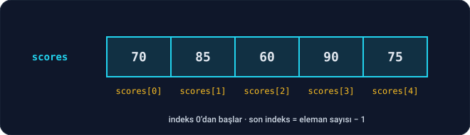
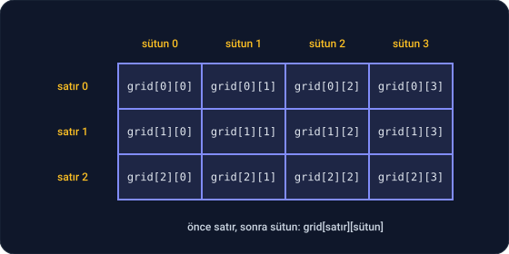
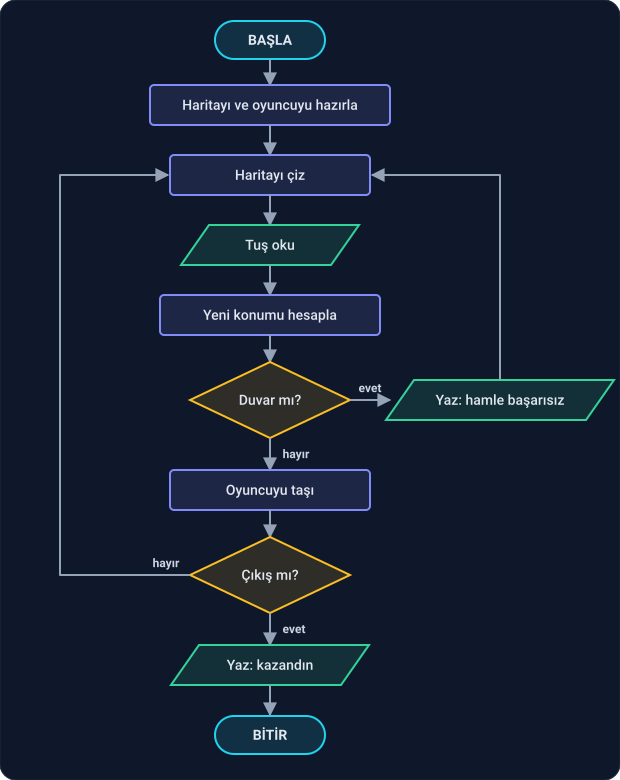

Şimdiye kadar her değeri ayrı bir kutuda tuttuk. Ama bir sınıftaki 30 öğrencinin notu, bir haftanın 7 günlük sıcaklığı, bir oyunun haritası… Bunlar için 30 ayrı değişken açmak hem yorucu hem de imkânsıza yakın. Bu derste aynı türden çok sayıda değeri tek bir isim altında tutmayı öğreneceğiz: **array** (dizi).

Ders iki parçadan oluşuyor:

1. **Array'ler:** Bölüm 1–7. Küçük örneklerle array'i kafanda oturtacağız.
2. **Labirent oyunu:** Bölüm 8. Öğrendiklerimizle, iki boyutlu bir harita üzerinde oynanan küçük bir oyun yazacağız. Ama asıl amaç oyunun kendisi değil: bir programın **nasıl tasarlandığını ve adım adım nasıl büyütüldüğünü** görmek.

Bu derste sadece fonksiyonun içinde tanımlanan, boyutu baştan belli olan array'leri kullanacağız. Boyutu program çalışırken belirlenen array'leri Faz 4'te göreceğiz.

---

## 1. Neden array?

Beş öğrencinin notunu tutmak istediğini düşün:

```c
int score1 = 70;
int score2 = 85;
int score3 = 60;
int score4 = 90;
int score5 = 75;
```

Ortalamayı bulmak için beşini tek tek toplaman gerekir. Öğrenci sayısı 100 olsa? 100 değişken, 100 terimli bir toplama… Üstelik döngü de kullanamazsın, çünkü her değişkenin adı farklı.

Array bu sorunu çözer:

```c
int scores[5] = {70, 85, 60, 90, 75};
```

"`scores` adında, içinde **5 tane** `int` olan bir array aç; içine sırayla 70, 85, 60, 90 ve 75'i koy."



Array, **yan yana dizilmiş kutulardır**. Faz 0'daki "bellek, numaralandırılmış kutulardan oluşan bir raf" benzetmesini hatırla: array, o raftaki yan yana duran birkaç kutuya tek bir isim vermektir. Her kutuya **indeks** denen sırasıyla ulaşılır.

---

## 2. Tanımlama ve erişim

**İndeks 0'dan başlar.** Bu, yeni başlayanları en çok şaşırtan kuraldır: 5 elemanlı bir array'in ilk elemanı `scores[0]`, son elemanı `scores[4]`'tür. `scores[5]` diye bir kutu **yoktur**.

```c
#include <stdio.h>

int main(void) {
    int scores[5] = {70, 85, 60, 90, 75};

    printf("İlk not: %d\n", scores[0]);
    printf("Son not: %d\n", scores[4]);

    scores[2] = 65;
    printf("Üçüncü not artık: %d\n", scores[2]);
    return 0;
}
```

```
İlk not: 70
Son not: 75
Üçüncü not artık: 65
```

`scores[2]`, tıpkı bir değişken gibi okunur ve değiştirilir.

**Döngüyle gezmek.** Array'in asıl gücü burada: indeks bir sayı olduğu için, onu bir döngü değişkeni yapabiliriz.

```c
#include <stdio.h>

#define SIZE 5

int main(void) {
    int scores[SIZE] = {70, 85, 60, 90, 75};

    for (int i = 0; i < SIZE; i++) {
        printf("scores[%d] = %d\n", i, scores[i]);
    }
    return 0;
}
```

```
scores[0] = 70
scores[1] = 85
scores[2] = 60
scores[3] = 90
scores[4] = 75
```

İki yenilik var:

- `#define SIZE 5` → "Kodda `SIZE` gördüğün her yere `5` yaz." Bunu, Ders 2.2'deki derleme hattının ilk adımı olan **preprocessor** yapar. Array'in boyutunu tek bir yerde yazarız; boyut değişirse sadece orayı değiştiririz.
- `for (int i = 0; i < SIZE; i++)` → İndeks 0'dan başlar ve `SIZE`'dan **küçük** olduğu sürece devam eder. `<=` değil `<`: son indeks 4'tür, 5 değil. Array ile yazacağın döngülerin neredeyse hepsi bu kalıpta olacak.

**Diğer tanımlama biçimleri:**

```c
int a[5] = {1, 2, 3, 4, 5};   // Hepsine değer ver
int b[5] = {1, 2};            // İlk ikisi 1 ve 2, kalanlar 0
int c[5] = {0};               // Hepsi 0
int d[] = {4, 8, 15};         // Boyutu yazma; değer sayısından 3 olarak anlaşılır
```

---

## 3. Array ile hesaplar

Array'i döngüyle gezmeyi öğrendin; artık her şey bir döngü uzaklığında.

```c
#include <stdio.h>

#define SIZE 5

int main(void) {
    int scores[SIZE] = {70, 85, 60, 90, 75};

    // Toplam ve ortalama
    int total = 0;
    for (int i = 0; i < SIZE; i++) {
        total += scores[i];
    }
    printf("Ortalama: %d\n", total / SIZE);

    // En yüksek not (Ders 1.1'deki EnBüyük algoritması)
    int best = scores[0];
    for (int i = 1; i < SIZE; i++) {
        if (scores[i] > best) {
            best = scores[i];
        }
    }
    printf("En yüksek: %d\n", best);

    // Kaç kişi 70 ve üstü aldı?
    int count = 0;
    for (int i = 0; i < SIZE; i++) {
        if (scores[i] >= 70) {
            count++;
        }
    }
    printf("70 ve üstü: %d kişi\n", count);

    // Tersten yazdır
    for (int i = SIZE - 1; i >= 0; i--) {
        printf("%d ", scores[i]);
    }
    printf("\n");
    return 0;
}
```

```
Ortalama: 76
En yüksek: 90
70 ve üstü: 4 kişi
75 90 60 85 70 
```

En yüksek notu bulan kısma dikkat et: Ders 1.1'de pseudocode ile yazdığın EnBüyük algoritmasının birebir C hali. O gün kağıtta yaptığın iş, bugün çalışan bir programın parçası.

---

## 4. Array'in sınırları

5 elemanlı bir array'de `scores[5]` ya da `scores[-1]` yazarsan ne olur?

**C bunu kontrol etmez.** Program array'in bittiği yerden sonraki belleği okur ya da oraya yazar. Sonuç belli değildir: program çökebilir, saçma bir sayı gösterebilir ya da en kötüsü, hiçbir şey olmamış gibi devam edip başka bir değişkeni sessizce bozabilir.

İndeks sabit bir sayıysa compiler seni uyarır:

```
warning: array index 5 is past the end of the array (that has type 'int[5]')
```

Ama indeks bir değişkense (`scores[i]`) compiler bunu önceden bilemez. Array'in dışına çıkmamak **senin sorumluluğundur**. Bu yüzden döngü koşullarını yazarken hep kendine sor: "İndeksin alabileceği en küçük ve en büyük değer ne? İkisi de array'in içinde mi?" Ders 1.3'teki edge case alışkanlığı burada hayat kurtarır.

---

## 5. Array'i fonksiyona vermek

Bir array'i fonksiyona verirken, **boyutunu da ayrıca** vermemiz gerekir; fonksiyon array'in kaç elemanlı olduğunu kendiliğinden bilemez:

```c
#include <stdio.h>

#define SIZE 5

int sum(int numbers[], int size) {
    int total = 0;
    for (int i = 0; i < size; i++) {
        total += numbers[i];
    }
    return total;
}

void double_all(int numbers[], int size) {
    for (int i = 0; i < size; i++) {
        numbers[i] = numbers[i] * 2;
    }
}

int main(void) {
    int values[SIZE] = {1, 2, 3, 4, 5};

    printf("Toplam: %d\n", sum(values, SIZE));

    double_all(values, SIZE);
    printf("İki katı: ");
    for (int i = 0; i < SIZE; i++) {
        printf("%d ", values[i]);
    }
    printf("\n");
    return 0;
}
```

```
Toplam: 15
İki katı: 2 4 6 8 10 
```

**Dikkat: array'ler kopyalanmaz.** Ders 2.3'te "fonksiyon, kendisine verilen değerin kopyasıyla çalışır" demiştik. Array'ler bu kuralın **istisnasıdır**: `double_all` kopya üzerinde değil, `main`'deki array'in **kendisi** üzerinde çalıştı ve onu değiştirdi. Bunun nedenini Faz 4'te, belleğin nasıl çalıştığını gördüğümüzde anlayacağız. Şimdilik kuralı bil: array'i fonksiyona verdiğinde, fonksiyon asıl array'i değiştirebilir.

---

## 6. Struct array'leri

Ders 2.3'teki struct'larla array'ler birleşince güçlü bir araç çıkar. Her öğrencinin numarasını ve notunu bir arada tutalım:

```c
#include <stdio.h>

#define COUNT 4

struct Student {
    int id;
    int score;
};

int main(void) {
    struct Student students[COUNT] = {
        {101, 70},
        {102, 92},
        {103, 58},
        {104, 85},
    };

    for (int i = 0; i < COUNT; i++) {
        printf("%d numaralı öğrenci: %d\n", students[i].id, students[i].score);
    }

    // En yüksek notu alan öğrenci
    int best = 0;
    for (int i = 1; i < COUNT; i++) {
        if (students[i].score > students[best].score) {
            best = i;
        }
    }
    printf("Birinci: %d numara, %d puan\n", students[best].id, students[best].score);
    return 0;
}
```

```
101 numaralı öğrenci: 70
102 numaralı öğrenci: 92
103 numaralı öğrenci: 58
104 numaralı öğrenci: 85
Birinci: 102 numara, 92 puan
```

`students[i].score` → "`students` array'inin `i`. elemanının `score`'u." Önce köşeli parantezle kutuyu seçiyoruz, sonra noktayla kutunun içindeki parçaya ulaşıyoruz.

En iyi öğrenciyi bulurken bu sefer notun kendisini değil, **indeksini** (`best`) tuttuk. Böylece hem notuna hem numarasına ulaşabildik.

---

## 7. İki boyutlu array'ler

Bazı veriler doğal olarak bir **tablo** şeklindedir: bir satranç tahtası, sinemadaki koltuklar, bir oyun haritası. Bunlar için **iki boyutlu array** kullanılır: satırlardan ve sütunlardan oluşan bir ızgara.



```c
int grid[3][4];
```

"3 satırlı, her satırında 4 sütun olan bir ızgara." Bir kutuya ulaşmak için iki indeks gerekir: **önce satır, sonra sütun**. `grid[1][2]`, 1. satırın 2. sütunudur (ikisi de 0'dan başlayarak).

İki boyutlu array'i gezmek için Ders 2.3'teki **iç içe döngü** tam olarak gereken şey: dış döngü satırları, iç döngü sütunları gezer.

**Örnek: sinema salonu.** 0 boş, 1 dolu koltuk:

```c
#include <stdio.h>

#define ROWS 4
#define COLS 6

int main(void) {
    int seats[ROWS][COLS] = {
        {1, 1, 0, 0, 1, 1},
        {0, 1, 1, 1, 1, 0},
        {0, 0, 0, 1, 0, 0},
        {1, 0, 0, 0, 0, 1},
    };

    int empty = 0;
    for (int row = 0; row < ROWS; row++) {
        for (int col = 0; col < COLS; col++) {
            if (seats[row][col] == 1) {
                printf("X ");
            } else {
                printf(". ");
                empty++;
            }
        }
        printf("\n");
    }
    printf("Boş koltuk: %d\n", empty);

    seats[2][2] = 1;   // 2. sıranın 2. koltuğu satıldı
    printf("Satıştan sonra seats[2][2] = %d\n", seats[2][2]);
    return 0;
}
```

```
X X . . X X 
. X X X X . 
. . . X . . 
X . . . . X 
Boş koltuk: 13
Satıştan sonra seats[2][2] = 1
```

İlk değer verirken her satır kendi süslü parantezinin içinde. Kodu bu şekilde hizalı yazarsan, ızgaranın şeklini kodun içinde de görebilirsin. Bir sonraki bölümde labirent haritasını tam olarak bu şekilde çizeceğiz.

İki boyutlu bir array'i fonksiyona verirken **sütun sayısını** yazmak zorundasın: `void print_seats(int seats[ROWS][COLS])`. Fonksiyon, bir satırın nerede bitip ötekinin nerede başladığını ancak böyle bilebilir.

---

## 8. Proje: labirent oyunu

Şimdi öğrendiklerimizi bir araya getirip küçük bir oyun yazacağız:

```
###########
#*  #     #
# # # ### #
# #   #   #
# ##### # #
#       #E#
###########
```

`*` sensin, `#` duvar, `E` çıkış. `w`, `a`, `s`, `d` tuşlarıyla yukarı, sola, aşağı ve sağa gidiyorsun. Duvara doğru hamle yaparsan hamle başarısız olur ve yerinde kalırsın. Çıkışa ulaşırsan kazanırsın.

Bu bölümde oyunu **tek seferde yazmayacağız**. Gerçek hayatta da hiçbir program tek seferde yazılmaz. Önce düşüneceğiz, sonra en küçük çalışan parçayı yazacağız, çalıştıracağız, eksiğini göreceğiz, ekleyeceğiz. Kod büyüyüp karışmaya başlayınca durup toparlayacağız. Her adımda **neden** öyle yaptığımızı konuşacağız. Bu bölümden almanı istediğim asıl şey oyun değil, bu çalışma biçimi.

### 8.1 Önce düşün

Ders 1.1'deki gibi, kod yazmadan önce problemi tanımlayalım:

- **Girdi:** Oyuncunun bastığı tuşlar: `w`, `a`, `s`, `d`, çıkmak için `q`.
- **Çıktı:** Her hamleden sonra ekrana çizilen harita.
- **Kurallar:**
  - Oyuncu her hamlede bir kare ilerler.
  - Gideceği kare duvarsa hamle başarısız olur, oyuncu yerinde kalır.
  - Oyuncu çıkışa ulaşınca oyun biter.

**Hangi verileri tutmamız gerekiyor?**

- **Harita:** Satırları ve sütunları olan bir ızgara. Bölüm 7'deki sinema salonunun aynısı: iki boyutlu bir `int` array'i. Her kutuda bir sayı: 0 boş, 1 duvar, 2 çıkış.
- **Oyuncunun yeri:** Bir satır ve bir sütun numarası.

Dikkat: oyuncuyu haritanın içine yazmıyoruz. Harita hiç değişmiyor; değişen tek şey oyuncunun yeri. Oyuncuyu ayrı tutmak, işimizi çok kolaylaştıracak.

**Akış.** Oyun bir döngüdür: çiz, tuş oku, hareket et, tekrar çiz… Faz 1'deki gibi önce akış diyagramını çizelim:



İki geri dönen ok var: duvara çarpınca da, çıkışa ulaşmadan ilerleyince de tekrar "Haritayı çiz" adımına dönülüyor. Döngüden çıkışın tek yolu çıkışa ulaşmak (bir de `q` tuşu; diyagramı sade tutmak için çizmedik).

**Plan.** Diyagramın hepsini birden yazmayacağız. Şu sırayla, her adımda çalışan bir program elde ederek ilerleyeceğiz:

1. Sadece haritayı çiz.
2. Oyuncuyu haritaya ekle.
3. Oyuncuyu tuşlarla hareket ettir.
4. Duvarları ve çıkışı kontrol et.
5. Kodu toparla.
6. Cilala.

### 8.2 Adım 1: haritayı çiz

İlk hedef çok küçük: haritayı ekrana çizmek. Ne hareket var ne oyuncu.

```c
#include <stdio.h>

#define ROWS 7
#define COLS 11

int main(void) {
    // 0: boş, 1: duvar, 2: çıkış
    int map[ROWS][COLS] = {
        {1, 1, 1, 1, 1, 1, 1, 1, 1, 1, 1},
        {1, 0, 0, 0, 1, 0, 0, 0, 0, 0, 1},
        {1, 0, 1, 0, 1, 0, 1, 1, 1, 0, 1},
        {1, 0, 1, 0, 0, 0, 1, 0, 0, 0, 1},
        {1, 0, 1, 1, 1, 1, 1, 0, 1, 0, 1},
        {1, 0, 0, 0, 0, 0, 0, 0, 1, 2, 1},
        {1, 1, 1, 1, 1, 1, 1, 1, 1, 1, 1},
    };

    for (int row = 0; row < ROWS; row++) {
        for (int col = 0; col < COLS; col++) {
            if (map[row][col] == 1) {
                printf("#");
            } else if (map[row][col] == 2) {
                printf("E");
            } else {
                printf(" ");
            }
        }
        printf("\n");
    }
    return 0;
}
```

```
###########
#   #     #
# # # ### #
# #   #   #
# ##### # #
#       #E#
###########
```

Çalıştı. Kodun içindeki sayılara bakıp ekrandaki haritayla karşılaştır: 1'lerin olduğu her yerde `#` var. Haritayı değiştirmek istersen sadece sayıları değiştirmen yeterli.

Dikkat ettin mi: haritanın bütün kenarları duvar. Bu bilinçli bir seçim, birazdan neden önemli olduğunu göreceğiz.

### 8.3 Adım 2: oyuncuyu ekle

Oyuncunun yerini tutacak iki değişken ekleyelim ve çizerken o kareye `*` koyalım. Değişen yerler:

```c
    int player_row = 1;
    int player_col = 1;

    for (int row = 0; row < ROWS; row++) {
        for (int col = 0; col < COLS; col++) {
            if (row == player_row && col == player_col) {
                printf("*");
            } else if (map[row][col] == 1) {
                printf("#");
            } else if (map[row][col] == 2) {
                printf("E");
            } else {
                printf(" ");
            }
        }
        printf("\n");
    }
```

```
###########
#*  #     #
# # # ### #
# #   #   #
# ##### # #
#       #E#
###########
```

Neden oyuncu kontrolü **en başta**? Çünkü oyuncu bir karede duruyorsa, o karede başka ne olursa olsun `*` görmek istiyoruz. `if-else if` zincirinde ilk doğru olan kazanır (Ders 2.3).

### 8.4 Adım 3: hareket et

Şimdi oyun döngüsünü kuralım: çiz, tuş oku, oyuncuyu taşı, tekrar çiz.

**Klavyeden tuş okumak.** `getchar()` klavyeden bir karakter okur ve onu bir sayı olarak geri verir. Faz 0'daki ASCII tablosunu hatırla: her harf aslında bir sayıdır. C'de bir karakteri **tek tırnak** içinde yazarsan, o karakterin sayısını yazmış olursun: `'w'` ile 119 aynı şeydir. Böylece `if (key == 'w')` diye kolayca karşılaştırabiliriz.

Bir incelik var: terminal, sen **Enter**'a basana kadar bekler. Enter da bir karakterdir: `'\n'`. Yani `w` yazıp Enter'a bastığında `getchar()` önce `'w'`'yi, bir sonraki çağrıda da `'\n'`'yi verir. Enter'ları atlamak için okumayı bir `do-while` içine koyuyoruz: "Enter olmayan bir karakter gelene kadar okumaya devam et."

**Sonsuz döngü.** Oyun, oyuncu çıkana kadar sürmeli. Kaç tur süreceği belli değil. `while (1)` yazıyoruz: 1 her zaman "doğru" olduğu için bu döngü kendiliğinden bitmez; oyundan çıkılacağı zaman içeriden `break` ile çıkacağız.

```c
#include <stdio.h>

#define ROWS 7
#define COLS 11

int main(void) {
    // 0: boş, 1: duvar, 2: çıkış
    int map[ROWS][COLS] = {
        {1, 1, 1, 1, 1, 1, 1, 1, 1, 1, 1},
        {1, 0, 0, 0, 1, 0, 0, 0, 0, 0, 1},
        {1, 0, 1, 0, 1, 0, 1, 1, 1, 0, 1},
        {1, 0, 1, 0, 0, 0, 1, 0, 0, 0, 1},
        {1, 0, 1, 1, 1, 1, 1, 0, 1, 0, 1},
        {1, 0, 0, 0, 0, 0, 0, 0, 1, 2, 1},
        {1, 1, 1, 1, 1, 1, 1, 1, 1, 1, 1},
    };

    int player_row = 1;
    int player_col = 1;

    while (1) {
        // Haritayı çiz
        for (int row = 0; row < ROWS; row++) {
            for (int col = 0; col < COLS; col++) {
                if (row == player_row && col == player_col) {
                    printf("*");
                } else if (map[row][col] == 1) {
                    printf("#");
                } else if (map[row][col] == 2) {
                    printf("E");
                } else {
                    printf(" ");
                }
            }
            printf("\n");
        }

        // Tuş oku
        int key;
        do {
            key = getchar();
        } while (key == '\n');

        if (key == 'q' || key == EOF) {
            break;
        }

        // Yeni konumu hesapla
        int new_row = player_row;
        int new_col = player_col;
        if (key == 'w') {
            new_row = new_row - 1;
        } else if (key == 's') {
            new_row = new_row + 1;
        } else if (key == 'a') {
            new_col = new_col - 1;
        } else if (key == 'd') {
            new_col = new_col + 1;
        }

        // Oyuncuyu taşı
        player_row = new_row;
        player_col = new_col;
    }
    return 0;
}
```

(`EOF`, "girdi bitti" demektir. Terminalde `Ctrl+D`'ye basarsan `getchar()` bunu döndürür. Döngünün sonsuza kadar dönmemesi için onu da `q` gibi çıkış sayıyoruz.)

Neden önce `new_row` ve `new_col`'u hesaplayıp sonra oyuncuyu taşıdık, doğrudan `player_row`'u değiştirmedik? Şimdilik fark etmiyor gibi görünüyor. Ama akış diyagramına bak: taşımadan önce "duvar mı?" diye soracağız. Gideceğimiz yeri önce **ayrı bir yerde** hesaplamak, o soruyu sormamıza yer açıyor. Bir sonraki adımı düşünerek yazılmış bir satır.

`F5` ile çalıştır, alttaki terminale `d` yazıp Enter'a bas, birkaç kez tekrarla:

```
###########
#   *     #
# # # ### #
# #   #   #
# ##### # #
#       #E#
###########
```

**Ne eksik?** Üç kez sağa gittik ve oyuncu **duvarın içine girdi**: 4. sütundaki `#`'nin yerinde artık `*` var. Henüz duvar kontrolü yazmadık. Bu, programı her adımda çalıştırmanın neden önemli olduğunu gösteriyor: eksik, kendini hemen gösterdi.

### 8.5 Adım 4: duvarlar ve çıkış

Akış diyagramındaki iki kararı ekleyelim. "Oyuncuyu taşı" kısmını şöyle değiştiriyoruz:

```c
        // Duvar mı?
        if (map[new_row][new_col] == 1) {
            printf("Duvar! Hamle başarısız.\n");
            continue;
        }

        // Oyuncuyu taşı
        player_row = new_row;
        player_col = new_col;

        // Çıkışa ulaştı mı?
        if (map[player_row][player_col] == 2) {
            printf("Tebrikler, labirentten kurtuldun!\n");
            break;
        }
```

- Gidilecek kare duvarsa mesaj yazıyor ve `continue` ile döngünün başına, yani "Haritayı çiz" adımına dönüyoruz. Oyuncu taşınmadı; yerinde kaldı.
- Duvar değilse taşıyoruz ve çıkışa ulaşıp ulaşmadığına bakıyoruz. Ulaştıysa `break` ile oyun bitiyor.

Önceki adımda `new_row` ve `new_col`'u ayrı hesaplamıştık; işte o ayrım burada işe yaradı. Taşımadan önce bakabiliyoruz.

**Neden array'in dışına hiç çıkmıyoruz?** Bölüm 4'ü hatırla: `map[-1][3]` gibi bir yere bakmak tehlikeli. Ama haritanın bütün kenarları duvar. Oyuncu en kenara gitmeye çalıştığında gideceği kare bir duvar oluyor, hamle başarısız sayılıyor ve oyuncu hiçbir zaman array'in dışına adım atmıyor. Kenarları duvarla çevirmek, bütün bu sorunu tek seferde çözen bir **tasarım kararı**.

Oyun artık çalışıyor ve kazanılabiliyor. Bitti mi?

### 8.6 Adım 5: kodu toparla

Oyun çalışıyor, ama koda dürüstçe bakalım. `main` 70 satırı geçti ve her şey iç içe:

- **Çizim** kodu, döngünün içinde 15 satır yer kaplıyor. Kazanınca haritayı bir kez daha çizmek istesek, o 15 satırı kopyalamamız gerekecek.
- **0, 1, 2** sayıları kodun her yerine dağılmış. `map[...] == 1` gören biri, 1'in "duvar" demek olduğunu bilmek için yukarıdaki yoruma gitmek zorunda.
- Oyuncunun yeri **iki ayrı değişkende** duruyor: `player_row` ve `player_col`. Hep birlikte değişiyorlar, hep birlikte kullanılıyorlar. Ayrı durmaları için bir sebep yok.

Bunları **davranışı değiştirmeden**, küçük adımlarla düzelteceğiz. Her küçük adımdan sonra programı çalıştırıp hâlâ aynı şekilde çalıştığından emin ol. Kodun ne yaptığını değiştirmeden nasıl yazıldığını iyileştirmeye **refactoring** (yeniden düzenleme) denir; yazılımcıların günlük işinin büyük kısmı budur.

**Toparlama 1: sayılara isim ver.** Sihirli sayılar yerine isimli sabitler:

```c
#define EMPTY 0
#define WALL 1
#define EXIT 2
```

Artık `map[new_row][new_col] == 1` yerine `map[new_row][new_col] == WALL` yazıyoruz. Okuyan herkes ne kastedildiğini anında anlıyor.

**Toparlama 2: oyuncunun yerini bir struct'a koy.** Ders 2.3'teki `struct` tam bunun için:

```c
struct Position {
    int row;
    int col;
};
```

`int player_row = 1; int player_col = 1;` yerine `struct Position player = {1, 1};`. Bir güzel yan etkisi de var: "yeni konum" da bir `struct Position` olabilir ve oyuncuyu taşımak tek satıra iner: `player = next;`.

**Toparlama 3: çizimi fonksiyona taşı.** Döngünün içindeki 15 satırlık çizim kodunu olduğu gibi bir fonksiyona alıyoruz:

```c
void draw_map(int map[ROWS][COLS], struct Position player) {
    for (int row = 0; row < ROWS; row++) {
        for (int col = 0; col < COLS; col++) {
            if (row == player.row && col == player.col) {
                printf("*");
            } else if (map[row][col] == WALL) {
                printf("#");
            } else if (map[row][col] == EXIT) {
                printf("E");
            } else {
                printf(" ");
            }
        }
        printf("\n");
    }
}
```

Döngünün içindeki 15 satır artık tek satır: `draw_map(map, player);`. Kazanınca haritayı tekrar çizmek de artık tek satır.

**Toparlama 4: tuş okumayı fonksiyona taşı.**

```c
int read_key(void) {
    int key;
    do {
        key = getchar();
    } while (key == '\n');
    return key;
}
```

**Toparlama 5: yeni konum hesabını fonksiyona taşı.** Bunu yaparken uzun `if-else if` zincirini de, Ders 2.3'teki `switch`'e çeviriyoruz; bir değişkenin belli değerlerine göre iş yapmak tam onun işi:

```c
struct Position next_position(struct Position p, int key) {
    switch (key) {
        case 'w': p.row--; break;
        case 's': p.row++; break;
        case 'a': p.col--; break;
        case 'd': p.col++; break;
    }
    return p;
}
```

`p`, fonksiyona gelen konumun **kopyası** (Ders 2.3). Kopyayı değiştirip geri veriyoruz; oyuncunun asıl konumu, biz `player = next;` diyene kadar değişmiyor. Adım 3'te `new_row`'u ayrı hesaplamamızın sebebi buradaki tasarıma birebir taşındı.

**Toparlama 6: soruları fonksiyona taşı.**

```c
int is_wall(int map[ROWS][COLS], struct Position p) {
    return map[p.row][p.col] == WALL;
}

int is_exit(int map[ROWS][COLS], struct Position p) {
    return map[p.row][p.col] == EXIT;
}
```

Bunlar tek satırlık fonksiyonlar. Neden zahmet? Çünkü `main`'i okuyan kişi artık `map[next.row][next.col] == WALL` yerine `is_wall(map, next)` okuyacak. Kod, akış diyagramındaki kutular gibi okunmaya başlıyor.

**Sonuç: `main`'in son hali.**

```c
    while (1) {
        draw_map(map, player);

        int key = read_key();
        if (key == 'q' || key == EOF) {
            break;
        }

        struct Position next = next_position(player, key);
        if (is_wall(map, next)) {
            printf("Duvar! Hamle başarısız.\n");
            continue;
        }

        player = next;

        if (is_exit(map, player)) {
            printf("Tebrikler, labirentten kurtuldun!\n");
            break;
        }
    }
```

Bunu akış diyagramının yanına koy: çiz, tuş oku, yeni konumu hesapla, duvar mı, taşı, çıkış mı. **Kod ile diyagram artık neredeyse satır satır aynı.** Toparlamanın amacı buydu: kodu okuyan biri, bütün ayrıntılara boğulmadan ne yaptığını bir bakışta görebilsin. Ayrıntıyı merak ederse ilgili fonksiyona gider.

### 8.7 Adım 6: cilala

Oyunu birkaç kez oynayınca küçük eksikler göze çarpıyor:

- `x` gibi bilinmeyen bir tuşa basınca hiçbir şey olmuyor ve oyuncu neden olmadığını anlamıyor. Bir uyarı yazalım.
- Oyunun başında hangi tuşların ne işe yaradığı yazmıyor.
- Kazanınca oyuncunun çıkıştaki son halini göremiyoruz; bir de kaç hamlede çıktığını söylesek güzel olur.

Toparlama sayesinde bunların her biri `main`'e birkaç satır eklemekten ibaret. Oyunun son hali:

```c
#include <stdio.h>

#define ROWS 7
#define COLS 11

#define EMPTY 0
#define WALL 1
#define EXIT 2

struct Position {
    int row;
    int col;
};

void draw_map(int map[ROWS][COLS], struct Position player) {
    for (int row = 0; row < ROWS; row++) {
        for (int col = 0; col < COLS; col++) {
            if (row == player.row && col == player.col) {
                printf("*");
            } else if (map[row][col] == WALL) {
                printf("#");
            } else if (map[row][col] == EXIT) {
                printf("E");
            } else {
                printf(" ");
            }
        }
        printf("\n");
    }
}

int read_key(void) {
    int key;
    do {
        key = getchar();
    } while (key == '\n');
    return key;
}

struct Position next_position(struct Position p, int key) {
    switch (key) {
        case 'w': p.row--; break;
        case 's': p.row++; break;
        case 'a': p.col--; break;
        case 'd': p.col++; break;
    }
    return p;
}

int is_wall(int map[ROWS][COLS], struct Position p) {
    return map[p.row][p.col] == WALL;
}

int is_exit(int map[ROWS][COLS], struct Position p) {
    return map[p.row][p.col] == EXIT;
}

int main(void) {
    int map[ROWS][COLS] = {
        {1, 1, 1, 1, 1, 1, 1, 1, 1, 1, 1},
        {1, 0, 0, 0, 1, 0, 0, 0, 0, 0, 1},
        {1, 0, 1, 0, 1, 0, 1, 1, 1, 0, 1},
        {1, 0, 1, 0, 0, 0, 1, 0, 0, 0, 1},
        {1, 0, 1, 1, 1, 1, 1, 0, 1, 0, 1},
        {1, 0, 0, 0, 0, 0, 0, 0, 1, 2, 1},
        {1, 1, 1, 1, 1, 1, 1, 1, 1, 1, 1},
    };
    struct Position player = {1, 1};
    int moves = 0;

    printf("w: yukarı, s: aşağı, a: sol, d: sağ, q: çık\n");

    while (1) {
        draw_map(map, player);

        int key = read_key();
        if (key == 'q' || key == EOF) {
            printf("Oyundan çıktın.\n");
            break;
        }
        if (key != 'w' && key != 'a' && key != 's' && key != 'd') {
            printf("Bilinmeyen tuş. w, a, s, d ya da q kullan.\n");
            continue;
        }

        struct Position next = next_position(player, key);
        if (is_wall(map, next)) {
            printf("Duvar! Hamle başarısız.\n");
            continue;
        }

        player = next;
        moves++;

        if (is_exit(map, player)) {
            draw_map(map, player);
            printf("Tebrikler, %d hamlede labirentten kurtuldun!\n", moves);
            break;
        }
    }
    return 0;
}
```

Bir oyun oturumundan kesit (`d`, `d`, `d`, sonra `q`):

```
w: yukarı, s: aşağı, a: sol, d: sağ, q: çık
###########
#*  #     #
# # # ### #
# #   #   #
# ##### # #
#       #E#
###########
###########
# * #     #
# # # ### #
# #   #   #
# ##### # #
#       #E#
###########
###########
#  *#     #
# # # ### #
# #   #   #
# ##### # #
#       #E#
###########
Duvar! Hamle başarısız.
###########
#  *#     #
# # # ### #
# #   #   #
# ##### # #
#       #E#
###########
Oyundan çıktın.
```

En kısa yol 16 hamle. Bulabilecek misin?

### 8.8 Geriye bakış

Oyunu nasıl yazdığımıza bir kez daha bakalım, çünkü bu derste öğrendiğin en kalıcı şey bu olacak:

| Adım | Ne yaptık? | Neden? |
| --- | --- | --- |
| Önce düşün | Kuralları, verileri ve akış diyagramını kağıtta çıkardık | Ne yazacağını bilmeden yazılan kod, sürekli baştan yazılır |
| 1–2 | Sadece haritayı, sonra oyuncuyu çizdik | En küçük çalışan parçadan başlamak |
| 3 | Hareketi ekledik ve hatayı gördük | Her adımda çalıştırmak, eksiği hemen gösterir |
| 4 | Duvar ve çıkış kontrolü | Bir önceki adımda bıraktığımız yer (`new_row`) işe yaradı |
| 5 | Davranışı değiştirmeden kodu toparladık | Kod büyüdükçe okunmaz hale gelir; fonksiyonlar ve isimler onu tekrar okunur yapar |
| 6 | Küçük eklemeler | Toparlanmış kodu geliştirmek kolaydır |

Hiçbir adımda "doğru kodu" bir kerede yazmadık. Önce çalışan bir şey yaptık, sonra iyileştirdik. Profesyonel yazılımcılar da tam olarak böyle çalışır.

---

## 9. Alıştırmalar

Array'ler bu kitabın geri kalanında her yerde karşına çıkacak. Alıştırmaları atlama.

### Array'ler

**9.1** Bir array'deki **en küçük** elemanı ve onun **indeksini** bulan programı yaz. Array: `{42, 17, 8, 99, 23}`. Beklenen: "En küçük: 8, indeks: 2".

**9.2** Bir sayının array'de olup olmadığını bulan `int find(int numbers[], int size, int target)` fonksiyonunu yaz. Sayı varsa indeksini, yoksa -1 döndürsün.

**9.3** Bir array'i **ters çeviren** `void reverse(int numbers[], int size)` fonksiyonunu yaz. `{1, 2, 3, 4, 5}` → `{5, 4, 3, 2, 1}`. İkinci bir array kullanma; elemanların yerini değiştir. (İpucu: ilk elemanla sonuncuyu, ikinciyle sondan ikinciyi değiştir… Nerede durmalısın?)

**9.4** Bölüm 7'deki sinema salonunda, **en çok boş koltuğu olan sırayı** bulan programı yaz.

<details>
<summary>Cevaplar</summary>

**9.1**
```c
#include <stdio.h>

#define SIZE 5

int main(void) {
    int numbers[SIZE] = {42, 17, 8, 99, 23};

    int min_index = 0;
    for (int i = 1; i < SIZE; i++) {
        if (numbers[i] < numbers[min_index]) {
            min_index = i;
        }
    }
    printf("En küçük: %d, indeks: %d\n", numbers[min_index], min_index);
    return 0;
}
```
Bölüm 6'daki gibi değeri değil indeksi tuttuk; değere `numbers[min_index]` ile her zaman ulaşabiliriz.

**9.2**
```c
int find(int numbers[], int size, int target) {
    for (int i = 0; i < size; i++) {
        if (numbers[i] == target) {
            return i;
        }
    }
    return -1;
}
```
Bulduğumuz anda `return` ile çıkıyoruz; döngü sonuna kadar gidip hiçbir şey bulamazsak -1. Neden -1? Çünkü hiçbir geçerli indeks negatif olamaz; -1 "bulunamadı" anlamına gelmesi için güvenli bir seçim.

**9.3**
```c
void reverse(int numbers[], int size) {
    for (int i = 0; i < size / 2; i++) {
        int temp = numbers[i];
        numbers[i] = numbers[size - 1 - i];
        numbers[size - 1 - i] = temp;
    }
}
```
Yer değiştirmek için üçüncü bir kutuya (`temp`) ihtiyaç var: bir bardaktaki suyla öbüründeki çayı yer değiştirmek için boş bir bardak gerekir. Döngü **yarıda** durmalı (`size / 2`): sonuna kadar gitseydi her çifti iki kez değiştirip array'i eski haline getirirdi. Tek sayıda elemanda ortadaki eleman yerinde kalır.

**9.4**
```c
int best_row = 0;
int best_empty = -1;
for (int row = 0; row < ROWS; row++) {
    int empty = 0;
    for (int col = 0; col < COLS; col++) {
        if (seats[row][col] == 0) {
            empty++;
        }
    }
    if (empty > best_empty) {
        best_empty = empty;
        best_row = row;
    }
}
printf("En boş sıra: %d (%d boş koltuk)\n", best_row, best_empty);
```
Bölüm 7'deki salon için cevap: 2. sıra, 5 boş koltuk. `empty` her sıranın başında sıfırlanıyor; dış döngünün **içinde** tanımlandığına dikkat et.

</details>

### Labirent

**9.5** Haritanın kenarındaki bir duvarı boşlukla değiştir, örneğin `map[1][10]`'u 0 yap. Oyuncuyla o boşluğa gidip bir adım daha sağa gitmeye çalış. Ne olabilir? Neden?

**9.6** Oyuna bir **hamle sınırı** ekle: oyuncu 30 hamlede çıkışa ulaşamazsa "Süren doldu!" yazıp oyun bitsin.

**9.7** Kendi haritanı çiz: 10 satır, 20 sütun. Neleri değiştirmen gerekti?

**9.8 (Bonus) Anahtar.** Haritaya `K` ile gösterilen bir anahtar ekle (haritada 3). Çıkış, oyuncu anahtarı almadan **kapalı** olsun: anahtarsız çıkışa gelince "Kapı kilitli!" yazsın. Anahtarın üstüne gelince anahtar alınsın ve haritadan silinsin.

<details>
<summary>Cevaplar</summary>

**9.5** Oyuncu 10. sütuna geçebilir; bir adım daha sağa gitmek, 11. sütuna, yani **array'in dışına** bakmak demektir. `is_wall` array'in dışındaki belleği okur. Bölüm 4'te gördüğümüz gibi sonuç belli değildir: oyuncu görünmez bir yere kaybolabilir, oyun saçma davranabilir ya da çökebilir. Kenarları duvarla çevirmek bu yüzden önemliydi. Kenarda bir açıklık istiyorsan, hareketten önce yeni konumun 0 ile `ROWS - 1` ve 0 ile `COLS - 1` arasında olduğunu kontrol etmen gerekir.

**9.6** `main`'de, `moves++;` satırının ardından ve çıkış kontrolünden sonra:

```c
        if (moves >= 30) {
            printf("Süren doldu!\n");
            break;
        }
```

Sıra önemli: önce çıkışa ulaşıp ulaşmadığına bak. Yoksa tam 30. hamlede çıkışa ulaşan oyuncu, kazanmak yerine kaybeder.

**9.7** Sadece `ROWS`, `COLS` ve haritanın kendisi. Başka hiçbir yere dokunmadın. `#define` ile boyutu tek bir yerde tutmanın ve kodu fonksiyonlara ayırmanın faydası bu.

**9.8** Değişmesi gerekenler:

- Yeni bir sabit: `#define KEY 3`.
- `draw_map`'e bir dal: `else if (map[row][col] == KEY) { printf("K"); }`.
- `main`'de anahtarın alınıp alınmadığını tutan bir değişken: `int has_key = 0;`.
- Oyuncu taşındıktan sonra:

```c
        if (map[player.row][player.col] == KEY) {
            has_key = 1;
            map[player.row][player.col] = EMPTY;
            printf("Anahtarı aldın!\n");
        }

        if (is_exit(map, player)) {
            if (has_key) {
                draw_map(map, player);
                printf("Tebrikler, %d hamlede labirentten kurtuldun!\n", moves);
                break;
            }
            printf("Kapı kilitli! Önce anahtarı bul.\n");
        }
```

Anahtarı haritadan silmek için array'i **değiştirdik**. Harita artık sabit değil; oyun sırasında değişiyor. Bu da `map`'i fonksiyonlara verirken neden kopyalanmadığını bilmenin (Bölüm 5) işe yaradığı bir yer.

</details>

---

## Kaynaklar

- Brian Kernighan & Dennis Ritchie, *The C Programming Language* (2. baskı), §1.6 ve §5.7: array'ler ve çok boyutlu array'ler.
- K. N. King, *C Programming: A Modern Approach* (2. baskı), Bölüm 8: array'ler.
- Martin Fowler, *Refactoring* (2. baskı), Bölüm 1: küçük adımlarla refactoring'in mantığı.

**Sıradaki ders:** Kontrol akışı alıştırmaları. On klasik problemi önce süre tutarak kendin çözeceksin.
