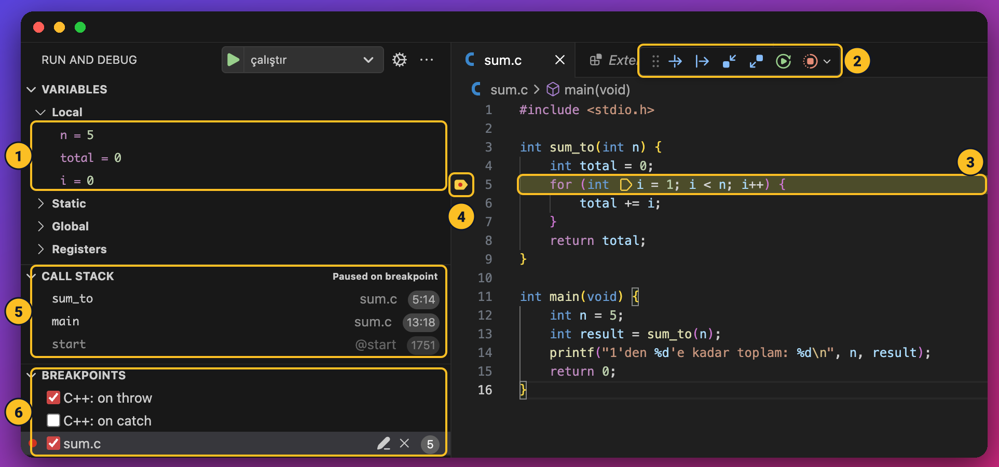

Ders 1.3'te bir programı elle çalıştırıp her adımda değişkenleri bir tabloya yazmayı öğrendin: **iz sürme**. Hata bulmanın en güçlü yollarından biri olduğunu da gördün. Ama programlar büyüdükçe iz tablosunu elle tutmak zorlaşır; 1000 turluk bir döngünün tablosunu kimse kağıda yazmaz.

**Hata ayıklayıcı** (debugger), bu tabloyu senin yerine tutan programdır. Programını istediğin satırda durdurur, o anda bütün değişkenlerin değerini gösterir, sonra satır satır ilerlemene izin verir. Bu kitapta kullanacağımız hata ayıklayıcı **LLDB** (Ders 2.2'de kurdun).

Bu derste dört şey öğreneceğiz:

1. **Kesme noktası** (breakpoint): programı istediğin satırda durdurmak.
2. **Adım adım ilerlemek**: `next`, `step` ve `finish`.
3. **Değerleri görmek**: durduğun anda değişkenlerde ne var?
4. **Watchpoint**: bir değişken değiştiği anda durmak.

Önce hepsini VS Code'da göreceğiz, sonra aynı işleri terminalde LLDB komutlarıyla yapacağız.

---

## 1. Hatalı bir program

Elimizde 1'den n'e kadar olan sayıları toplaması gereken bir program var. `faz-02/sum.c`:

```c
#include <stdio.h>

int sum_to(int n) {
    int total = 0;
    for (int i = 1; i < n; i++) {
        total += i;
    }
    return total;
}

int main(void) {
    int n = 5;
    int result = sum_to(n);
    printf("1'den %d'e kadar toplam: %d\n", n, result);
    return 0;
}
```

```
1'den 5'e kadar toplam: 10
```

1 + 2 + 3 + 4 + 5 = 15 olmalıydı. Program **10** diyor. Hata nerede?

Belki koda bakınca hemen gördün. Ama bu derste hatayı gözle değil, **hata ayıklayıcıyla** bulacağız; çünkü bir gün göremeyeceğin kadar büyük bir programla karşılaşacaksın ve o gün bu yöntem tek yolun olacak.

---

## 2. Kesme noktası

Ders 2.2'de hazırladığın çalışma alanında `sum.c`'yi aç. 5. satırın (`for` satırı) **numarasının hemen soluna** tıkla. Kırmızı bir nokta belirir: bu bir **kesme noktası**. "Program bu satıra geldiğinde, satırı çalıştırmadan önce dur" demektir.

Şimdi `F5`'e bas. Program derlenir, çalışır ve 5. satıra gelince durur. Ekranın şöyle görünecek:



Numaralara tek tek bakalım:

**1. Değişkenler (VARIABLES → Local).** O anda geçerli olan bütün değişkenler ve değerleri: `n = 5`, `total = 0`, `i = 0`. Bir iz tablosunun tek satırı gibi.

Bir tuhaflık var: kodda `int i = 1` yazıyor ama panel `i = 0` diyor. Çünkü program bu satırda **durdu ama satırı henüz çalıştırmadı**; `i`'ye 1 henüz konmadı. Gördüğün 0, o kutuda o an ne varsa odur. Ders 2.3'teki "değer vermeden kullanma" uyarısını hatırla: başka bir çalıştırmada orada rastgele bir sayı da görebilirsin. Altındaki **Static**, **Global** ve **Registers** başlıklarını şimdilik kapalı bırak.

**2. Hata ayıklama düğmeleri.** Programı ilerletmek için. Fareyi bir düğmenin üstüne getirirsen ne işe yaradığı yazar. Hepsini bir sonraki bölümde, kısayollarıyla birlikte göreceğiz.

**3. Durulan satır.** Program tam burada durdu. Sarı satır **henüz çalışmadı**; bir sonraki adımda çalışacak. Satırın içindeki küçük sarı işaret (`i = 1`'in hemen önünde) durulan yeri karakter düzeyinde gösterir: `for`'un üç parçasından ilki, yani başlangıç, çalışmak üzere.

**4. Kesme noktası.** Koyduğun kırmızı nokta. Program tam kesme noktasının olduğu satırda durduğu için kırmızı noktanın üstüne sarı bir işaret binmiş durumda. Kesme noktasını kaldırmak için kırmızı noktaya tekrar tıkla.

**5. Çağrı yığını (CALL STACK).** Hangi fonksiyonun içinde olduğunu ve oraya nereden gelindiğini gösterir: şu an `sum_to`'nun içindeyiz (5. satır), onu da `main` çağırdı (13. satır). En alttaki `start`, `main`'den önce çalışan ve onu çağıran küçük bir başlangıç kodudur. Çağrı yığınını fonksiyonlar dersinde ayrıntısıyla göreceğiz.

**6. Kesme noktaları (BREAKPOINTS).** Koyduğun bütün kesme noktalarının listesi: `sum.c`, 5. satır. Yanındaki tiki kaldırırsan kesme noktası silinmeden geçici olarak kapanır. Listedeki **C++: on throw** ve **C++: on catch**, CodeLLDB'nin C++ programları için hazır getirdiği ayarlardır; C'de bir işe yaramazlar, olduğu gibi bırak.

---

## 3. Adım adım ilerlemek

Program durduğunda, onu üstteki düğmelerle (2 numara) ya da kısayollarla ilerletirsin. Düğmeleri fareyle bulmak yerine kısayolları öğrenmek çok daha hızlıdır:

| Düğme | Kısayol | Ne yapar? |
| --- | --- | --- |
| **Devam** | `F5` | Bir sonraki kesme noktasına kadar çalış. Kesme noktası yoksa programın sonuna kadar. |
| **Üzerinden geç** | `F10` | Sarı satırı çalıştır, bir sonraki satırda dur. Satırda bir fonksiyon çağrısı varsa fonksiyonu **tek adımda** çalıştırır, içine girmez. |
| **İçine gir** | `F11` | Sarı satırda bir fonksiyon çağrısı varsa **fonksiyonun içine gir** ve ilk satırında dur. |
| **Dışarı çık** | `Shift+F11` | İçinde bulunduğun fonksiyonu sonuna kadar çalıştır, onu çağıran yere dön. |
| **Yeniden başlat** | `Ctrl+Shift+F5` | Programı baştan çalıştır. |
| **Durdur** | `Shift+F5` | Hata ayıklamayı bitir. |

(macOS'ta `Ctrl` yerine `Cmd`.)

**Şimdi hatayı bulalım.** Program 5. satırda durmuş durumda. `F10`'a bas: 6. satıra geçersin ve `i` artık 1 olur. `F10`'a basmaya devam et; program döngünün içinde 6. ve 5. satırlar arasında gidip gelecek. Her 6. satıra gelişinde soldaki değerleri bir tabloya yaz:

| Durduğumuz an | `i` | `total` |
| --- | --- | --- |
| 6. satıra 1. geliş | 1 | 0 |
| 6. satıra 2. geliş | 2 | 1 |
| 6. satıra 3. geliş | 3 | 3 |
| 6. satıra 4. geliş | 4 | 6 |
| Döngüden çıkış, 8. satır | — | 10 |

Bu, Ders 1.3'te elle tuttuğun iz tablosunun **aynısı**. Fark şu: değerleri sen hesaplamadın, bilgisayar gösterdi.

Tabloya bak: `i` 5 olunca döngü hiç çalışmadı. Neden? Koşul `i < n`, yani `5 < 5`, yanlış. 5 hiç toplanmadı. **Hata bulundu:** koşul `i <= n` olmalı.

Ders 1.3'teki **uç durum** fikrini hatırla: hata, döngünün tam sınırında saklanıyordu.

### Fonksiyonun içine girmek

Bu sefer kesme noktasını 5. satırdan kaldır ve 13. satıra (`int result = sum_to(n);`) koy. `F5`'e bas; program 13. satırda durur.

- `F10`'a (**üzerinden geç**) basarsan, `sum_to` tek adımda çalışır ve 14. satırda durursun. Soldaki panelde `result = 10`'u görürsün. Fonksiyonun içinde ne olduğunu göremezsin.
- `F11`'e (**içine gir**) basarsan, `sum_to`'nun ilk satırında, yani 4. satırda durursun. Artık fonksiyonun içindesin; soldaki panelde `n = 5` var, ama `main`'in değişkenleri yok.
- İçerideyken `Shift+F11`'e (**dışarı çık**) basarsan, fonksiyon sonuna kadar çalışır ve 13. satıra geri dönersin.

Hangi düğmeyi ne zaman kullanacağın basit bir soruya bağlı: **"Bu fonksiyonun içinde hata olabilir mi?"** Olabilirse içine gir, emin olduğun fonksiyonların (`printf` gibi) üzerinden geç.

---

## 4. Değerleri görmek

Soldaki **VARIABLES** paneli, durduğun anda geçerli olan değişkenleri kendiliğinden gösterir. Değerleri görmenin iki yolu daha var:

- **Fareyi üstüne getir:** Program durduğunda kodda bir değişkenin adının üzerine fareyi getir; değeri küçük bir kutuda görünür.
- **WATCH paneli:** Soldaki **WATCH** başlığının yanındaki `+`'ya tıkla ve bir ifade yaz: `total`, `i * 2`, `n - i`… Bu ifadeler her adımda yeniden hesaplanır. Dizilerde özellikle işe yarar: `scores[2]` yazıp tek bir elemanı izleyebilirsin.

---

## 5. Watchpoint: bir değişken değiştiğinde dur

Kesme noktası "şu **satıra** gelince dur" der. Bazen soru farklıdır: "Bu **değişken** ne zaman değişiyor?" ya da "Neden hiç değişmiyor?" Bunun için **watchpoint** kullanılır.

Bir sıcaklık listesindeki en yüksek değeri bulan şu programa bak. `faz-02/highest.c`:

```c
#include <stdio.h>

#define SIZE 4

int main(void) {
    int temps[SIZE] = {-5, -12, -3, -8};

    int highest = 0;
    for (int i = 0; i < SIZE; i++) {
        if (temps[i] > highest) {
            highest = temps[i];
        }
    }
    printf("En yüksek sıcaklık: %d\n", highest);
    return 0;
}
```

```
En yüksek sıcaklık: 0
```

En yüksek sıcaklık -3 olmalıydı. Listede 0 diye bir değer bile yok!

`highest`'ın ne zaman değiştiğini izleyelim:

1. 9. satıra (`for` satırına) bir kesme noktası koy ve `F5`'e bas.
2. Soldaki VARIABLES panelinde `highest`'a **sağ tıkla** ve **Break on Value Change** (değer değişince dur) seçeneğini seç.
3. `F5` ile devam et.

Program `highest` her değiştiğinde durmalı, eski ve yeni değeri göstermeliydi. Ama **hiç durmadı**; doğrudan sonuna kadar çalıştı.

Watchpoint'in hiç tetiklenmemesi de bir bilgi: **`highest` döngü boyunca bir kez bile değişmedi.** Neden? Listedeki bütün sayılar negatif; hiçbiri 0'dan büyük değil. `temps[i] > highest` sorusu her seferinde "hayır" dedi.

**Hata:** `highest`'ı 0 ile başlatmak, "en yüksek değer en az 0'dır" diye bir varsayım yapmak demek. Bu varsayım negatif sayılarda çöküyor. Ders 1.1'deki EnBüyük algoritmasını hatırla: "ilk sayıyı şimdiye kadarki en büyük kabul et". Doğrusu `int highest = temps[0];`.

Düzeltip watchpoint ile tekrar çalıştırırsan program bu sefer bir kez durur: `highest` -5'ten -3'e değiştiğinde. Durduğu yer, değişikliği yapan satırın hemen sonrasıdır.

**Ne zaman watchpoint, ne zaman kesme noktası?** Hatanın **nerede** olduğunu tahmin edebiliyorsan kesme noktası. Bir değişkenin değeri yanlış çıkıyor ama **kimin** ya da **ne zaman** bozduğunu bilmiyorsan watchpoint.

---

## 6. Terminalde LLDB

VS Code'daki düğmelerin hepsi arka planda LLDB komutlarını çalıştırır. Aynı işleri doğrudan terminalden de yapabilirsin. Bunu bilmek iki sebeple önemli: VS Code'un olmadığı yerlerde (örneğin uzaktaki bir sunucuda) çalışabilmek ve ileride göreceğimiz daha güçlü komutlara hazırlanmak.

Önce programı **hata ayıklama bilgisiyle** derle. `-g` bayrağı, LLDB'nin satır numaralarını ve değişken adlarını tanıması için gerekli. `tasks.json`'daki ayar bunu zaten yapıyor; `Ctrl+Shift+B` ile derlemen yeterli. Sonra:

```sh
lldb build/faz-02/sum
```

LLDB açılır ve `(lldb)` yazan bir istem gösterir. Artık komut yazabilirsin.

| Komut | Kısası | Ne yapar? | VS Code'daki karşılığı |
| --- | --- | --- | --- |
| `breakpoint set --name sum_to` | `b sum_to` | Fonksiyonun başına kesme noktası koy | — |
| `breakpoint set --file sum.c --line 6` | `b sum.c:6` | Belirli bir satıra kesme noktası koy | Satır numarasının soluna tıklamak |
| `run` | `r` | Programı başlat | `F5` |
| `next` | `n` | Satırı çalıştır, fonksiyonun içine girme | `F10` |
| `step` | `s` | Fonksiyonun içine gir | `F11` |
| `finish` | — | Fonksiyonun sonuna kadar çalış, çağıran yere dön | `Shift+F11` |
| `continue` | `c` | Bir sonraki durağa kadar devam et | `F5` |
| `print total` | `p total` | Bir değişkenin ya da ifadenin değerini göster | Fareyi üstüne getirmek, WATCH |
| `frame variable` | `v` | O anki bütün değişkenleri göster | VARIABLES paneli |
| `watchpoint set variable highest` | `w s v highest` | Değişken değişince dur | Break on Value Change |
| `quit` | `q` | LLDB'den çık | Durdur |

**Örnek oturum.** `sum_to`'ya kesme noktası koyup döngünün içinde ilerleyelim. Çıktıyı kısalttık; adresler ve bazı satırlar senin ekranında farklı görünecek:

```
(lldb) breakpoint set --name sum_to
Breakpoint 1: where = sum`sum_to + 8 at sum.c:4:9
(lldb) run
Process 9051 stopped
* thread #1, stop reason = breakpoint 1.1
    frame #0: sum`sum_to(n=5) at sum.c:4:9
   3   	int sum_to(int n) {
-> 4   	    int total = 0;
   5   	    for (int i = 1; i < n; i++) {
   6   	        total += i;
(lldb) next
-> 5   	    for (int i = 1; i < n; i++) {
(lldb) next
-> 6   	        total += i;
(lldb) print total
(int) 0
(lldb) print i
(int) 1
```

`->` işareti, VS Code'daki sarı satırın karşılığı: program orada durdu, o satır henüz çalışmadı. `frame #0: sum_to(n=5)` satırı, hangi fonksiyonun içinde olduğunu ve parametrelerin değerini söylüyor.

**Fonksiyonun içine girip çıkmak:**

```
(lldb) breakpoint set --file sum.c --line 13
(lldb) run
-> 13  	    int result = sum_to(n);
(lldb) step
    frame #0: sum`sum_to(n=5) at sum.c:4:9
-> 4   	    int total = 0;
(lldb) finish
Return value: (int) $0 = 10
-> 13  	    int result = sum_to(n);
```

`step` ile `sum_to`'nun içine girdik. `finish` ile fonksiyonu sonuna kadar çalıştırıp `main`'e döndük; LLDB bize fonksiyonun **döndürdüğü değeri** de gösterdi: 10. Hatalı sonucun `sum_to`'dan geldiğini böylece tek adımda doğruladık.

Dikkat: `finish`'ten sonra hâlâ 13. satırdayız. Fonksiyon bitti ama dönen değer henüz `result`'a yazılmadı. `next` ile satırı bitirince `result` 10 olur.

**Watchpoint:**

```
(lldb) breakpoint set --file highest.c --line 9
(lldb) run
-> 9   	    for (int i = 0; i < SIZE; i++) {
(lldb) watchpoint set variable highest
Watchpoint created: Watchpoint 1: addr = 0x16fdfdf58 size = 4 state = enabled type = m
(lldb) continue
En yüksek sıcaklık: 0
Process 9077 exited with status = 0 (0x00000000)
```

`continue`'dan sonra program **hiç durmadan** bitti: watchpoint hiç tetiklenmedi, yani `highest` hiç değişmedi. (Watchpoint'i koyduğun anda LLDB, değişkenin o anki değerini de gösterebilir; bu bir değişiklik değil, sadece başlangıç değeri.)

Hatayı düzeltip aynı adımları tekrarlarsan, LLDB değişikliği yakaladığı anda durur ve eski ile yeni değeri gösterir:

```
(lldb) continue
Watchpoint 1 hit:
old value: -5
new value: -3
-> 12  	        }
(lldb) print i
(int) 2
```

`highest`, döngünün `i = 2` turunda, yani `temps[2]` = -3 okunduğunda değişti.

---

## 7. İleride neler var?

LLDB bu derste gördüklerinden çok daha fazlasını yapabilir. Bunları, gerekli bilgiyi edindikçe kitabın ilerleyen bölümlerinde göreceğiz:

- **Çağrı yığını** (`bt`, VS Code'daki CALL STACK paneli): hangi fonksiyonun hangisini çağırdığını görmek. Fonksiyonlar ve özyineleme derslerinde.
- **Koşullu kesme noktaları:** "sadece `i` 500 olduğunda dur" demek.
- **Belleğe doğrudan bakmak** (`memory read`): değişkenlerin bellekte gerçekte nasıl durduğunu görmek. Faz 4'te, pointer'larla birlikte.
- **Assembly düzeyinde adım atmak** (`disassemble`, `stepi`): C satırlarının makine komutlarına nasıl dönüştüğünü izlemek. Faz 7'de.
- **Çökmüş bir programı sonradan incelemek** (core dump) ve LLDB'yi betiklerle otomatikleştirmek: Faz 10'da.

---

## Alıştırmalar

Aşağıdaki programların her birinde bir hata var. Hatayı **koda bakarak değil, hata ayıklayıcıyla** bul: önce bir kesme noktası ya da watchpoint koy, değerleri izle, sonra düzelt. Her birinde, hatayı bulduğun anı bir iz tablosuyla not et.

**1. Faktöriyel.** `5! = 120` yazması gerekirken `5! = 0` yazıyor.

```c
#include <stdio.h>

int factorial(int n) {
    int result = 0;
    for (int i = 1; i <= n; i++) {
        result = result * i;
    }
    return result;
}

int main(void) {
    printf("5! = %d\n", factorial(5));
    return 0;
}
```

**2. Ters çevirme.** `reverse(1234)` sonucu 4321 olmalı, ama 432 çıkıyor.

```c
#include <stdio.h>

int reverse(int n) {
    int result = 0;
    while (n > 10) {
        result = result * 10 + n % 10;
        n = n / 10;
    }
    return result;
}

int main(void) {
    printf("%d\n", reverse(1234));
    return 0;
}
```

**3. Izgaranın toplamı.** Satır toplamları doğru, ama genel toplam 21 yerine 0 çıkıyor. (İpucu: dıştaki `total`'a bir watchpoint koy.)

```c
#include <stdio.h>

#define ROWS 2
#define COLS 3

int main(void) {
    int grid[ROWS][COLS] = {
        {1, 2, 3},
        {4, 5, 6},
    };

    int total = 0;
    for (int row = 0; row < ROWS; row++) {
        int total = 0;
        for (int col = 0; col < COLS; col++) {
            total += grid[row][col];
        }
        printf("Satır %d: %d\n", row, total);
    }
    printf("Toplam: %d\n", total);
    return 0;
}
```

```
Satır 0: 6
Satır 1: 15
Toplam: 0
```

<details>
<summary>Cevaplar</summary>

**1.** 6. satıra (`result = result * i;`) kesme noktası koy ve her turda `F5` ile ilerle:

| `i` | `result` (satır çalışmadan önce) |
| --- | --- |
| 1 | 0 |
| 2 | 0 |
| 3 | 0 |

`result` hiç değişmiyor: 0 ile çarpılan her şey 0'dır. Ders 1.2'deki faktöriyel diyagramını hatırla: çarpma işleminde başlangıç değeri **1** olmalı. Düzeltme: `int result = 1;`.

**2.** `while` satırına kesme noktası koy ve her turda `n` ile `result`'a bak:

| Tur | `n` | `result` |
| --- | --- | --- |
| 1 | 1234 | 0 |
| 2 | 123 | 4 |
| 3 | 12 | 43 |
| — | 1 | 432 |

`n` 1 olunca `1 > 10` yanlış oluyor ve döngü bitiyor; son basamak (1) hiç eklenmiyor. Koşul `n > 0` olmalı. Yine bir sınır hatası: Ders 2.5'teki ters çevirme çözümüyle karşılaştır.

**3.** 13. satıra (`for` satırı) kesme noktası koy, `F5` ile dur, VARIABLES panelinde `total`'a sağ tıklayıp **Break on Value Change**'i seç ve devam et. Program satır toplamlarını yazıp bitiyor; watchpoint **hiç tetiklenmiyor**. Dıştaki `total` hiç değişmedi.

Döngünün içine girip VARIABLES paneline bakarsan bir tuhaflık görürsün: iki tane `total` var. Döngünün içindeki `int total = 0;` satırı, dıştakinden bağımsız, **aynı isimde yeni bir değişken** açıyor. Döngü içindeki bütün toplamalar bu iç değişkene yapılıyor ve o değişken her turun sonunda yok oluyor. Dıştaki `total` 0 olarak kalıyor.

Düzeltme: içteki `total`'a başka bir isim ver (`row_total`) ve her satırın sonunda dıştakine ekle:

```c
    int total = 0;
    for (int row = 0; row < ROWS; row++) {
        int row_total = 0;
        for (int col = 0; col < COLS; col++) {
            row_total += grid[row][col];
        }
        printf("Satır %d: %d\n", row, row_total);
        total += row_total;
    }
```

Bu, gözle bulunması en zor hatalardan biridir: kod doğru görünür, derleyici uyarmaz. Watchpoint'in "hiç tetiklenmedi" demesi, hatanın yerini doğrudan gösterdi.

</details>

---

## Kaynaklar

- [LLDB belgeleri: GDB'den LLDB'ye komut eşleme tablosu](https://lldb.llvm.org/use/map.html): bütün komutların kısa listesi.
- [LLDB belgeleri: Eğitim](https://lldb.llvm.org/use/tutorial.html): komutların genel yapısı.
- [CodeLLDB kullanım kılavuzu](https://github.com/vadimcn/codelldb/blob/master/MANUAL.md): VS Code tarafındaki ayarlar.

**Sıradaki ders:** Fonksiyonlar ve kapsam. Bir değişkenin nerede yaşadığını ve ne zaman yok olduğunu öğreneceğiz; Alıştırma 3'teki iki `total`'ın sırrı da orada.
