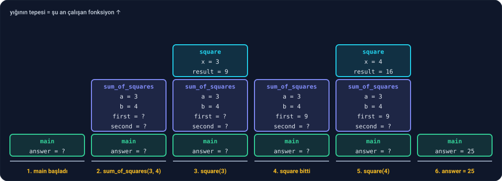

Ders 2.3'te fonksiyon yazmayı öğrendin. Bu derste fonksiyonların perde arkasına bakacağız. Cevaplayacağımız sorular şunlar:

- Bir fonksiyonu kullanmadan önce neden tanımlamak zorundayız? Zorunda mıyız?
- Bir değişken **nerede** görünür, **ne zaman** doğar, **ne zaman** yok olur?
- Bir fonksiyon başka bir fonksiyonu çağırdığında bilgisayar nerede kaldığını nasıl hatırlar?

Ders 2.6'nın son alıştırmasındaki iki `total`'ın sırrı da bu dersin içinde.

---

## 1. Prototip: fonksiyonu önceden tanıtmak

Ders 2.3'te "fonksiyonlarını `main`'in üstüne yaz" demiştik. Tersini deneyelim:

```c
#include <stdio.h>

int main(void) {
    printf("%d\n", square(4));
    return 0;
}

int square(int x) {
    return x * x;
}
```

```
error: call to undeclared function 'square'; ISO C99 and later do not support implicit function declarations
```

Derleyici dosyayı yukarıdan aşağıya okur. `main`'in içinde `square`'i gördüğünde, henüz böyle bir fonksiyonla karşılaşmamıştır. Kaç parametre aldığını, ne döndürdüğünü bilmez ve durur.

Çözüm: fonksiyonun **kendisini** değil, sadece **tanıtımını** yukarıya yazmak. Buna **prototip** denir:

```c
#include <stdio.h>

int square(int x);

int main(void) {
    printf("%d\n", square(4));
    return 0;
}

int square(int x) {
    return x * x;
}
```

```
16
```

`int square(int x);` satırı, fonksiyonun ilk satırının aynısı; ama süslü parantez yerine noktalı virgülle bitiyor. Derleyiciye şunu söylüyor: "`square` adında, bir `int` alıp bir `int` döndüren bir fonksiyon var. Gövdesi ileride gelecek." Derleyici için bu yeterli: çağrının doğru yazılıp yazılmadığını kontrol edebilir.

**Neden işe yarar?** Prototipler sayesinde `main`'i dosyanın en üstüne koyabilirsin. Dosyayı açan kişi önce programın ana akışını, yani bir tür içindekiler sayfasını görür; ayrıntılar aşağıda durur. Ders 2.4'teki labirent oyununu düşün: `main` en üstte olsaydı, akış diyagramıyla aynı sırada okunurdu.

Prototipler asıl gücünü Ders 2.13'te, programı birden fazla dosyaya böldüğümüzde gösterecek.

---

## 2. Kapsam: bir değişken nerede görünür?

Bir değişkenin **kapsamı**, onun adının kullanılabildiği bölgedir. C'de kural basit: **bir değişken, tanımlandığı süslü parantez bloğunun içinde, tanımlandığı satırdan bloğun sonuna kadar görünür.**

```c
#include <stdio.h>

int main(void) {
    int score = 72;
    if (score >= 50) {
        int bonus = 10;
        score = score + bonus;
    }
    printf("%d\n", bonus);
    return 0;
}
```

```
error: use of undeclared identifier 'bonus'
```

`bonus`, `if`'in süslü parantezinin içinde doğdu ve o parantez kapandığı anda **yok oldu**. Dışarıdan ona ulaşmanın yolu yok. `score` ise `main`'in bloğunda tanımlandığı için hem `if`'in içinden hem dışından görünüyor.

Aynı kural `for` döngüsü için de geçerli: `for (int i = 0; ...)` yazdığında `i` sadece döngünün içinde yaşar. Bu yüzden Ders 2.4'te art arda birçok döngüde `i` adını rahatça kullanabildik: her döngünün kendi `i`'si vardı.

**Neden böyle?** Değişkeni olabildiğince dar bir bölgede tanımlamak, onu yanlışlıkla başka bir yerde kullanmanı ya da değiştirmeni engeller. Bir değişken ne kadar az yerden görünürse, hata ayıklarken o kadar az yere bakarsın.

### Gölgeleme: Ders 2.6'nın iki `total`'ı

İç içe iki blokta **aynı isimde** iki değişken tanımlarsan ne olur?

```c
#include <stdio.h>

int main(void) {
    int total = 0;
    for (int row = 0; row < 2; row++) {
        int total = 5;
        printf("İçeride: %d\n", total);
    }
    printf("Dışarıda: %d\n", total);
    return 0;
}
```

```
İçeride: 5
İçeride: 5
Dışarıda: 0
```

C buna izin verir. Döngünün içindeki `int total = 5;` **yeni bir değişken** açar. Döngünün içinde `total` dendiğinde, en yakındaki, yani içteki kastedilir; dıştaki o bölgede görünmez hale gelir. Buna **gölgeleme** (shadowing) denir: içteki değişken dıştakinin önüne geçip onu gölgede bırakır.

Ders 2.6'daki ızgara toplamı alıştırmasında olan tam buydu: döngünün içindeki bütün toplamalar içteki `total`'a yapıldı, içteki `total` her turun sonunda yok oldu, dıştaki ise 0 olarak kaldı. Watchpoint'in hiç tetiklenmemesinin sebebi bu.

Gölgeleme, kod doğru görünürken yanlış çalışan hataların klasik kaynağıdır. `-Wall` ve `-Wextra` onu yakalamaz, ama bunun için ayrı bir uyarı var:

```sh
clang -std=c17 -Wall -Wextra -Wshadow shadow.c -o shadow
```

```
warning: declaration shadows a local variable [-Wshadow]
```

İstersen `.vscode/tasks.json`'daki derleme komutuna `-Wshadow` ekleyebilirsin. En iyi çözüm ise basit: iç içe bloklarda aynı ismi kullanma.

---

## 3. Çağrı yığını

Bir fonksiyon başka bir fonksiyonu çağırdığında, çağıran fonksiyon **beklemeye** geçer. Çağrılan fonksiyon bitince, çağıranın kaldığı yerden devam edilir. Peki bilgisayar kimin nerede kaldığını ve kimin değişkenlerinin ne olduğunu nasıl hatırlar?

Şu programa bakalım:

```c
#include <stdio.h>

int square(int x) {
    int result = x * x;
    return result;
}

int sum_of_squares(int a, int b) {
    int first = square(a);
    int second = square(b);
    return first + second;
}

int main(void) {
    int answer = sum_of_squares(3, 4);
    printf("3² + 4² = %d\n", answer);
    return 0;
}
```

```
3² + 4² = 25
```

Her fonksiyon çağrısı için bellekte bir **kutu** açılır. Bu kutuda o çağrının parametreleri ve yerel değişkenleri durur. Kutular üst üste dizilir: yeni bir çağrı yapıldığında yığının tepesine bir kutu eklenir, fonksiyon bitince tepedeki kutu kaldırılır. Bu yapıya **çağrı yığını** (call stack) denir; tıpkı üst üste konan tabaklar gibi, en son konan en önce alınır.

Program çalışırken yığının altı farklı anı:



Adım adım:

1. Program `main`'den başlar. Yığında tek kutu var: `main`'in kutusu. `answer`'a henüz değer verilmedi.
2. `main`, `sum_of_squares(3, 4)`'ü çağırır. Tepeye yeni bir kutu eklenir: `a = 3`, `b = 4`. `main` beklemede.
3. `sum_of_squares`, `square(3)`'ü çağırır. Tepeye bir kutu daha: `x = 3`. Artık iki fonksiyon bekliyor.
4. `square` 9 döndürür ve **kutusu kaldırılır**. `x` ve `result` artık yok. Dönen 9, `first`'e yazılır.
5. `sum_of_squares`, `square(4)`'ü çağırır. Yığının tepesine **yepyeni** bir `square` kutusu eklenir: `x = 4`. Bir önceki `square` çağrısından hiçbir iz yok.
6. İkinci `square` 16 döndürür, kutusu kaldırılır. `sum_of_squares` 9 + 16 = 25 döndürür, onun kutusu da kaldırılır. `answer` 25 olur.

Bu resim, Ders 2.3'te gördüğün iki kuralı da açıklıyor:

- **Fonksiyon, kendisine verilen değerin kopyasıyla çalışır.** `sum_of_squares(3, 4)` çağrıldığında 3 ve 4, yeni kutudaki `a` ve `b`'ye kopyalanır. Kutunun içinde ne değişirse değişsin, `main`'in kutusuna dokunulmaz.
- **Fonksiyonun yerel değişkenleri, fonksiyon bitince yok olur.** Çünkü kutusu yığından kaldırılır.

Bir de şunu fark et: farklı fonksiyonlarda aynı isimde değişken kullanmak sorun değildir. İki fonksiyonun kutusu ayrı olduğu için, ikisinde de `result` adında bir değişken olsa birbirlerine karışmazlar.

### Çağrı yığınını LLDB'de görmek

Ders 2.6'da VS Code'daki **CALL STACK** panelini görmüştün (ekran görüntüsündeki 5 numara). O panel, tam olarak bu yığını gösterir: en üstte şu an çalışan fonksiyon, altında onu çağıran, onun altında onu çağıran…

Terminalde LLDB ile de görebilirsin. `square`'e bir kesme noktası koy ve `bt` (backtrace, "geriye doğru iz") yaz:

```
(lldb) breakpoint set --file stack.c --line 4
(lldb) run
(lldb) bt
* thread #1, stop reason = breakpoint 1.1
  * frame #0: stack`square(x=3) at stack.c:4:18
    frame #1: stack`sum_of_squares(a=3, b=4) at stack.c:9:17
    frame #2: stack`main at stack.c:15:18
    frame #3: dyld`start + 6992
```

Her satır yığındaki bir kutu; LLDB bunlara **frame** der. `frame #0` tepedeki, yani şu an çalışan kutu. `frame #2`'deki `main`'in altında bir de `start` var: `main`'den önce çalışıp onu çağıran küçük başlangıç kodu.

Alt kutulara inip onların değişkenlerine de bakabilirsin. `up` bir alttaki kutuya geçer, `down` geri çıkar:

```
(lldb) frame variable
(int) x = 3
(int) result = 0
(lldb) up
frame #1: stack`sum_of_squares(a=3, b=4) at stack.c:9:17
(lldb) frame variable
(int) a = 3
(int) b = 4
(int) first = 1
(int) second = -143148432
```

`result`, `first` ve `second`'ın değerlerine dikkat: hiçbirine henüz değer verilmedi. `result`'ın satırı henüz çalışmadı, `square(3)` henüz `first`'e dönmedi, `second`'ın sırası hiç gelmedi. Gördüğün sayılar o kutularda o an ne varsa o. Ders 2.6'da `i = 0`'da gördüğümüz durumun aynısı; bu sayılar bir sonraki çalıştırmada başka olabilir.

VS Code'da aynı işi CALL STACK panelinde bir satıra tıklayarak yaparsın: tıkladığın fonksiyonun değişkenleri VARIABLES panelinde görünür.

---

## 4. Global değişkenler

Şimdiye kadarki bütün değişkenler bir fonksiyonun içindeydi: **yerel** (local) değişkenler. Bir değişkeni bütün fonksiyonların **dışında** da tanımlayabilirsin. O zaman ona **global** değişken denir:

```c
#include <stdio.h>

int total_moves = 0;

void move(void) {
    total_moves++;
}

int main(void) {
    move();
    move();
    move();
    printf("Toplam hamle: %d\n", total_moves);
    return 0;
}
```

```
Toplam hamle: 3
```

Global bir değişken:

- Tanımlandığı satırdan dosyanın sonuna kadar **her fonksiyondan** görünür.
- Program başlarken doğar, program bitene kadar yaşar. Yığında değil, ayrı bir yerde durur; hiçbir fonksiyonun kutusuna ait değildir.
- Değer vermezsen **0** ile başlar. Yerel değişkenlerin aksine, içinde rastgele bir değer olmaz.

Kolay görünüyor: parametre geçmeye gerek yok, herkes her yerden ulaşıyor. Ama tam da bu yüzden **tehlikeli**:

- Değişken yanlış bir değer aldığında, onu **hangi** fonksiyonun bozduğunu bulmak için programdaki **bütün** fonksiyonlara bakmak gerekir. Yerel bir değişkende sadece kendi fonksiyonuna bakarsın.
- Bir fonksiyonu okurken, ne yaptığını anlamak için parametrelerine bakmak yetmez; hangi global değişkenleri okuyup değiştirdiğini de bilmen gerekir.
- Program büyüdükçe, birbirini hiç tanımayan fonksiyonlar aynı global değişken üzerinden birbirine gizlice bağlanır.

Aynı işi global değişken kullanmadan da yapabilirdik: değeri parametreyle verip sonucu `return` ile geri almak.

```c
#include <stdio.h>

int move(int moves) {
    return moves + 1;
}

int main(void) {
    int total_moves = 0;
    total_moves = move(total_moves);
    total_moves = move(total_moves);
    total_moves = move(total_moves);
    printf("Toplam hamle: %d\n", total_moves);
    return 0;
}
```

Biraz daha uzun, ama artık `move`'un ne yaptığı ilk satırından belli: bir sayı alıyor, bir sayı döndürüyor. `total_moves`'u sadece `main` görebiliyor ve değiştirebiliyor.

**Kural:** Global değişkeni ancak gerçekten gerektiğinde kullan. Ders 2.4'teki labirent oyununu tek bir global değişken kullanmadan yazdığımızı hatırla; haritayı ve oyuncunun yerini fonksiyonlara parametre olarak verdik.

Bir istisna var: hiç değişmeyen değerler. `#define ROWS 7` gibi sabitler, her yerden görünse de sorun çıkarmaz; çünkü kimse onları değiştiremez.

---

## 5. static yerel değişkenler

Bazen bir fonksiyonun, çağrılar arasında bir şeyi **hatırlaması** gerekir. Örneğin bir sıra numarası dağıtan makine: her çağrıldığında bir sonraki numarayı vermeli.

Yerel bir değişken bu işi yapamaz; fonksiyon her bittiğinde kutusuyla birlikte yok olur. Global bir değişken yapabilir, ama az önce gördüğümüz bütün dertleriyle birlikte. Arada bir yol var: **`static` yerel değişken**.

```c
#include <stdio.h>

int count_normal(void) {
    int calls = 0;
    calls++;
    return calls;
}

int count_static(void) {
    static int calls = 0;
    calls++;
    return calls;
}

int main(void) {
    for (int i = 0; i < 3; i++) {
        printf("normal: %d, static: %d\n", count_normal(), count_static());
    }
    return 0;
}
```

```
normal: 1, static: 1
normal: 1, static: 2
normal: 1, static: 3
```

İki fonksiyonun tek farkı `static` kelimesi:

- `count_normal`'daki `calls` her çağrıda yeni bir kutuda 0 olarak doğar, 1 olur ve fonksiyon bitince yok olur. Sonuç hep 1.
- `count_static`'teki `calls` ise **bir kez**, program başlarken doğar ve program bitene kadar yaşar. Yığındaki kutuda değil, global değişkenlerle aynı yerde durur. `static int calls = 0;` satırındaki ilk değer de sadece bir kez verilir; sonraki çağrılarda bu satır değeri sıfırlamaz. Her çağrı, bir öncekinin bıraktığı değerden devam eder.

Ama global değişkenden farklı olarak, `calls`'u **sadece kendi fonksiyonu** görebilir. Ömrü global kadar uzun, görünürlüğü yerel kadar dar: iki dünyanın iyi tarafı.

`static` kelimesinin C'de bir anlamı daha var: fonksiyonların ve global değişkenlerin başına yazıldığında başka bir iş yapar. Onu Ders 2.13'te, programı birden fazla dosyaya böldüğümüzde göreceğiz.

---

## 6. Özet

| | Yerel | Global | `static` yerel |
| --- | --- | --- | --- |
| **Nerede tanımlanır?** | Bir bloğun içinde | Bütün fonksiyonların dışında | Bir bloğun içinde, başında `static` ile |
| **Nereden görünür?** | Sadece kendi bloğundan | Tanımlandığı yerden dosyanın sonuna kadar her yerden | Sadece kendi bloğundan |
| **Ne kadar yaşar?** | Blok bitene kadar | Program boyunca | Program boyunca |
| **Nerede durur?** | Çağrı yığınındaki kutuda | Yığının dışında | Yığının dışında |
| **İlk değer vermezsen?** | Belirsiz, rastgele olabilir | 0 | 0 |

İki ayrı soru var ve karıştırılmamalı: **kapsam** (adı nereden kullanılabilir?) ve **ömür** (bellekte ne zamana kadar yaşar?). `static` yerel değişken, bu ikisinin birbirinden farklı olabileceğinin en güzel örneği.

---

## Alıştırmalar

**1. Kapsam bulmacası.** Programı çalıştırmadan, ekrana ne yazacağını tahmin et. Sonra çalıştırıp kontrol et.

```c
#include <stdio.h>

int x = 1;

void f(void) {
    int x = 2;
    x++;
    printf("f: %d\n", x);
}

int main(void) {
    printf("main: %d\n", x);
    f();
    {
        int x = 10;
        printf("blok: %d\n", x);
    }
    printf("main: %d\n", x);
    return 0;
}
```

(`main`'in ortasındaki tek başına duran süslü parantezler de bir bloktur; içinde tanımlanan değişken orada doğar ve orada ölür.)

**2. Yığını çiz.** Aşağıdaki programda `add` iki kez çağrılıyor. Her iki çağrı sırasında çağrı yığını nasıl görünüyor? Kutuları ve içlerindeki değerleri kağıda çiz. Hangi `add` çağrısı önce çalışıyor? Sonra cevabını LLDB ile kontrol et.

```c
#include <stdio.h>

int add(int a, int b) {
    return a + b;
}

int triple(int n) {
    return add(n, add(n, n));
}

int main(void) {
    int r = triple(5);
    printf("%d\n", r);
    return 0;
}
```

**3. Sıra numarası.** Her çağrıldığında bir sonraki sıra numarasını (1, 2, 3, …) döndüren `int next_ticket(void)` fonksiyonunu **global değişken kullanmadan** yaz ve üç kez çağır:

```
Sıra numaranız: 1
Sıra numaranız: 2
Sıra numaranız: 3
```

**4. Prototiplerle düzenle.** Ders 2.5'teki palindrom çözümünü, `main` dosyanın **en üstünde** olacak şekilde yeniden düzenle.

<details>
<summary>Cevaplar</summary>

**1.**
```
main: 1
f: 3
blok: 10
main: 1
```

- İlk `printf`, `main`'in içinde `x` adında yerel bir değişken olmadığı için **global** `x`'i (1) yazar.
- `f`'in içindeki `int x = 2;` global `x`'i gölgeler; `f` kendi `x`'ini 3 yapar. Global `x`'e dokunulmaz.
- Bloğun içindeki `int x = 10;` da global `x`'i gölgeler ama sadece blok bitene kadar.
- Son `printf`'te blok bitmiş, içteki `x` yok olmuş; yine global `x` görünür: 1.

Üç ayrı `x` var ve hiçbiri diğerini değiştirmedi. Bu program, gölgelemenin neden kafa karıştırıcı olduğunun güzel bir örneği: `-Wshadow` ile derlersen clang, global `x`'i gölgeleyen iki tanım için iki ayrı uyarı verir.

**2.** `add(n, add(n, n))` satırında, dıştaki `add`'in çağrılabilmesi için önce ikinci parametresinin değeri bilinmeli. Bu yüzden önce **içteki** `add(5, 5)` çalışır.

İçteki `add` çalışırken:

```
add      a = 5, b = 5      ← tepe
triple   n = 5
main     r = ?
```

İçteki `add` 10 döndürür ve kutusu kaldırılır. Sonra dıştaki `add(5, 10)` çalışır:

```
add      a = 5, b = 10     ← tepe
triple   n = 5
main     r = ?
```

Dıştaki `add` 15 döndürür, `triple` de 15 döndürür, `r` 15 olur.

LLDB ile kontrol ederken kesme noktasını isimle değil, **dosya ve satırla** koy: `breakpoint set --file triple.c --line 4`. `add` çok yaygın bir isim; `breakpoint set --name add` yazarsan LLDB, sistem kütüphanelerinin içindeki aynı isimli fonksiyonlarda da durabilir. İlk durakta `bt` yazınca `add(a=5, b=5)`'i, `continue`'dan sonraki durakta `add(a=5, b=10)`'u görürsün.

**3.**
```c
#include <stdio.h>

int next_ticket(void) {
    static int number = 0;
    number++;
    return number;
}

int main(void) {
    printf("Sıra numaranız: %d\n", next_ticket());
    printf("Sıra numaranız: %d\n", next_ticket());
    printf("Sıra numaranız: %d\n", next_ticket());
    return 0;
}
```

`number`'ı sadece `next_ticket` görebiliyor. Programın başka hiçbir yeri sıra numarasını bozamaz.

**4.**
```c
#include <stdio.h>

int reverse(int n);
int is_palindrome(int n);

int main(void) {
    int numbers[] = {12321, 1221, 1234, 7};
    for (int i = 0; i < 4; i++) {
        printf("%d: %s\n", numbers[i], is_palindrome(numbers[i]) ? "palindrom" : "palindrom değil");
    }
    return 0;
}

int reverse(int n) {
    int result = 0;
    while (n > 0) {
        result = result * 10 + n % 10;
        n = n / 10;
    }
    return result;
}

int is_palindrome(int n) {
    return n == reverse(n);
}
```

`is_palindrome`, `reverse`'ü çağırıyor; ama `reverse`'ün prototipi en üstte olduğu için ikisinin gövdesinin hangi sırayla yazıldığı artık önemli değil.

</details>

---

## Kaynaklar

- Brian Kernighan & Dennis Ritchie, *The C Programming Language* (2. baskı), Bölüm 4.1–4.6: fonksiyonlar, dış değişkenler, kapsam kuralları ve `static` değişkenler.
- K. N. King, *C Programming: A Modern Approach* (2. baskı), Bölüm 9–10: fonksiyonlar ve program yapısı.

**Sıradaki ders:** Özyineleme. Bir fonksiyon kendisini çağırırsa ne olur? Bu dersteki çağrı yığını, orada her şeyin anahtarı olacak.
