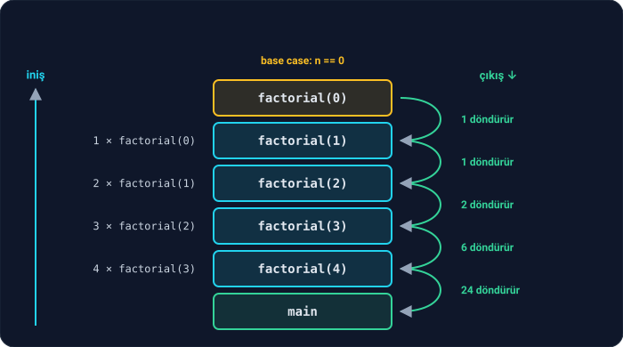
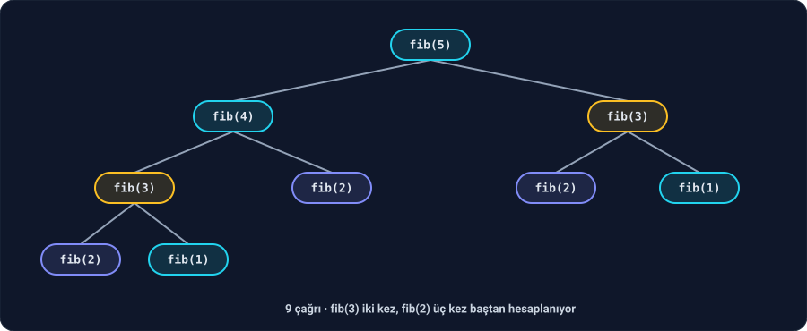

Ders 2.7'de bir fonksiyonun başka bir fonksiyonu çağırdığını ve her çağrının yığında kendi kutusunu açtığını gördük. Peki bir fonksiyon **kendisini** çağırırsa ne olur?

Kulağa garip geliyor ama hiçbir kural bunu yasaklamıyor. Bir fonksiyonun kendisini çağırmasına **özyineleme** (recursion) denir. Bu derste özyinelemenin nasıl çalıştığını, ne zaman işe yaradığını ve ne zaman başını ağrıttığını göreceğiz.

---

## 1. Problemi kendisinin küçüğüne indirgemek

Faktöriyeli hatırla: 5! = 5 × 4 × 3 × 2 × 1. Şimdi dikkatli bak:

- 5! = 5 × **(4 × 3 × 2 × 1)** = 5 × **4!**
- 4! = 4 × **3!**
- 3! = 3 × **2!**
- …

Her faktöriyel, **bir küçüğünün** faktöriyeli cinsinden yazılabiliyor: **n! = n × (n − 1)!**. Bu bir tarif, ama sonsuza kadar sürmemesi için bir yerde durması gerekiyor: **0! = 1**. Tanım gereği bu bir başlangıç noktası; hesaplanmaz, bilinir.

Bu iki cümleyi doğrudan C'ye çevirelim:

```c
#include <stdio.h>

int factorial(int n) {
    if (n == 0) {
        return 1;
    }
    return n * factorial(n - 1);
}

int main(void) {
    for (int i = 0; i <= 5; i++) {
        printf("%d! = %d\n", i, factorial(i));
    }
    return 0;
}
```

```
0! = 1
1! = 1
2! = 2
3! = 6
4! = 24
5! = 120
```

Her özyinelemeli fonksiyonun iki parçası vardır:

1. **Durma koşulu** (base case): Problemin artık bölünmeyecek kadar küçük olduğu, cevabın doğrudan bilindiği durum. Burada `n == 0` ise 1.
2. **Özyinelemeli adım**: Problemi kendisinin **daha küçük** bir haline indirip, o küçük problemi çözmek için fonksiyonu tekrar çağırmak. Burada `n * factorial(n - 1)`.

İkincisi olmadan fonksiyon hiçbir şey çözemez. Birincisi olmadan da asla durmaz. Biraz sonra göreceğiz.

---

## 2. Yığında iniş ve çıkış

`factorial(4)` çağrıldığında perde arkasında ne olur? Ders 2.7'deki çağrı yığını tam olarak bunu gösterir:



**İniş.** `factorial(4)`, sonucunu hesaplayabilmek için `factorial(3)`'ün cevabına ihtiyaç duyar ve onu çağırır; kendisi beklemeye geçer. `factorial(3)` de `factorial(2)`'yi çağırır ve bekler… Bu, `factorial(0)`'a kadar sürer. Yığında **beş ayrı** `factorial` kutusu üst üste durur ve her birinin kendi `n`'i vardır: 4, 3, 2, 1, 0. Aynı fonksiyon, ama beş ayrı çağrı, beş ayrı kutu.

**Dip.** `factorial(0)` durma koşuluna takılır ve hiçbir şey çağırmadan 1 döndürür.

**Çıkış.** Şimdi bekleyenler sırayla uyanır. `factorial(1)` bekliyordu: 1 × 1 = 1 döndürür. `factorial(2)`: 2 × 1 = 2. `factorial(3)`: 3 × 2 = 6. `factorial(4)`: 4 × 6 = **24**. Her kutu, işi bitince yığından kaldırılır.

Bunu kendi gözünle görebilirsin. Ders 2.6'daki gibi `return 1;` satırına bir kesme noktası koy ve programı başlat. `main`'deki döngü 0'dan başladığı için program bu satırda beş kez duracak: `factorial(0)`, `factorial(1)`, …, `factorial(4)` çağrılarının her birinin dibinde. `continue` ile dört kez devam et; beşinci duruşta `factorial(4)`'ün dibindesin. Şimdi `bt` yaz:

```
(lldb) breakpoint set --file factorial.c --line 5
(lldb) run
(lldb) continue
(lldb) continue
(lldb) continue
(lldb) continue
(lldb) bt
  * frame #0: factorial(n=0) at factorial.c:5:9
    frame #1: factorial(n=1) at factorial.c:7:16
    frame #2: factorial(n=2) at factorial.c:7:16
    frame #3: factorial(n=3) at factorial.c:7:16
    frame #4: factorial(n=4) at factorial.c:7:16
    frame #5: main at factorial.c:12:33
```

VS Code'da da aynı şeyi CALL STACK panelinde görürsün: alt alta beş `factorial` satırı. Birine tıklarsan, VARIABLES panelinde o çağrının `n`'ini görürsün.

**Özyinelemeyi anlamanın sırrı:** Fonksiyonun içindeki `factorial(n - 1)` çağrısını okurken, perde arkasındaki bütün bu iniş çıkışı düşünmeye çalışma. Sadece şuna güven: "`factorial(n - 1)` doğru cevabı verecek." Bu güvenle bakınca fonksiyon tek satırlık bir matematik tanımına dönüşür: n! = n × (n − 1)!. Bu güven ilk başta zor gelir; birkaç örnekten sonra alışırsın.

### Bir uyarı: taşma

```c
printf("12! = %d\n", factorial(12));
printf("13! = %d\n", factorial(13));
```

```
12! = 479001600
13! = 1932053504
```

13! aslında 6.227.020.800. Program saçma bir sayı verdi, çünkü bu sayı bir `int`'e sığmıyor. Faz 0'daki 8 bit taşmasını hatırla: aynı şey burada 32 bitte oluyor. `int`'in sınırlarını ve taşmanın tehlikelerini Faz 3'te ve Ders 2.14'te ayrıntısıyla göreceğiz; şimdilik faktöriyeli 12'ye kadar kullan.

---

## 3. Durma koşulunu unutursan

Durma koşulunu sil:

```c
int factorial(int n) {
    return n * factorial(n - 1);
}
```

clang derlerken seni uyarır:

```
warning: all paths through this function will call itself [-Winfinite-recursion]
```

"Bu fonksiyonun bütün yolları kendini çağırıyor": yani hiçbir yolu bir yerde durmuyor. Uyarıya rağmen çalıştırırsan program bir süre sonra çöker:

```
Segmentation fault
```

Ne oldu? `factorial(5)`, `factorial(4)`'ü çağırdı, o `factorial(3)`'ü, sonra 2, 1, 0, -1, -2, … Hiçbir çağrı bitmiyor, her çağrı yığına yeni bir kutu ekliyor. Yığın sonsuz değil; bir noktada dolar ve işletim sistemi programı durdurur. Bu duruma **yığın taşması** (stack overflow) denir. Ünlü programcı soru-cevap sitesinin adı da buradan gelir.

Ders 1.1'deki **sonluluk** özelliğini hatırla: her özyinelemeli adım, problemi durma koşuluna **gerçekten yaklaştırmalı**. `factorial(n - 1)` her seferinde `n`'yi bir azaltıyor ve sonunda 0'a ulaşıyor. Ama `factorial(-3)` çağırırsan `n` 0'dan uzaklaşır ve yine yığın taşar. Sağlam bir durma koşulu `n == 0` yerine `n <= 0` olabilirdi.

---

## 4. Daha fazla örnek

Özyinelemeli düşünmenin kalıbı her zaman aynı: **"En küçük durumda cevap ne? Problemi bir adım küçültürsem, küçüğün cevabından büyüğün cevabını nasıl kurarım?"**

**Basamak toplamı.** Ders 1.3'te döngüyle yapmıştık. Özyinelemeli düşünelim: 2026'nın basamak toplamı = son basamak (6) + 202'nin basamak toplamı. Tek basamaklı bir sayının basamak toplamı kendisidir.

```c
int digit_sum(int n) {
    if (n < 10) {
        return n;
    }
    return n % 10 + digit_sum(n / 10);
}
```

`digit_sum(2026)` = 6 + `digit_sum(202)` = 6 + 2 + `digit_sum(20)` = 6 + 2 + 0 + `digit_sum(2)` = 6 + 2 + 0 + 2 = **10**.

**Sıra önemli.** Bir sayının rakamlarını yazdıran iki fonksiyona bak. Tek farkları, `printf`'in özyinelemeli çağrıdan **önce** mi **sonra** mı olduğu:

```c
void print_reversed(int n) {
    printf("%d", n % 10);
    if (n >= 10) {
        print_reversed(n / 10);
    }
}

void print_in_order(int n) {
    if (n >= 10) {
        print_in_order(n / 10);
    }
    printf("%d", n % 10);
}
```

`print_reversed(2026)` → `6202`, `print_in_order(2026)` → `2026`.

- `print_reversed`, rakamı **inerken** yazar: önce 6'yı yazar, sonra kalanını (202) halletmesi için kendini çağırır.
- `print_in_order`, önce kalanın halledilmesini bekler, rakamını **çıkarken** yazar. İniş 2026 → 202 → 20 → 2 diye gider; yazma ise dipten yukarı doğru olur: 2, 0, 2, 6.

Faz 0'daki bölme–kalan yönteminin sorunu buydu: rakamlar sağdan sola çıkıyordu ama soldan sağa yazmak istiyorduk. Ders 2.5'te bunu 2'nin kuvvetleriyle çözdük. Özyineleme aynı sorunu çok daha kısa çözüyor: yığın, rakamları ters sırada bizim için saklıyor. Bu fikri Ders 2.11'de `printf` kullanmadan sayı yazdırırken tekrar kullanacağız.

---

## 5. Fibonacci ve çağrı ağacı

Fibonacci dizisinin tanımı zaten özyinelemelidir: her terim, kendinden önceki iki terimin toplamı; ilk iki terim 1.

```c
int fib(int n) {
    if (n <= 2) {
        return 1;
    }
    return fib(n - 1) + fib(n - 2);
}
```

Tanımın neredeyse kelimesi kelimesine C hali. Güzel görünüyor. Ama bir sorun var: `fib`, kendisini **iki kez** çağırıyor. `fib(5)`'in çağrılarını bir ağaç olarak çizelim:



`fib(5)`'i hesaplamak için `fib(3)` **iki kez**, `fib(2)` **üç kez** baştan hesaplandı. Her çağrı, bir başkasının zaten yaptığı işi tekrar yapıyor. `n` büyüdükçe bu tekrar inanılmaz bir hızla büyür. Çağrıları sayan bir programla ölçtük:

| `n` | `fib(n)` | Çağrı sayısı |
| --- | --- | --- |
| 5 | 5 | 9 |
| 10 | 55 | 109 |
| 20 | 6.765 | 13.529 |
| 30 | 832.040 | 1.664.079 |
| 40 | 102.334.155 | 204.668.309 |

`n` her 10 arttığında çağrı sayısı **yüz katından fazla** artıyor. `fib(40)` için 200 milyondan fazla çağrı! `fib(50)`'yi denersen, sonucu beklerken bir çay demleyebilirsin. (Sonuç zaten `int`'e sığmaz.)

Ders 2.5'te Fibonacci'yi döngüyle, iki değişkenle hesaplamıştık. O çözüm `fib(40)` için sadece 39 tur dönüyor. **Aynı problem, aynı sonuç: bir tarafta 39 adım, öbür tarafta 200 milyon çağrı.** Kodun kısa ve şık görünmesi, hızlı olduğu anlamına gelmez.

---

## 6. Özyinelemeden döngüye

Her özyinelemeli fonksiyon bir döngüyle de yazılabilir; her döngü de özyinelemeyle. Faktöriyel ve Fibonacci'nin döngülü halleri:

```c
int factorial(int n) {
    int result = 1;
    for (int i = 2; i <= n; i++) {
        result *= i;
    }
    return result;
}

int fib(int n) {
    int previous = 0;
    int current = 1;
    for (int i = 1; i < n; i++) {
        int next = previous + current;
        previous = current;
        current = next;
    }
    return current;
}
```

Hangisini seçmeli?

| | Özyineleme | Döngü |
| --- | --- | --- |
| **Okunabilirlik** | Problem doğal olarak kendine benzer parçalara bölünüyorsa çok kısa ve açık | Adım adım, ne olduğu hemen belli |
| **Bellek** | Her çağrı yığında yeni bir kutu açar; çok derinse yığın taşar | Sabit, birkaç değişken |
| **Hız** | Çağrı açmanın bir maliyeti var; Fibonacci gibi tekrarlı hesaplarda çok yavaş olabilir | Genelde daha hızlı |

**Kural:** Problem kendisinin küçük kopyalarına doğal olarak bölünüyorsa ve derinlik makul ise özyineleme harika bir araçtır. Faktöriyel gibi düz bir döngüyle rahatça yazılabilen problemlerde döngüyü tercih et.

Özyinelemenin gerçekten parladığı yerler ileride gelecek: bir dosya sistemindeki iç içe klasörleri gezmek, bir matematiksel ifadeyi parçalarına ayırmak, ağaç veri yapıları (Faz 8), hızlı sıralama algoritmaları (Faz 9)… Bunların döngüyle yazılması çok daha zordur. Bunlardan birini, Hanoi kulelerini, aşağıdaki alıştırmada çözeceksin.

---

## Alıştırmalar

**1. Basamak sayısı.** Bir sayının kaç basamaklı olduğunu döndüren `int count_digits(int n)` fonksiyonunu **özyinelemeyle** yaz. `count_digits(0)` 1, `count_digits(7)` 1, `count_digits(2026)` 4 döndürmeli. (Ders 1.1'deki BasamakSayısı algoritmasının 0'da yaptığı hatayı hatırla.)

**2. Dizi toplamı.** Bir dizinin elemanlarının toplamını döndüren `int sum(int numbers[], int size)` fonksiyonunu **döngü kullanmadan**, özyinelemeyle yaz. `{3, 1, 4, 1, 5}` için 14 olmalı. (İpucu: `size` elemanlı bir dizinin toplamı = son eleman + ilk `size - 1` elemanın toplamı. Boş bir dizinin toplamı ne?)

**3. Hanoi kuleleri.** Üç çubuk var. Birinci çubukta, büyükten küçüğe dizilmiş `n` disk duruyor. Bütün diskleri üçüncü çubuğa taşıman gerekiyor. Kurallar:

- Her seferinde sadece bir disk taşıyabilirsin; bir çubuğun sadece en üstteki diskini alabilirsin.
- Büyük bir disk, küçük bir diskin üstüne konamaz.

Hamleleri yazdıran `void hanoi(int n, int from, int to, int spare)` fonksiyonunu yaz. 3 disk için 7 hamle olmalı.

Bu problemi döngüyle çözmeye çalışırsan çok zorlanırsın. Özyinelemeli düşün: "`n` diski taşımak için önce üstteki `n - 1` diski bir kenara çekebilseydim…"

<details>
<summary>İpucu: Hanoi</summary>

`n` diski 1. çubuktan 3. çubuğa taşımak üç adımdır:

1. Üstteki `n - 1` diski 1. çubuktan **2. çubuğa** taşı. (Bu, aynı problemin küçüğü!)
2. Geriye kalan en büyük diski 1. çubuktan 3. çubuğa taşı.
3. 2. çubuktaki `n - 1` diski **3. çubuğa** taşı. (Yine aynı problemin küçüğü.)

Durma koşulu: taşınacak disk yoksa (`n == 0`) hiçbir şey yapma.

</details>

<details>
<summary>Cevaplar</summary>

**1.**
```c
int count_digits(int n) {
    if (n < 10) {
        return 1;
    }
    return 1 + count_digits(n / 10);
}
```
Tek basamaklı bir sayı (0 dahil) 1 basamaklıdır. Daha büyük bir sayı, son basamağı atılmış halinden bir basamak fazladır. Durma koşulu `n < 10` olduğu için 0 da doğru sonucu veriyor; Ders 1.1'deki hata burada kendiliğinden ortadan kalktı.

**2.**
```c
int sum(int numbers[], int size) {
    if (size == 0) {
        return 0;
    }
    return numbers[size - 1] + sum(numbers, size - 1);
}
```
Boş bir dizinin toplamı 0'dır; durma koşulu bu. Her çağrı diziyi bir eleman "kısaltıyor": aslında dizi değişmiyor, sadece fonksiyona "ilk `size - 1` elemana bak" diyoruz.

**3.**
```c
#include <stdio.h>

void hanoi(int n, int from, int to, int spare) {
    if (n == 0) {
        return;
    }
    hanoi(n - 1, from, spare, to);
    printf("%d numaralı diski %d. çubuktan %d. çubuğa taşı\n", n, from, to);
    hanoi(n - 1, spare, to, from);
}

int main(void) {
    hanoi(3, 1, 3, 2);
    return 0;
}
```

```
1 numaralı diski 1. çubuktan 3. çubuğa taşı
2 numaralı diski 1. çubuktan 2. çubuğa taşı
1 numaralı diski 3. çubuktan 2. çubuğa taşı
3 numaralı diski 1. çubuktan 3. çubuğa taşı
1 numaralı diski 2. çubuktan 1. çubuğa taşı
2 numaralı diski 2. çubuktan 3. çubuğa taşı
1 numaralı diski 1. çubuktan 3. çubuğa taşı
```

Diskler küçükten büyüğe 1, 2, 3 diye numaralı. Fonksiyonun gövdesi ipucundaki üç adımın birebir karşılığı; `void` bir fonksiyonda `return;` "hiçbir şey döndürmeden çık" demektir.

`n` disk için hamle sayısı 2ⁿ − 1'dir: 3 disk 7 hamle, 10 disk 1.023 hamle, 64 disk 18 kentilyondan fazla hamle. Efsaneye göre bir tapınaktaki rahipler 64 diskli kuleyi taşıyor ve iş bitince dünyanın sonu gelecek. Saniyede bir hamleyle bu yaklaşık 585 milyar yıl sürer, yani evrenin şimdiki yaşının 40 katından fazla; içimiz rahat olabilir.

</details>

---

## Kaynaklar

- Brian Kernighan & Dennis Ritchie, *The C Programming Language* (2. baskı), §4.10: özyineleme.
- Ronald Graham, Donald Knuth & Oren Patashnik, *Concrete Mathematics* (2. baskı), §1.1: Hanoi kuleleri ve hamle sayısının ispatı.

**Sıradaki ders:** Sayı teorisi fonksiyonları. EBOB, EKOK, asal testi ve hızlı üs alma; aynı sonucu veren farklı yöntemlerin kaç adımda bittiğini karşılaştıracağız.
