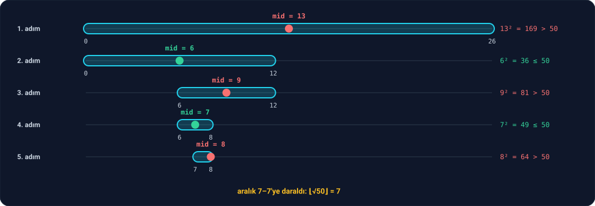

Bu derste tek bir problemi üç farklı yolla çözeceğiz: **bir sayının karekökünü, sadece tamsayılarla bulmak.**

Henüz küsuratlı sayıları görmedik (Faz 3). O yüzden "√50 = 7,07…" diyemeyiz. Bunun yerine şunu soracağız: **karesi n'yi geçmeyen en büyük tamsayı hangisi?** Buna n'nin **tamsayı karekökü** denir ve ⌊√n⌋ diye yazılır.

| n | √n | ⌊√n⌋ |
| --- | --- | --- |
| 49 | 7 | 7 |
| 50 | 7,07… | 7 |
| 63 | 7,93… | 7 |
| 64 | 8 | 8 |

Neden lazım? Ders 1.3'ten beri asal testinde "kareköke kadar dene" diyoruz. Bir sayının tam kare olup olmadığını anlamak, iki nokta arasındaki uzaklığı bulmak, bir ızgaranın kenarını hesaplamak… Hepsi karekök ister.

Bu ders aynı zamanda Ders 2.9'un devamı: üç yöntem de **aynı** sonucu verecek, ama aralarındaki hız farkı çarpıcı olacak.

---

## 1. Tek tek denemek

En basit fikir: 0'dan başla, karesi n'yi geçmediği sürece bir artır.

```c
int isqrt_naive(int n) {
    int r = 0;
    while ((r + 1) <= n / (r + 1)) {
        r++;
    }
    return r;
}
```

Koşulda bir incelik var. Asıl sormak istediğimiz soru "(r + 1)² ≤ n mi?". Neden `(r + 1) * (r + 1) <= n` yazmadık?

Çünkü çok büyük bir `n` için `(r + 1) * (r + 1)` bir `int`'e **sığmayabilir**. `int`'in alabileceği en büyük değer 2.147.483.647, karekökü yaklaşık 46.340. 46.341² ise bu sınırı aşar: overflow olur (Ders 2.8'deki 13! gibi). Aynı soruyu çarpma yerine bölmeyle sorabiliriz: "(r + 1) ≤ n / (r + 1) mi?" Bölme sayıyı küçültür, hiçbir zaman overflow olmaz. Bu küçük hileyi ders boyunca kullanacağız.

`n` için yaklaşık √n adım atıyor: n = 1.000.000 için 1.000 adım. Daha iyisini yapabilir miyiz?

---

## 2. Binary search

Ders 1.1'deki tahmin oyununu hatırla: biri 1 ile 1.000.000 arasında bir sayı tutuyor, sen "büyük mü, küçük mü?" diye soruyorsun. Her soruyla ihtimalleri **yarıya** indirirsen en fazla 20 soruda bulursun.

Karekök de bir tahmin oyunu. Bir aday `mid` seçip "mid² ≤ n mi?" diye soruyoruz:

- **Evet** ise cevap `mid` ya da daha büyük bir sayı.
- **Hayır** ise cevap `mid`'den küçük.

Her soruda aramayı aralığın yarısına daraltıyoruz. Buna **binary search** (ikili arama) denir.

```c
int isqrt_binary(int n) {
    int low = 0;
    int high = n / 2 + 1;
    while (low < high) {
        int mid = low + (high - low + 1) / 2;
        if (mid <= n / mid) {
            low = mid;
        } else {
            high = mid - 1;
        }
    }
    return low;
}
```

`low` ile `high`, cevabın içinde olduğundan emin olduğumuz aralığın iki ucu. Döngü bu aralığı her turda yarıya indirir; iki uç birleşince cevabı bulmuşuzdur.

**n = 50 için iz:**



| Adım | `low` | `high` | `mid` | mid² ≤ 50? | Yeni aralık |
| --- | --- | --- | --- | --- | --- |
| 1. | 0 | 26 | 13 | 169, hayır | 0–12 |
| 2. | 0 | 12 | 6 | 36, evet | 6–12 |
| 3. | 6 | 12 | 9 | 81, hayır | 6–8 |
| 4. | 6 | 8 | 7 | 49, evet | 7–8 |
| 5. | 7 | 8 | 8 | 64, hayır | 7–7 |

Aralık 7–7'ye daraldı: cevap **7**.

Kodun üç inceliği var. Hepsi bir edge case'den ya da overflow'dan korunmak için:

- **`high = n / 2 + 1`:** Neden üst sınır `n` değil? ⌊√n⌋ hiçbir zaman `n / 2 + 1`'i geçmez (16 için: 4 ≤ 9). Daha dar bir aralıkla başlamak bir adım kazandırır. Daha önemlisi, `n` çok büyükken `high - low + 1` gibi ara hesapların overflow olmasını önler.
- **`mid <= n / mid`:** Bölüm 1'deki bölme hilesi, `mid * mid`'in overflow olmaması için.
- **`(high - low + 1) / 2`'deki `+ 1`:** `mid`'i aralığın ortasının **yukarısına** yuvarlar. Bunu yapmasaydık, `low = 7` ve `high = 8` olduğunda `mid` 7 çıkardı. Cevap "evet" olunca `low = mid = 7` olur ve aralık **hiç daralmazdı**: sonsuz döngü. Yukarı yuvarlamak, `mid`'in her zaman `low`'dan büyük olmasını sağlıyor. Bir yan faydası daha var: `mid` hiçbir zaman 0 olmadığı için `n / mid`'de sıfıra bölme olmuyor.

Binary search'ün adım sayısı, aralığın kaç kez yarıya bölünebileceğine eşittir: yaklaşık n'nin **bit sayısı** kadar. Ders 2.9'daki hızlı üs alma gibi.

---

## 3. Newton yöntemi

Üçüncü yol 4.000 yıllık. Babilliler bunu kil tabletlere yazmış; 1. yüzyılda İskenderiyeli Heron tarif etmiş; 17. yüzyılda Isaac Newton çok daha genel bir yöntemin parçası olarak yeniden bulmuş.

**Fikir:** √50'yi arıyoruz ve tahminimiz `x` olsun. Tahmin çok büyükse, mesela x = 10, o zaman 50 / x = 5 çok küçük olur. Gerçek cevap ikisinin **arasında** bir yerdedir; çünkü x × (50 / x) = 50. İkisinin ortalamasını al: (10 + 5) / 2 = 7,5. Bu, 10'dan çok daha iyi bir tahmin. Aynı şeyi tekrarla.

Kural tek satır: **yeni tahmin = (x + n / x) / 2**

Elle, n = 50 ve tamsayı bölmesiyle:

| Adım | `x` | `n / x` | `(x + n / x) / 2` |
| --- | --- | --- | --- |
| 1. | 26 | 1 | 13 |
| 2. | 13 | 3 | 8 |
| 3. | 8 | 6 | 7 |
| 4. | 7 | 7 | 7 |

Tahmin 7'de durdu: artık küçülmüyor. Cevap **7**. Sadece üç adım.

```c
int isqrt_newton(int n) {
    if (n < 2) {
        return n;
    }
    int x = n / 2 + 1;
    int y = (x + n / x) / 2;
    while (y < x) {
        x = y;
        y = (x + n / x) / 2;
    }
    return x;
}
```

- `x`, büyük bir tahminle başlıyor: `n / 2 + 1`. Newton yöntemi, cevaptan **büyük** bir tahminle başlarsa her adımda küçülerek cevaba iner. Neden `n` değil? `n + n / n` hesabı, `n` en büyük `int` olduğunda overflow olur.
- Döngü, yeni tahmin `y` eskisinden küçük olduğu sürece devam ediyor. Tahmin artık küçülmüyorsa cevaba ulaştık.
- 0 ve 1'in karekökü kendisidir; `n / x`'te sıfıra bölmemek için onları baştan ayırdık.

**Yakınsama.** n = 1.000.000 için tahminlerin izi:

| Adım | `x` |
| --- | --- |
| başlangıç | 500.001 |
| 1. | 250.001 |
| 2. | 125.002 |
| 3. | 62.504 |
| 4. | 31.259 |
| 5. | 15.645 |
| 6. | 7.854 |
| 7. | 3.990 |
| 8. | 2.120 |
| 9. | 1.295 |
| 10. | 1.033 |
| 11. | **1.000** |

İki ayrı evre var:

- **Uzaktayken** (1–7. adımlar) tahmin her adımda kabaca **yarıya** iniyor. Tahmin cevaptan çok büyükken `n / x` neredeyse 0'dır; ortalama da `x`'in yarısı olur.
- **Yaklaşınca** (8–11. adımlar) her şey birden hızlanıyor: 2.120 → 1.295 → 1.033 → 1.000. Cevaba yakınken Newton yönteminin **doğru basamak sayısı her adımda kabaca ikiye katlanır**. Bu yüzden son birkaç adımda cevaba "kilitlenir".

Newton yönteminin neden bu kadar hızlı çalıştığının matematiğini Faz 6'da göreceğiz.

---

## 4. Karşılaştırma

Üç yöntemin adım sayılarını ölçtük. Ders 2.9'daki gibi döngünün her turunda artan bir sayaçla:

| n | ⌊√n⌋ | Tek tek | Binary search | Newton |
| --- | --- | --- | --- | --- |
| 50 | 7 | 7 | 5 | 3 |
| 10.000 | 100 | 100 | 13 | 8 |
| 1.000.000 | 1.000 | 1.000 | 19 | 11 |
| 2.147.483.647 | 46.340 | 46.340 | 30 | 18 |

Son satır `int`'in alabileceği en büyük değer. Tek tek deneme 46 bin adım atarken binary search 30, Newton 18 adımda bitiyor. Ders 2.9'daki tabloyu hatırla:

- **Tek tek deneme:** adım sayısı √n ile büyüyor.
- **Binary search:** n'nin bit sayısıyla büyüyor.
- **Newton:** cevaba yaklaşınca binary search'ten bile hızlı.

---

## 5. Üç yöntemi birbiriyle test etmek

Üç farklı fonksiyon yazdık. Hepsinin **gerçekten** doğru çalıştığından nasıl emin olabiliriz?

Birkaç örnekle denemek yetmez: Ders 1.3'te gördük, hatalar edge case'lerde saklanır. İyi bir yol, **en basit ve en güvendiğin** yöntemi bir referans olarak kullanıp diğerlerini onunla karşılaştırmaktır. Tek tek deneme yavaş ama o kadar basit ki yanlış olması zor. Onu "doğru cevap" kabul edip binlerce sayı için diğerleriyle karşılaştırabiliriz:

```c
int errors = 0;
for (int n = 0; n <= 200000; n++) {
    int expected = isqrt_naive(n);
    if (isqrt_binary(n) != expected || isqrt_newton(n) != expected) {
        printf("Hata: n = %d\n", n);
        errors++;
    }
}
printf("%d hata bulundu.\n", errors);
```

```
0 hata bulundu.
```

0'dan 200.000'e kadar her sayı için üç yöntem aynı cevabı veriyor. Bu, birkaç örneği elle denemekten çok daha güçlü bir güvence. Hızlı ama karmaşık bir yöntemi, yavaş ama basit bir yöntemle sınamak; profesyonel yazılımcıların sık kullandığı bir tekniktir.

---

## Alıştırmalar

Alıştırmalarda `isqrt` dediğimiz yerde binary search sürümünü kullanabilirsin.

**1. Tam kare mi?** Bir sayının tam kare olup olmadığını döndüren `int is_perfect_square(int n)` fonksiyonunu yaz. 49 → 1, 50 → 0, 0 → 1, 1 → 1.

**2. Pisagor üçlüleri.** a² + b² = c² eşitliğini sağlayan tamsayılara **Pisagor üçlüsü** denir: (3, 4, 5) gibi. a ≤ b olacak şekilde, c'si 30'u geçmeyen bütün üçlüleri bul. (İpucu: a ve b için iki döngü kur; c'yi `isqrt` ile bul ve gerçekten tam kare olup olmadığını kontrol et.)

**3. Küp kök.** ⌊∛n⌋'yi, yani küpü n'yi geçmeyen en büyük tamsayıyı bulan `int icbrt(int n)` fonksiyonunu binary search ile yaz. 1000 → 10, 999 → 9. Taşmaya dikkat et.

**4. Gizli hata.** Ders 2.9'daki asal testini `int`'in en büyük değeri olan 2.147.483.647 ile dene. Bu sayı asaldır. Programın ne diyor? Neden? `isqrt` kullanarak düzelt.

<details>
<summary>Cevaplar</summary>

**1.**
```c
int is_perfect_square(int n) {
    int r = isqrt(n);
    return r * r == n;
}
```
⌊√n⌋'nin karesi n'ye eşitse n tam karedir. Burada `r * r` overflow olmaz, çünkü `r * r ≤ n` olduğunu zaten biliyoruz.

**2.**
```c
for (int a = 1; a <= 30; a++) {
    for (int b = a; b <= 30; b++) {
        int sum = a * a + b * b;
        int c = isqrt(sum);
        if (c <= 30 && c * c == sum) {
            printf("(%d, %d, %d) ", a, b, c);
        }
    }
}
```
```
(3, 4, 5) (5, 12, 13) (6, 8, 10) (7, 24, 25) (8, 15, 17) (9, 12, 15) (10, 24, 26) (12, 16, 20) (15, 20, 25) (18, 24, 30) (20, 21, 29)
```
`b`'yi `a`'dan başlatmak, (4, 3, 5) gibi aynı üçlünün ters sırasını iki kez saymamızı önlüyor.

**3.**
```c
int icbrt(int n) {
    int low = 0;
    int high = n / 2 + 1;
    while (low < high) {
        int mid = low + (high - low + 1) / 2;
        if (mid <= n / mid / mid) {
            low = mid;
        } else {
            high = mid - 1;
        }
    }
    return low;
}
```
Karekökteki binary search'ün aynısı; değişen tek şey soru: "mid³ ≤ n mi?" Bunu `mid * mid * mid <= n` diye sorsaydık, büyük `mid` değerlerinde çarpım overflow olurdu. İki kez bölerek aynı soruyu overflow olmadan soruyoruz. `icbrt(2147483647)` → 1290.

**4.** Program 2.147.483.647'nin asal **olmadığını** söyler. Yanlış!

Sebep, döngünün koşulu `d * d <= n`. `d` 46.341'e ulaştığında `d * d` = 2.147.488.281 olur ve bu `int`'e sığmaz. Overflow olan bir çarpımın sonucu belirsizdir: C, bu durumda programın ne yapacağı konusunda hiçbir söz vermez. Bizim denememizde döngü durması gereken yerde durmadı, `d` büyümeye devam etti ve program sonunda yanlışlıkla bir bölen bulduğunu sandı. Başka bir compiler'da ya da başka bir ayarla bambaşka bir şey olabilirdi.

Bu hata, `d * d`'nin overflow olabildiği tek bölgede ortaya çıkıyor: 46.340² = 2.147.395.600'den büyük sayılarda. Daha küçük her sayı için önceki derslerdeki asal testleri doğru çalışıyor. Ama işte edge case'lerin tehlikesi: bir fonksiyonun **neredeyse her** girdide doğru çalışması, doğru olduğu anlamına gelmez.

Düzeltme: karekökü bir kez, baştan hesapla ve döngüyü onunla sınırla:

```c
int is_prime(int n) {
    if (n < 2) {
        return 0;
    }
    if (n % 2 == 0) {
        return n == 2;
    }
    int limit = isqrt(n);
    for (int d = 3; d <= limit; d += 2) {
        if (n % d == 0) {
            return 0;
        }
    }
    return 1;
}
```

Artık hiçbir çarpma yok, dolayısıyla overflow da yok. Bir faydası daha var: `d * d`'yi her turda hesaplamak yerine sınırı bir kez hesaplıyoruz.

Bu hatayı nasıl yakaladık? clang'in `-fsanitize=undefined` adlı bir ayarı, program çalışırken overflow'u tespit edip uyarıyor: `runtime error: signed integer overflow: 46341 * 46341 cannot be represented in type 'int'`. Bu aracı ve overflow'un neden bu kadar tehlikeli olduğunu Ders 2.14'te ayrıntısıyla göreceğiz.

</details>

---

## Kaynaklar

- Donald Knuth, *The Art of Computer Programming*, Cilt 3 (2. baskı), §6.2.1: binary search ve ünlü edge case hataları.
- Henry S. Warren, *Hacker's Delight* (2. baskı), Bölüm 11: tamsayı karekök ve küp kök (Faz 5'te bu kitaba tekrar döneceğiz).

**Sıradaki ders:** `printf` olmadan sayı yazdırma. Ders 2.8'deki `print_in_order` fikrinden yola çıkıp kendi `print_int` fonksiyonumuzu yazacağız.
