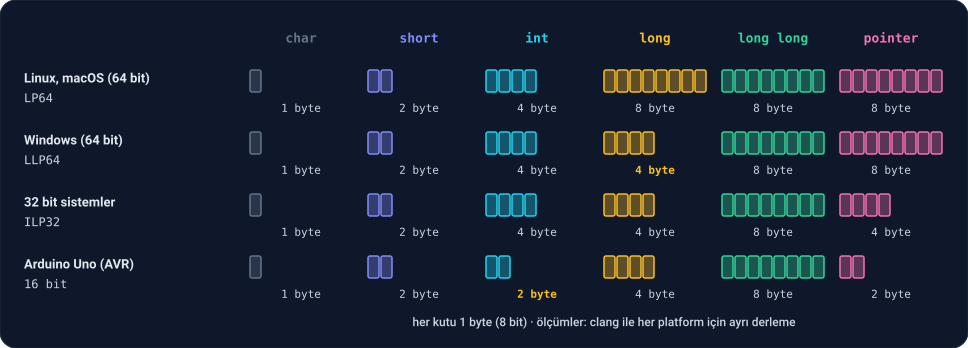

Ders 3.1'de `int`'in sabit sayıda byte'tan oluştuğunu ve bu yüzden sınırları olduğunu gördük. Daha büyük sayılar için daha büyük kutulara, küçük değerler için de daha küçük kutulara ihtiyacımız var. C'de beş tamsayı tipi var:

| Tip | Bugünkü bilgisayarlarda tipik boyut |
| --- | --- |
| `char` | 1 byte |
| `short` | 2 byte |
| `int` | 4 byte |
| `long` | 4 **ya da** 8 byte |
| `long long` | 8 byte |

`long`'un satırındaki "ya da"ya dikkat. Bu dersin en önemli konusu o.

---

## 1. Kendi makinende ölç

Her tipin boyutunu ve sınırlarını `sizeof` ile ve Ders 2.11'de tanıştığımız `<limits.h>` ile öğrenebiliriz:

```c
#include <stdio.h>
#include <limits.h>

int main(void) {
    printf("char:      %zu byte, %d ile %d arası\n", sizeof(char), CHAR_MIN, CHAR_MAX);
    printf("short:     %zu byte, %d ile %d arası\n", sizeof(short), SHRT_MIN, SHRT_MAX);
    printf("int:       %zu byte, %d ile %d arası\n", sizeof(int), INT_MIN, INT_MAX);
    printf("long:      %zu byte, %ld ile %ld arası\n", sizeof(long), LONG_MIN, LONG_MAX);
    printf("long long: %zu byte, %lld ile %lld arası\n", sizeof(long long), LLONG_MIN, LLONG_MAX);
    printf("CHAR_BIT:  %d\n", CHAR_BIT);
    return 0;
}
```

Bu kitabın yazıldığı bilgisayarda (macOS, Apple Silicon):

```
char:      1 byte, -128 ile 127 arası
short:     2 byte, -32768 ile 32767 arası
int:       4 byte, -2147483648 ile 2147483647 arası
long:      8 byte, -9223372036854775808 ile 9223372036854775807 arası
long long: 8 byte, -9223372036854775808 ile 9223372036854775807 arası
CHAR_BIT:  8
```

İki yeni `printf` biçimi var: `long` için `%ld`, `long long` için `%lld`. `l` harfi "long" demektir. Yanlış biçimi kullanırsan (örneğin bir `long`'u `%d` ile yazdırırsan) `-Wall` seni uyarır.

`CHAR_BIT`, bir byte'ın kaç bit olduğunu söyler. Bugün her yerde 8. (Geçmişte 9 bitlik byte'ları olan bilgisayarlar vardı; C bu yüzden bunu bile sabit kabul etmez.)

8 byte'lık `long long`'un en büyük değeri yaklaşık 9,2 **kentilyon**, yani 9,2 × 10¹⁸. Ders 2.8'deki faktöriyeli `long long` ile yazarsak:

```c
#include <stdio.h>

long long factorial(int n) {
    long long result = 1;
    for (int i = 2; i <= n; i++) {
        result *= i;
    }
    return result;
}

int main(void) {
    for (int n = 12; n <= 21; n++) {
        printf("%d! = %lld\n", n, factorial(n));
    }
    return 0;
}
```

```
12! = 479001600
13! = 6227020800
14! = 87178291200
15! = 1307674368000
16! = 20922789888000
17! = 355687428096000
18! = 6402373705728000
19! = 121645100408832000
20! = 2432902008176640000
21! = -4249290049419214848
```

13! artık doğru: 6.227.020.800. Hatta 20!'e kadar her şey doğru. Ama 21! yine overflow oldu; `-fsanitize=undefined` ile derlersen sanitizer bunu yakalar. Daha büyük kutu sorunu **ertelemiş**, ortadan kaldırmamıştır. Her tipin bir sınırı var.

---

## 2. Standart neyi garanti ediyor?

Ders 3.1'de standardın `int` için sadece bir alt sınır koyduğunu gördük. Diğer tipler için de durum aynı. C standardının **garanti ettiği** tek şey, her tipin en az belli sayıda bit olması:

| Tip | Standardın garantisi | En az şu aralık |
| --- | --- | --- |
| `char` | en az 8 bit | −127 … 127 |
| `short` | en az 16 bit | −32.767 … 32.767 |
| `int` | en az 16 bit | −32.767 … 32.767 |
| `long` | en az 32 bit | −2.147.483.647 … 2.147.483.647 |
| `long long` | en az 64 bit | yaklaşık ±9,2 × 10¹⁸ |

Bir de sıralama garantisi var: her tip, kendinden öncekinin bütün değerlerini tutabilir. Yani `short`, `char`'dan küçük olamaz; `long`, `int`'ten küçük olamaz.

(Tablodaki en küçük değerlerin −128 değil −127 olduğunu fark etmiş olabilirsin. Eski standart, negatif sayıların bitlerle farklı şekillerde gösterilebildiği makinelere de yer bırakıyordu. Bunu Ders 3.3'te göreceğiz; en yeni standart C23 artık −128'i de garanti ediyor.)

Gerisi platforma kalmıştır. `int`'in 2 byte mı 4 byte mı olacağına, `long`'un 4 byte mı 8 byte mı olacağına, programı derleyen sistem karar verir.

---

## 3. Veri modelleri: LP64 ve LLP64

Hangi tipin kaç byte olacağına dair her platformun bir **veri modeli** (data model) vardır. Ders 3.1'deki gibi clang ile aynı dosyayı farklı platformlar için derleyip boyutları ölçtük:



- **LP64** (Linux, macOS, 64 bit): **L**ong ve **P**ointer **64** bit. Bugünkü Linux ve Mac bilgisayarların hepsi.
- **LLP64** (Windows, 64 bit): **L**ong **L**ong ve **P**ointer **64** bit; ama `long` 32 bit. Microsoft, eski Windows programlarıyla uyumluluğu bozmamak için `long`'u 4 byte'ta bıraktı.
- **ILP32** (32 bit sistemler): **I**nt, **L**ong ve **P**ointer **32** bit.
- **Arduino Uno gibi 16 bit sistemler:** `int` 2 byte.

Tablodaki son sütun, `pointer`, bellek adreslerini tutan bir tip; Faz 4'te göreceğiz.

**Bu ne anlama geliyor?** Linux'ta yazdığın ve dünya nüfusunu (yaklaşık 8 milyar) bir `long`'da tutan bir program, Windows'ta **overflow** olur; çünkü orada `long`'un en büyük değeri yaklaşık 2,1 milyar. Kod aynı, sonuç farklı.

**Kural:** `long`'un 8 byte olduğunu varsayma. 2 milyarı aşabilecek bir sayı için `long long` kullan; o her platformda en az 8 byte. Ders 3.4'te ise boyutu **tam olarak** belli olan tiplerle (`int32_t`, `int64_t`) bu belirsizliği tamamen ortadan kaldırmayı göreceğiz.

---

## 4. char bir sayıdır

`char` adını "character"dan, yani karakterden alır; ama aslında **1 byte'lık bir tamsayı tipidir**. Faz 0'da her karakterin bir sayı olduğunu görmüştük; `char` bu sayıyı tutar.

```c
#include <stdio.h>

int main(void) {
    char letter = 'A';
    printf("%c %d\n", letter, letter);
    letter = letter + 1;
    printf("%c %d\n", letter, letter);
    printf("%d\n", 'Z' - 'A');
    char small = 'a';
    printf("%c\n", small - 32);
    return 0;
}
```

```
A 65
B 66
25
A
```

- Aynı değişken, `%c` ile yazdırılınca **harf** (`A`), `%d` ile yazdırılınca **sayı** (65) olarak görünür. Bellekte duran şey aynı; değişen sadece yorum. Faz 0'daki "her şey sayıdır, anlamı bağlam belirler" cümlesinin ta kendisi.
- `'A' + 1` = 66 = `'B'`. Harflerle aritmetik yapabilirsin; Ders 2.11 ve 2.12'de rakamlarla yaptığımız gibi.
- `'a' - 32` = `'A'`: Faz 0'daki "büyük harfle küçük harf arasındaki fark 32" kuralı.

**Bir tuhaflık: `char` işaretli mi, işaretsiz mi?** Standart bunu da platforma bırakır. clang ile kontrol ettik: macOS'ta ve x86 işlemcili Linux'ta `char` −128 ile 127 arasında; ama ARM işlemcili Linux'ta, örneğin bir Raspberry Pi'de, 0 ile 255 arasında. Harf tutarken bu fark etmez; ama `char`'ı küçük bir sayı tutmak için kullanırsan ve negatif değerlere ihtiyacın varsa, sürpriz yaşayabilirsin. Ders 3.3'te `signed char` ve `unsigned char` ile bu belirsizliği nasıl ortadan kaldıracağımızı göreceğiz.

---

## 5. Hangi tipi seçmeli?

| Durum | Tip |
| --- | --- |
| Genel amaçlı sayılar, sayaçlar, döngü değişkenleri | `int` |
| ±2 milyarı aşabilecek sayılar | `long long` |
| Karakterler | `char` |
| Çok sayıda küçük değeri bellekte az yer kaplayarak tutmak | `char`, `short` (ama Ders 3.4'teki tipler daha iyi) |
| Platformdan bağımsız, tam belli boyut gerektiğinde | Ders 3.4'teki `int32_t`, `int64_t`… |

`int`, adı üstünde, işlemcinin en rahat çalıştığı "doğal" tamsayı boyutu olacak şekilde seçilir. Bu yüzden özel bir sebebin yoksa `int` kullan. `short` ve `char`'ı aritmetik için kullanmak çoğu zaman kazandırmaz; Ders 3.5'te nedenini göreceğiz: işlemci onları hesaba katmadan önce zaten `int`'e çevirir.

`long`'u ise yeni kod yazarken neredeyse hiç kullanma: boyutu platforma göre değiştiği için ne `int`'ten büyük olduğuna ne de 8 byte olduğuna güvenebilirsin.

---

## Alıştırmalar

**1** – Bölüm 1'deki programı kendi bilgisayarında çalıştır. Sonuçlar burada gösterilenlerle aynı mı? Windows'taysan (WSL kullanmadan, doğrudan Windows için derleseydin) hangi satır farklı olurdu?

**2** – Aşağıdaki değerlerin her biri için hangi tipi seçerdin? Neden?

- a) Türkiye'nin nüfusu (yaklaşık 86 milyon)
- b) Dünya nüfusu (yaklaşık 8,1 milyar)
- c) 1 Ocak 1970'ten bu yana geçen milisaniye sayısı
- d) Bir sınav notu (0–100)
- e) Ders 2.4'teki labirent haritasının bir kutusu (0, 1 ya da 2)

**3** – Çalıştırmadan, ekrana ne yazacağını tahmin et:

```c
printf("%c\n", 'a' + 1);
printf("%d\n", '7' - '0');
printf("%c\n", 'z' - 25);
printf("%d\n", 'a' - 'A');
```

**4** – Ders 2.4'teki labirent haritasını `int map[7][11]` yerine `char map[7][11]` ile tut ve geri kalan kodu hiç değiştirme. Program hâlâ çalışıyor mu? `sizeof(map)` ne oldu?

<details>
<summary>Cevaplar</summary>

**1** – Linux, macOS ve WSL'de aynı sonuçları görmelisin. Doğrudan Windows için derlenmiş bir programda `long` satırı farklı olurdu: `4 byte, -2147483648 ile 2147483647 arası`.

**2** –

- a) **`int`.** 86 milyon, 2,1 milyarın çok altında.
- b) **`long long`.** 8,1 milyar `int`'e sığmaz. `long` Linux'ta yeterli olurdu ama Windows'ta olmaz.
- c) **`long long`.** Bugün yaklaşık 1,8 × 10¹² milisaniye; `int`'in sınırının yaklaşık bin katı. Benzer bir sayı gerçekten kullanılıyor: Unix sistemleri zamanı 1970'ten bu yana geçen **saniye** olarak tutar. Bunu 32 bitlik bir tamsayıda tutan eski sistemler 19 Ocak 2038'de taşacak; buna "2038 problemi" denir ve Faz 10'da göreceğiz.
- d) **`int`.** `char` da yeterdi, ama tek bir not için bellek tasarrufu anlamsız; `int` daha doğal ve tuzaksız.
- e) **`char`** düşünülebilir: 77 kutuluk bir haritada 308 yerine 77 byte. Haritalar büyüdükçe (oyunlarda milyonlarca kutu olabilir) bu fark önemli hale gelir.

**3** –
```
b
7
a
32
```
`'7' - '0'` = 7: Ders 2.12'deki karakteri rakama çevirme hilesi. `'a' - 'A'` = 32: Faz 0'daki büyük-küçük harf farkı.

**4** – Program aynen çalışır ve `sizeof(map)` **77** olur (308 yerine). 0, 1 ve 2 değerleri `char`'a rahatça sığar ve `map[row][col] == WALL` gibi karşılaştırmalar `char` ile de aynı çalışır. Fonksiyonların parametre tipini de `char map[ROWS][COLS]` yapman gerekir; yoksa compiler tip uyuşmazlığı hatası verir.

</details>

---

## Kaynaklar

- C standardı (ISO/IEC 9899:2018), §5.2.4.2.1: tamsayı tiplerinin en küçük aralıkları (`limits.h`).
- Randal Bryant & David O'Hallaron, *Computer Systems: A Programmer's Perspective* (3. baskı), §2.2.
- [The Open Group: 64-Bit Programming Models](https://unix.org/version2/whatsnew/lp64_wp.html): LP64'ün neden seçildiği.

**Sıradaki ders:** İşaretli ve işaretsiz sayılar. Negatif sayılar bitlerle nasıl gösterilir, `INT_MIN` neden `INT_MAX`'tan bir fazladır?
